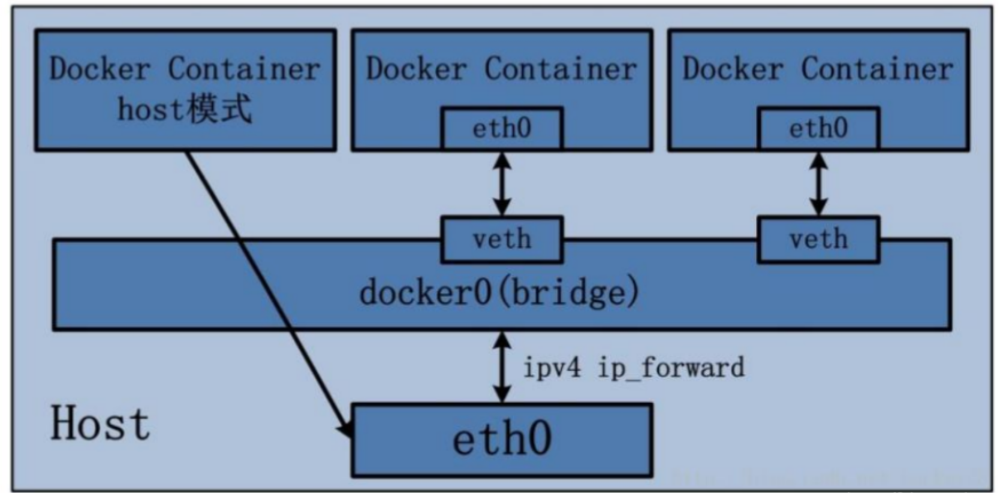
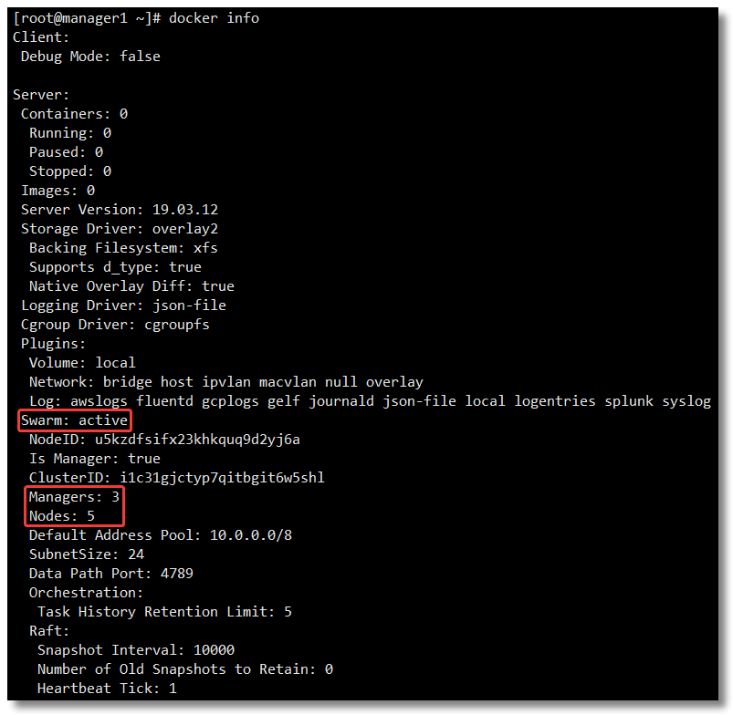

# 初识Docker

## 1.Docker为什么诞生？

随着计算机硬件的性能提升，会有这些现象发生：

- 计算机上可运行的软件越来越多，不同软件之间或者相同软件不同版本之间，会造成一些冲突，这时候需要一种技术，将冲突的软件进行隔离
- 硬件性能过剩，希望将其最大限度的利用起来
- 操作系统上安装的软件，希望能完整的copy给其他人，而不用重新安装

为了应对上述需求，一般是一台电脑安装多个操作系统或者多个电脑协同工作，但缺点显而易见，很麻烦，且没法最大限度的利用硬件资源。

> **怎么办？**

`硬件虚拟化`这个解决方案就普及开来并迅速成为主流。

所谓`硬件虚拟化`，就是某个特殊的`软件`，`仿真`出一台或者多台计算机的各种硬件，用户可以在这一台虚拟机上`安装、运行操作系统`（一般叫来宾操作系统，`Guest OS`）和各种应用，并且把 `Guest OS` 和上面应用软件对硬件资源的访问转发到`底层的硬件`上来实现。

对于`Guest OS`和上面的应用程序来说，这台虚拟机和普通物理计算机是完全一样没有任何区别的——除了性能可能差一点。全球第一人气的 `VMware Workstation `就是这么一个软件，Oracle 的 `VirtualBox `以及 Microsoft 的 `Virtual PC `都是。

这类软件英语有一个专用的单词是 `Hypervisor`（虚拟机管理程序）。


### 1.1 虚拟机的优缺点

> 优点：

1. 硬件最大化利用
2. 更易移植
3. 更易拓展（比如云服务，利用虚拟机虚拟不同的物理资源）

> 缺点：

**硬件资源的严重浪费**

1. 每启动一个虚拟机，就会占用大量的内存和硬盘资源，即使不使用
2. 为了管理各个虚拟机，又需要额外的内存资源
3. 单台计算机上可运行的虚拟机数量有上限，随着虚拟机的增多，系统资源的浪费会加重

### 1.2 解决虚拟机的缺点

> 能不能解决虚拟机的缺点呢？

这里有个`前提：` 一般单台计算机上运行的虚拟机操作系统大多是一样的。

基于上述前提，能不能所有的`虚拟机`都使用同一个操作系统底层呢？这样就避免了硬件资源的浪费。当然共享操作系统底层的时候，`虚拟机`之间的隔离性仍旧需要存在。

**「操作系统层虚拟化——容器」**概念的提出，就是为了解决这个问题。

**Docker** 就是一个容器的标准化实现。

## 2.认识容器化技术

`容器化`就是应用程序级别的虚拟化技术。容器提供了将应用程序的代码、运行时、系统工具、系统库和配置打包到一个实例中的标准方法。容器**共享一个内核（操作系统）**，它安装在硬件上。


和虚拟机相比，容器有以下优点：

1. **启动迅速**：没有虚拟机硬件的初始化，没有 Guest OS 的启动过程，可以节约很多启动时间，这就是容器的“开箱即用”；
2. **占用资源少**：没有运行 Guest OS 所需的内存开销，无需为虚拟机预留运行内存，无需安装、运行 App 不需要的运行库/操作系统服务，内存占用、存储空间占用都小的多。相同配置的服务器，如果运行虚拟机能运行十多台的，通常可以运行上百个容器毫无压力——当然前提是单个容器应用本身不会消耗太多资源

### 2.1 容器化技术历史

**1979年**

1979年，第一个Unix版本V7发布，在1979年的这个V7版本上，chroot这个系统调用被发明了出来，什么是chroot呢？就是改变一个进程及其子进程的根目录到另外一个目录下，在经过 chroot 之后，系统读取到的目录和文件将不在是旧系统根下的而是新根下(即被指定的新的位置)的目录结构和文件，这样有几个好处：

- 增强系统安全性，限制了用户进程的权限，使得进程不能访问一些特定的文件；
- 建立一个和原系统隔离的目录结构（是不是联想到了容器的隔离文件系统union gs），为进程指定一个单独的、新的文件系统上下文环境。

于是，Unix就具有了这种能力：为每个进程提供一个隔离的虚拟文件系统。Chroot在后来的1982年被新增到了BSD这个分支中。可见，在早期构建Unix系统的先驱们已经有了这种意识，就是隔离的意识。chroot可以认为是容器技术的鼻祖。

**1999年**

在这年，一家共享主机托管商提供了FreeBSD Jails的概念，顾名思义，就是将服务和客户端服务明确的区分开，实现安全性和可管理的便捷性，它允许将系统划分为几个独立的较小的系统，称之为Jail，并且这些小系统有独立的配置和IP地址。这就有容器的意思了。2000年，伴随FreeBSD4.0版的发布，正式对外公开。系统管理者可以使用jail(8)这个命令来调用这个服务。

**2001年**

该Linux出场了，GUN和Linux整合后迅速发展，这个时间点上Linux已经比较成熟了，Linux Vserver出现了，和Free BSD的Jails是相同的原理，可以对OS上的资源（文件系统、网络等）进行隔离划分。到了2001年，Linux通过对内核打补丁的方式实现了该种虚拟化，其实就是namespace机制，中间经过了很多次完善，最后的stable补丁在2006年发布。

**2004年**

Solaris属于Unix的一个变种，在2004年，Solaris上的虚拟化诞生了，初期称为Solaris container，Solaris的虚拟化技术由Sun公司开发，2004年2月同Solaris10版本对外发布，Sun公司在2009年被并购后落入了Oracle公司，Solaris11之后叫Solaris zones。从名字也能看出来，也是一种操作系统层面的轻量级虚拟化技术。

Solaris zones 是Native zone，kernel zone的统称，能够为你使你的应用在隔离的环境中运行，并实现有效的资源管理。几乎所有的Oracle用户都在使用Zone，广泛应用在生产环境中，从web app 到Oracle数据库实例都可以安装在zone里面。zone 技术为应用程序创建了虚拟的一层，可以将zone 称之为一个沙箱，我们安装的操作系统称为global-zone，在global zone里面可以创建很多独立的zone，称为non-globalzone，global zone 控制着操作系统内核，设备驱动，系统内存管理，文件系统等等并为non global zone 提供接口。非global zone 之间互相独立，互不影响，每一个zone 拥有自己的文件系统，进程空间，防火墙，网络配置等等，对于global zone 来说每一个non-global zone 是一个拥有一组资源并用zone ID命名的进程。Solaris zone 是一种轻量级的虚拟化技术，虚拟化的开销很小，所有的native zone 依赖于操作系统内核，kernelzone 可以拥有独立的内核版本：


**2005: Open VZ (Open Virtuzzo)**

2005年，SWsoft发布了Open VZ，OpenVZ是开源软件，是基于Linux平台的操作系统级服务器虚拟化解决方案。OpenVZ采用SWsoft的Virtuozzo虚拟化服务器软件产品的内核，Virutozzo是SWsoft公司提供的商业虚拟化解决方案。

OpenVZ可以在单个物理服务器上创建多个隔离的虚拟专用服务器(VPS)并以最大效率共享硬件和管理资源。每个VPS的运行和独立服务器完全一致，因其自身的用户、应用程序都可以独立重启，它拥有根访问权限、用户、IP地址、内存、处理器、文件、应用服务、系统库文件和配置文件等。拥有轻量级处理损耗和高效设计的OpenVZ是运行应用服务和实时数据生产型服务器虚拟化的最佳选择。

OpenVZ软件同时为用户提供工具，协助自动化管理虚拟服务器。基于模板的应用程序部署可以在几分钟内用简单的方法创建新的虚拟服务器并投入使用，而且与其他的虚拟化技术相比，OpenVZ可以在每CPU上运行几倍于其他虚拟化服务器技术的虚拟化服务器。

OpenVZ是基于Linux内核和作业系统的操作系统级虚拟化技术。OpenVZ允许物理服务器运行多个操作系统，被称虚拟专用服务器（VPS，Virtual Private Server）或虚拟环境（VE, Virtual Environment）。

与硬件虚拟化的VMware和半虚拟化的Xen相比，OpenVZ的host OS和guest OS都必需是Linux（虽然在不同的虚拟环境里可以用不同的Linux发行版）。但是，OpenVZ声称这样做有性能上的优势。根据OpenVZ网站的说法，使用OpenVZ与使用独立的服务器相比，性能只会有1-3%的损失。

**2006: Process Containers**

Process Containers横空出世，这个名字可能比较陌生，但是提到另外一个名字：Cgroups你可能就了然了。Cgroups在容器中控制容器的资源配额，是极其重要的一个控制功能，由谷歌工程师在2006年发布，2008年在2.6.24版本合并到Linux内核中。

**2008: LXC**

终于，在2008年，LXC横空出世，LXC作为集大成者，采集众家之所长，有了前期的N多铺垫，终于有了容器技术的雏形。LXC的主要两大依托就是namespace和Cgroups，一个做资源隔离，解决进程可以用什么资源的问题；一个做资源控制，解决进程可以用多少资源的问题。

进程在运行时，除了CPU和内存外，其实还需要很多其他资源，为了将其隔离，需要将资源一并隔离，如网络、文件系统、IPC等，什么是namespace？

```text
A namespace wraps a global system resource in an abstraction that  makes it
 appear to the processes within the namespace that they have their own isolated
 instance of the global resource.  Changes to the global resource are visible 
to other processes that are members of the namespace, but are invisible to other
 processes. One use of namespaces is to implement containers.
```

namespace的存在，使得每个进程都以为自己是单独的存在，拥有独享的必要资源，其实是被划分到一个单独的隔离区域。

**2011: Warden**

LXC是个好东西，加上Linux系统的覆盖面和应用广泛的加持，CloudFoundry在2011年启动了Warden项目，早期使用了LXC的技术，但是后面就用自己的实现替代掉了，它可以隔离进程的上下文环境，并且在后台提供了一个daemon进程提供了各种API来供你进行容器的管理,它提供了一种C/S架构的工具用来跨域多个主机来管理容器，它支持对cgroups，namespace及进程生命周期的管理。这是不是有Docker的影子了？如果你对Docker比较熟悉的话，和Docker的架构有点像。

**2013: LMCTFY**

Let Me Contain That For You (LMCTFY)，谷歌在2013年搞起的一个容器栈，可以为Linux应用提供容器（container）。这些容器可以让一台机器上的不同应用使用相互隔离的资源，以独占的方式运行在同一台机器上。这些应用也可以拥有容器，因此能够创建和管理属于他们自己的子容器。这个项目的地址如下：

```text
https://github.com/google/lmctfy
```

谷歌后来转向了libcontainer，因此这个项目在2015年停止更新，现在已经合并到了[https://github.com/opencontainers/runc/tree/master/libcontaineropen in new window](https://link.zhihu.com/?target=https%3A//github.com/opencontainers/runc/tree/master/libcontainer)

读到这里，感觉是不是越来越像Docker了？

**2013: Docker**

是的，Docker（go语言开发）也很快出现了，Docker优秀的设计使得它非常流行，像Warden一样，初期也是基于LXC的，后来就以自己的libcontainer来替代了，Docker之所以如此流行，一个重要的原因就是提供了一个完整的解决方案生态系统，使得易用、简单，这是它的前辈们所做不到的，历史上的解决方案看起来都有Docker的影子，但是都有各种各样的不足，Docker几乎解决了所有的痛点，变得非常易用。

**2014 微服务**

明明讲容器技术的发展史，为什么提到微服务呢？这是有原因的，大家对微服务的一致性认知，都是出自2014年，马丁福勒的那篇布道文，通俗易懂的阐述了什么是微服务架构。

其实微服务的概念早在2012年就陆续的出现了，但是由于容器技术还不太完善，微服务的一个特点就是拆分，服务的数量会增长，膨胀的服务如何部署是个问题，无论是用虚拟机还是物理机，成本都比较高，而且扩容也不是很流畅。容器技术逐渐完善了后，微服务的发展终于得到了解放，一个个小而美的服务运行在容器里，具有必要的隔离性，且近乎原生系统的性能（直接在内核上运行），简直是再合适不过了。微服务得到了长足的进展，而这又反过来促进了容器的发展。

**2014 k8s**

Docker引爆了容器技术，加上微服务的加持，使得二者发展迅速，但是容器更像是一个好玩的玩具，如何在产线上工业化的使用起来？网络问题、负载均衡问题、监控、部署、更新、镜像管理、发布……需要解决很多很多问题，因此容器的编排应运而生，k8s在2014年横空出世，说横空出世或许有点夸张，因为它是基于谷歌内部建设了十几年的Borg构建的开源版本，实践出真知，因此很快就成为容器编排事实上的标准。

**2014: Rocket**

Rocket代码： https://github.com/coreos/rkt

Rocket ( 也叫rkt，Go语言实现 ) 是一个类似Docker的命令行工具。她可以打包应用和依赖包到可移植容器中，简化搭环境等部署工作。 Rocket 的开发者认为，现在的Docker社区背离了当初设计Docker的初衷：即一个可复用的标准Linux容器。

Rocket设计目标就是希望再次实现这个初衷, 当然，它也兼容Docker(rkt可以执行 Docker镜像)。

"Rocket 和 Docker 不同的地方在于，Rocket 没有 Docker 那些为企业用户提供的“友好功能”，比如云服务加速工具、集群系统等。反过来说，Rocket 想做的，是一个更纯粹的业界标准。"

```
CoreOS发布并开始支持rkt（最初作为Rocket发布）作为Docker的替代品。
```

**2015 CNCF**

容器技术，容器编排，微服务，三者相辅相成，共同促进，迅速发展，容器云的概念也应运而生，于是乎，谷歌在2015年底拉着一票巨头成立了CNCF这个组织，共同做大云原生这个生态，无利不起早，也是为了照顾自家生意。

**如今**

微服务、容器编排、容器云，整个生态变得异常的火爆

## 3.Docker历史

2010 年，几个搞 IT 的年轻人，在美国旧金山成立了一家名叫 `dotCloud` 的公司。dotCloud 的平台即服务（Platform-as-a-Service, PaaS）提供商。底层技术上，dotCloud 平台利用了 Linux 的 LXC 容器技术。

为了方便创建和管理这些容器，dotCloud 基于 Google 公司推出的 Go 语言开发了一套内部工具，之后被命名为 `Docker`。Docker 就是这样诞生的。

```
提示：“Docker”一词来自英国口语，意为码头工人（Dock Worker），即从船上装卸货物的人。
```

> LXC 是 Docker 的底层基石，但是在 Docker 0.9 版本的时候，Docker 见异思迁了，引入了基于 Go 语言构建的 Libcontainer 的 execution driver。有了 Libcontainer 这个项目，Docker 不再需要依赖于 Linux 部件（LXC，libvirt，systemd-nspawn...）就可以处理 namespaces、control groups、capabilities、apparmor profiles、network interfaces。这下，LXC 沦为可选项。


在 Docker 1.8 中 LXC 被 deprecated，`在 Docker 1.10，LXC 彻底出局`。Docker 推出 Libcontainer 自己集成了 Linux 内核中的很多特性，作为一个独特、稳定且不受制于 Linux 的 Library，独立的时代终于到来了。


如同 Docker 的 Logo 一样，Docker 的思想来源于集装箱。集装箱解决了什么问题？在一艘大船上，可以把货物规整的摆放起来，并且各种各样的货物被集装箱标准化，集装箱与集装箱之间互不影响。那么就不需要专门运送水果的船和专门运送化学用品的船了。只要这些货物封装在不同的集装箱里，就可以用一艘大船把它们都运走。

2013年，dotCloud 的 PaaS 业务并不景气，公司需要寻求新的突破。

2013 年 3 月，dotCloud 公司的创始人之一，Docker 之父，28 岁的 **「Solomon Hykes」** 正式决定，将 Docker 项目开源。

怀揣着“将 Docker 和容器技术推向全世界”的使命，开启了一段新的征程。

开源之后，越来越多的 IT 工程师发现了 Docker 的优点，然后蜂拥而至，加入 Docker 开源社区。Docker 的人气迅速攀升，速度之快，令人瞠目结舌。

此时的 Docker，已经成为行业里人气最火爆的开源技术，没有之一。

于是他们聘请了 Ben Golub 作为新的 CEO，将公司重命名为“Docker”，放弃dotCloud PaaS 平台。

## 4.容器和虚拟机的比较

Docker 和传统虚拟化方式的不同之处，容器是在操作系统层面上实现虚拟化，直接复用本地主机的操作系统，而传统方式则是在硬件层面实现。


# Docker概念介绍

## 1.Docker架构


从上图得知，Docker分为三部分，`客户端`，`Docker服务端`，`仓库`。

### 1.1 客户端

平常我们使用的就是客户端，通过客户端`命令`和Docker引擎进行交互

Docker 是一个客户端-服务器（C/S）架构程序。

Docker 客户端只需要向 Docker 服务端发起请求，服务端将完成所有的工作并返回相应结果。

Docker 提供了一个命令行工具 `docker` 以及一整套 RESTful API。

比如：

```bash
docker pull 
docker run 
```

**客户端可以和服务端在一台宿主机上，也可以不在**

### 1.2 Docker服务端

Docker服务端 又称为Docker主机，Docker引擎，Docker守护进程。

依托于`宿主机`，守护进程，用于管理镜像，容器，执行客户端命令等。

### 1.3 仓库Registry

Docker有两个重要的概念`镜像`和`容器`。

**镜像可以理解为就是软件安装包，容器就是软件安装完成后可运行的状态。**

既然镜像是软件安装包，那么这个安装包从哪下载呢？

Docker推出了`Registry`这个概念，一般有人也称为是 注册中心，当我们需要发布Docker镜像（Docker专用软件安装包）的时候，就需要将镜像发布到注册中心上，这样其他人就可以下载使用。

Registry 分为`公共`和`私有`两种。Docker 公司运营公共的 Registry 叫做 `Docker Hub`，地址为：[https://hub.docker.comopen in new window](https://hub.docker.com/)

- 一个 Docker Registry 中可以包含多个仓库（Repository）
- 每个仓库可以包含多个标签（Tag）
- 每个标签对应一个镜像

通常，一个仓库会包含同一个软件不同版本的镜像，而标签对应该软件的各个版本。我们可以通过 **「<仓库名>:<标签>」** 的格式来指定具体是这个软件哪个版本的镜像。如果不给出标签，将以 **「latest」** 作为默认标签。

## 2.镜像

上面我们提到，`镜像可以理解为就是软件安装包`，但是这个软件安装包和我们理解意义上是不一样的，一个Docker镜像是`一个完整的操作系统的描述`。

什么意思呢？

就是一个Docker镜像描述了，`需要运行的程序以及运行程序所处的操作系统`

那不同的镜像区别在哪里呢？镜像中的操作系统中安装的软件不同，运行的程序不同。

当然镜像只是一个可执行的包，其中包括运行应用程序所需要的所有内容：包含代码，运行时间，库，环境变量和配置文件等。

真正运行，我们需要`通过镜像启动容器`。

容器才是真正的可运行的操作系统。

Docker 把 App 文件打包成为一个镜像，并且采用类似多次快照的存储技术，可以实现：

- 多个 App 可以共用相同的底层镜像（初始的操作系统镜像）；
- App 运行时的 IO 操作和镜像文件隔离；
- 通过挂载包含不同配置/数据文件的目录或者卷（Volume），单个 App 镜像可以用来运行无数个不同业务的容器。

## 3.容器

镜像（Image）和容器（Container）的关系，就像是面向对象程序设计中的类和实例一样，镜像是静态的定义，容器是镜像运行时的实体。

容器可以被创建、启动、停止、删除、暂停等。

**注意：容器运行需要指定镜像，当容器运行后，一个容器就相当于一个虚拟的完整的操作系统，比如你通过mysql的镜像来安装mysql，当mysql的容器启动后，就相当于开启了一个操作系统，mysql只是安装在此容器内部的操作系统中，我们可以进入容器内部操作mysql（和正常操作系统一致），也可以通过docker命令来操作**

## 4.安装docker

官方文档教程：https://docs.docker.com/engine/install/centos/

1. 卸载原有的版本

   ```bash
    sudo yum remove docker \
                     docker-client \
                     docker-client-latest \
                     docker-common \
                     docker-latest \
                     docker-latest-logrotate \
                     docker-logrotate \
                     docker-engine
   ```

2. 安装 `yum-utils`

   ```bash
   sudo yum install -y yum-utils
   ```

3. 添加阿里云镜像

   ```bash
   yum-config-manager --add-repo http://mirrors.aliyun.com/docker-ce/linux/centos/docker-ce.repo
   ```

4. 安装

   ```bash
   sudo yum install docker-ce docker-ce-cli containerd.io
   ```

5. 启动并加入开机启动

   ```bash
   sudo systemctl start docker
   
   sudo systemctl enable docker
   ```

# Docker常用命令

官方文档：https://docs.docker.com/reference/

## 1.查看镜像

```bash
[root@VM-0-15-centos ~]# docker images
REPOSITORY   TAG       IMAGE ID   CREATED   SIZE
```

- `REPOSITORY`：镜像在仓库中的名称
- `TAG`：镜像标签(一般是软件的版本号)
- `IMAGE ID`：镜像 ID
- `CREATED`：镜像的创建日期（不是获取该镜像的日期）
- `SIZE`：镜像大小

## 2.搜索镜像

如果需要下载镜像，但是又不知道docker有没有，可以通过搜索镜像命令进行查看。

```bash
[root@VM-0-15-centos ~]# docker search 镜像名称
```

比如：


- `NAME`：镜像名称
- `DESCRIPTION`：镜像描述
- `STARS`：用户评价，反映一个镜像的受欢迎程度
- `OFFICIAL`：是否为官方构建
- `AUTOMATED`：自动构建，表示该镜像由 Docker Hub 自动构建流程创建的。

## 3.拉取镜像

拉取镜像就是从中央仓库下载镜像到本地。

```bash
[root@VM-0-15-centos ~]# docker pull 镜像名称:tag
```

如果不声明tag，默认拉取latest版本。

可以通过https://hub.docker.com/ 搜索该镜像，查看支持的 tag 信息。

比如我们要下载centos7的镜像：


```bash
[root@VM-0-15-centos ~]# docker pull centos:7
```

## 4.镜像仓库加速

因为docker的网站是国外的，有时候访问速度较慢，我们可以设置镜像仓库加速，提升获取Docker官方镜像的速度。

这里我们选用阿里云，阿里云搜索[容器镜像服务open in new window](https://cr.console.aliyun.com/cn-beijing/instances)


选择centos，因为我的操作系统是centos的。


根据提示，配置镜像加速器

## 5.删除镜像

```bash
[root@VM-0-15-centos ~]# docker rmi 镜像id
```

```bash
[root@VM-0-15-centos ~]# docker rmi 镜像名称
```

```bash
[root@VM-0-15-centos ~]# docker rmi 镜像名称:tag
```

**使用镜像id删除的时候，输入id的前几位即可**

> 删除镜像的时候，必须保证没有镜像被使用，也就是说没有通过镜像创建容器，如果有，则必须先删除容器

`docker images -q` 可以查询到所有镜像的 ID

```bash
#以下命令可以删除 所有镜像
docker rmi `docker images -q`
```

## 6.查看正在运行的容器 docker ps

```bash
[root@localhost ~]# docker ps
CONTAINER ID   IMAGE   COMMAND  CREATED    STATUS  PORTS   NAMES
```

- `CONTAINER ID`：容器 ID
- `IMAGE`：所属镜像
- `COMMAND`：命令
- `CREATED`：创建时间
- `STATUS`：容器状态 Up运行 Exited退出
- `PORTS`：端口
- `NAMES`：容器名称

## 7.查看所有的容器 docker ps -a

不管是运行的还是未运行的

```bash
[root@localhost ~]# docker ps -a
CONTAINER ID   IMAGE   COMMAND  CREATED    STATUS  PORTS   NAMES
```


## 8.其他容器查看命令

```bash
#查看退出的容器
docker ps -f status=exited
#查看最后一次运行的容器
docker ps -l
```

## 9.容器启动命令

```bash
[root@localhost ~]# docker run [OPTIONS] IMAGE [COMMAND] [ARG...]
```

- `-i`：表示运行容器；
- `-t`：表示容器启动后会进入其命令行。加入这两个参数后，容器创建就能登录进去。即分配一个伪终端；
- `--name`：为创建的容器命名；
- `-v`：表示目录映射关系（前者是宿主机目录，后者是映射到宿主机上的目录），可以使用多个 -v 做多个目录或文件映射。注意：最好做目录映射，在宿主机上做修改，然后共享到容器上；
- `-d`：在 run 后面加上 -d 参数，则会创建一个守护式容器在后台运行（这样创建容器后不会自动登录容器，如果只加 -i -t 两个参数，创建容器后就会自动进容器里）；
- `-p`：表示端口映射，前者是宿主机端口，后者是容器内的映射端口。可以使用多个 -p 做多个端口映射。
- `-P`：随机使用宿主机的可用端口与容器内暴露的端口映射。

### 9.1 创建并进入容器

```bash
docker run -it --name 容器名称 镜像名称:标签 /bin/bash
```

**注意：Docker 容器运行必须有一个前台进程， 如果没有前台进程执行，容器认为是空闲状态，就会自动退出。**

退出命令 exit，一旦退出容器停止运行

示例：

```bash
docker run -it --name mszlu_mysql mysql:5.7 /bin/bash
```

### 9.2 守护方式创建容器

```bash
docker run -di --name 容器名称 镜像名称:标签
```

**此方式创建完成后，会启动容器，但不会进入容器，容器一直运行，除非使用docker stop命令关闭容器**

### 9.3 进入容器

```bash
# 必须是容器正在运行
docker exec -it 容器名称|容器ID /bin/bash
```

### 9.4 常用镜像的容器启动

**mysql**

```bash
docker run -d --name m_mysql -e MYSQL_ROOT_PASSWORD=123 -p 3306:3306 mysql:5.7
```


## 10.停止与启动容器 docker stop/start

```bash
# 停止容器
docker stop 容器名称|容器ID
# 启动容器
docker start 容器名称|容器ID
```

## 11.文件拷贝

如果我们需要将文件拷贝到容器内可以使用 cp 命令。

```bash
docker cp 需要拷贝的文件或目录 容器名称:容器目录
```

也可以将文件从容器内拷贝出来。

```bash
docker cp 容器名称:容器目录 需要拷贝的文件或目录
```

## 12.容器数据卷

> 数据卷这个概念非常重要

比如有以下场景：

1. 配置文件需要频繁修改
2. 容器内部的数据需要备份
3. 删除容器不希望删除数据

上述的需求，有了数据卷之后，变的非常容易。

我们可以在`创建容器`的时候，将宿主机的`目录与容器内的目录进行映射`，这样我们就可以通过修改宿主机某个目录的文件从而去影响容器，而且这个操作是`双向绑定`的，也就是说容器内的操作也会影响到宿主机，实现备份功能。

但是容器被删除的时候，`宿主机`的内容`并不会被删除`，因为底层是通过`拷贝`实现的。如果多个容器挂载同一个目录，其中一个容器被删除，其他容器的内容也不会受到影响，同理，底层是拷贝实现的。

> 容器与宿主机之间的数据卷属于引用的关系，数据卷是从外界挂载到容器内部中的，所以可以脱离容器的生命周期而独立存在，正是由于数据卷的生命周期并不等同于容器的生命周期，在容器退出或者删除以后，数据卷仍然不会受到影响，数据卷的生命周期会一直持续到没有容器使用它为止。

### 12.1 命令

创建容器添加 `-v` 参数，格式为`宿主机目录:容器目录`，例如：

```bash
docker run -di -v /mszlu/docker/centos/data:/usr/local/data --name centos7-01 centos:7
# 多目录挂载
docker run -di -v /宿主机目录:/容器目录 -v /宿主机目录2:/容器目录2 镜像名
```

**注意：目录挂载操作可能会出现权限不足的提示。这是因为 CentOS7 中的安全模块 SELinux 把权限禁掉了，在 docker run 时通过 `--privileged=true` 给该容器加权限来解决挂载的目录没有权限的问题。**

### 12.2 匿名挂载

匿名挂载只需要写容器目录即可，宿主机对应的目录会在 `/var/lib/docker/volumes` 中生成。

```bash
# 匿名挂载
docker run -di -v /usr/local/data --name centos7-02 centos:7
# 查看 volume 数据卷信息
docker volume ls
```


如果需要知道当前容器的挂载情况：

```bash
# docker inspect centos7-02（容器名称）
```


### 12.3 具名挂载

具名挂载就是给数据卷起了个名字，容器外对应的目录会在 `/var/lib/docker/volume` 中生成。

```bash
# 具名挂载
docker run -di -v docker_centos_data:/usr/local/data --name centos7-03 centos:7
# 查看 volume 数据卷信息
docker volume ls
```

通过 `docker volume inspect 数据卷名称` 可以查看该数据卷对应宿主机的目录地址。


### 12.4 只读/读写

```bash
# 只读。只能通过修改宿主机内容实现对容器的数据管理。
docker run -it -v /宿主机目录:/容器目录:ro 镜像名
# 读写，默认。宿主机和容器可以双向操作数据。
docker run -it -v /宿主机目录:/容器目录:rw 镜像名
```

### 12.5 数据卷容器（数据卷继承）

```bash
# 容器 centos7-01 指定目录挂载
docker run -di -v /mydata/docker_centos/data:/usr/local/data --name centos7-01 centos:7
# 容器 centos7-04 和 centos7-05 相当于继承 centos7-01 容器的挂载目录
docker run -di --volumes-from centos7-01 --name centos7-04 centos:7
docker run -di --volumes-from centos7-01 --name centos7-05 centos:7
```

上述 `centos7-01`称为数据卷容器

这样做的好处就是，如果需要创建大量的相同目录的映射关系，可以简化命令便于操作和记忆

## 13.查看容器ip地址

我们可以通过以下命令查看容器的元信息。

```bash
docker inspect 容器名称|容器ID
```

也可以直接执行下面的命令直接输出 IP 地址。

```bash
docker inspect --format='{{.NetworkSettings.IPAddress}}' 容器名称|容器ID
```

## 14.删除容器

```bash
# 删除指定容器
docker rm 容器名称|容器ID
# 删除多个容器
docker rm 容器名称|容器ID 容器名称|容器ID
```

# Docker部署

## 1.镜像分层原理

> 为什么centos镜像只有200多MB？

因为centos镜像使用了宿主机的内核。


**base镜像的定义**

1. 不依赖其他镜像，从scratch构建
2. 其他镜像可以在其基础进行扩展

base镜像一般都是各种Linux发行版本的Docker镜像，比如：Ubuntu，Debian或者CentOS等。

Linux操作系统由用户空间和内核空间构成。

内核空间是`kernel`，用户空间是`rootfs`，不同发行版的区别主要是rootfs。比如Ubuntu 14.04使用 upstart 管理服务，apt 管理软件包；而 CentOS 7 使用 systemd 和 yum。这些都是用户空间的不同，Kernel差别不大。

所以Docker可以同时支持多种 Linux 镜像，模拟出不同的操作系统环境。

> 为什么jdk的镜像有500多MB？


jdk镜像包含了rootfs和jdk本身，所以jdk的镜像要加上rootfs的大小，才是jdk镜像的大小。

> 为什么tomcat正常下载几十兆，镜像却要几百兆？


**分层说明：**


**修改时复制策略（copy-on-write）**

Docker通过一个修改时复制策略来保证base镜像的安全性，以及更高的性能和空间利用率。

- 当容器需要读取文件的时候

从最上层的镜像层开始往下找，找到后读取到内存中，若已经在内存中，可以直接使用。换句话说，运行在同一台机器上的Docker容器共享运行时相同的文件。

-  当容器需要修改文件的时候

从上往下查找，找到后复制到容器层，对于容器来说，可以看到的是容器层的这个文件，看不到镜像层里的文件，然后直接修改容器层的文件。

- 当容器需要删除文件的时候

从上往下查找，找到后在容器中记录删除，并不是真正的删除，而是软删除。这导致镜像体积只会增加，不会减少。

当容器需要增加文件的时候 直接在最上层的容器可写层增加，不会影响镜像层。

## 2.部署

### 2.1 tomcat部署

拉取镜像

```bash
docker pull tomcat
```

创建容器

```bash
docker run -di --name tomcat -v /mnt/docker/tomcat/webapps:/usr/local/tomcat/webapps -p 8080:8080 tomcat
```

在webapps下添加ROOT文件夹，其中添加一个index.html

访问 http://ip:8080/index.html 即可

### 2.2 nginx部署

1. 拉取镜像

   ```bash
   docker pull nginx
   ```

2. 创建容器

   ```bash
   docker run -di --name nginx -p 80:80 -v /mnt/docker/nginx:/etc/nginx nginx
   ```

3. 访问 http://ip 即可

4. 通过nginx访问tomcat

   nginx.conf

   ```bash
   user  nginx;
   worker_processes  1;
   
   error_log  /var/log/nginx/error.log warn;
   pid        /var/run/nginx.pid;
   
   
   events {
       worker_connections  1024;
   }
   
   
   http {
       include       /etc/nginx/mime.types;
       default_type  application/octet-stream;
   
       log_format  main  '$remote_addr - $remote_user [$time_local] "$request" '
                         '$status $body_bytes_sent "$http_referer" '
                         '"$http_user_agent" "$http_x_forwarded_for"';
   
       access_log  /var/log/nginx/access.log  main;
   
       sendfile        on;
       #tcp_nopush     on;
   
       keepalive_timeout  65;
   
       #gzip  on;
   
       server {
       	listen 80;
       	server_name localhost;
       	location / {
       		proxy_pass http://172.17.0.2:8080;
       	}
       }
   }
   ```

5. 访问http://ip/index.html

### 2.3 mysql部署

1. 拉取镜像

   ```bash
   docker pull mysql:5.7
   ```

2. 创建镜像

   ```bash
   docker run -id \
   -p 3307:3306 \
   --name=m_mysql \
   -v /mnt/docker/mysql/conf:/etc/mysql/conf.d \
   -v /mnt/docker/mysql/logs:/logs \
   -v /mnt/docker/mysql/data:/var/lib/mysql \
   -e MYSQL_ROOT_PASSWORD=123 \
   mysql:5.7
   ```

3. 可以进入容器访问，也可以通过3307 外部访问

### 2.4 Redis部署

拉取镜像。

```bash
docker pull redis
```

创建并进入容器

```bash
docker run -di -p 6379:6379 --name redis redis
docker exec -it redis /bin/bash
```

连接容器中的 Redis 时，只需要连接宿主机的 IP + 指定的映射端口即可。

```bash
root@8091a7388bab:/data redis-cli
127.0.0.1:6379> get name
"ls"
```

### 2.5 MongoDB部署

拉取镜像

```bash
docker pull mongo
```

创建容器

```bash
docker run -di --name mongo -p 27017:27017 mongo
```

连接容器中的 MongoDB 时，只需要连接宿主机的 IP + 指定的映射端口即可。

### 2.6 Elasticsearch部署

拉取镜像

```bash
docker pull elasticsearch:7.8.1
```

创建容器，为了方便演示，修改 ES 启动占用内存大小。

```bash
docker run -e ES_JAVA_OPTS="-Xms256m -Xmx512m" -e "discovery.type=single-node" -di --name es -p 9200:9200 -p 9300:9300 -p 5601:5601 -v /mnt/docker/es/plugins:/usr/share/elasticsearch/plugins elasticsearch:7.8.1
```

安装中文分词器

```bash
# 进入容器
docker exec -it es /bin/bash
# 安装中文分词器 
elasticsearch-plugin install https://github.com/medcl/elasticsearch-analysis-ik/releases/download/v7.8.1/elasticsearch-analysis-ik-7.8.1.zip
# 重启 es
docker restart es
```

访问：http://ip:9200/

### 2.7 Solr部署

拉取镜像

```bash
docker pull solr
```

创建容器

```bash
docker run -di --name=solr -p 8983:8983 solr
```

访问：http://ip:8983/solr/#/ 结果如下

### 2.8 RabbitMQ部署

拉取镜像

```bash
docker pull rabbitmq
```

创建容器

```bash
docker run -di --name rabbitmq -p 4369:4369 -p 5671:5671 -p 5672:5672 -p 15671:15671 -p 15672:15672 -p 25672:25672 rabbitmq
```

进入容器并开启管理功能

```bash
# 进入容器
docker exec -it rabbitmq /bin/bash
# 开启 RabbitMQ 管理功能
rabbitmq-plugins enable rabbitmq_management
```

访问：http://ip:15672/ 使用 `guest` 登录账号密码

# Docker镜像构建

## 1.docker commit

平常我们都是从公共仓库拉取镜像，我们也可以从容器中构建我们自己的镜像。

需求：

```java
1. 基础镜像centos
2. 安装jdk
3. 安装nginx
```

### 1.1 创建容器

```bash
# 拉取镜像
docker pull centos:7
# 创建容器
docker run -di --name centos7 centos:7
```

### 1.2 安装jdk和nginx

```bash
#进入容器
docker exec -it centos7 /bin/bash
# 安装jdk
yum -y install java-1.8.0-openjdk.x86_64
# 安装nginx
yum -y install epel-release
yum install -y nginx
# 安装vim
yum -y install vim
# 启动nginx
/usr/sbin/nginx
# 访问nginx
curl http://localhost
```

### 1.3 通过容器构建镜像

接下来，我们将我们做好的容器，构建为一个新的镜像

```bash
docker commit [OPTIONS] CONTAINER [REPOSITORY[:TAG]]
docker commit -a="lll" -m="jdk8 and nginx" centos7 mycentos:7
```

- `-a`：提交的镜像作者；
- `-c`：使用 Dockerfile 指令来创建镜像；
- `-m`：提交时的说明文字；
- `-p`：在 commit 时，将容器暂停。


我们可以发现我们构建的镜像比较大，因为里面有jdk和nginx

### 1.4 使用新镜像构建容器

```bash
docker run -di --name mycentos7 -p 80:80 mycentos:7
#进入容器 启动nginx
/usr/sbin/nginx
```

访问：

http://ip/index.html

## 2.Dockerfile

在 Docker 中构建镜像最常用的方式，就是使用 `Dockerfile`。Dockerfile 是一个用来构建镜像的文本文件，文本内容包含了一条条构建镜像所需的指令和说明。官方文档：https://docs.docker.com/engine/reference/builder/

### 2.1 常用指令

#### **FROM**

语法：`FROM <image>:<tag>`

指明构建的新镜像是来自于哪个基础镜像，如果没有选择 tag，那么默认值为 latest。

```text
FROM centos:7
```

> 如果不以任何镜像为基础，那么写法为：FROM scratch。官方说明：scratch 镜像是一个空镜像，可以用于构建 busybox 等超小镜像，可以说是真正的从零开始构建属于自己的镜像。

**MAINTAINER**

语法：`MAINTAINER <name>`

指明镜像维护者及其联系方式（一般是邮箱地址）。官方说明已过时，推荐使用 LABEL。

```bash
MAINTAINER mszlu <mszlu@mszlu.com>
```

#### **LABEL **

语法：`LABEL <key>=<value> <key>=<value> <key>=<value> ...`

功能是为镜像指定标签。也可以使用 LABEL 来指定镜像作者。

```text
LABEL maintainer="mszlu.com"
```

#### **RUN**

语法：`RUN <command>`

构建镜像时运行的 Shell 命令，比如构建的新镜像中我们想在 /usr/local 目录下创建一个 java 目录。

```bash
RUN mkdir -p /usr/local/java
```

#### **ADD**

语法：`ADD <src>... <dest>`

拷贝文件或目录到镜像中。src 可以是一个本地文件或者是一个本地压缩文件，压缩文件会自动解压。还可以是一个 url，如果把 src 写成一个 url，那么 ADD 就类似于 wget 命令，然后自动下载和解压。

```bash
ADD jdk-11.0.6_linux-x64_bin.tar.gz /usr/local/java
```

#### **COPY **

语法：`COPY <src>... <dest>`

拷贝文件或目录到镜像中。用法同 ADD，只是不支持自动下载和解压。

```bash
COPY jdk-11.0.6_linux-x64_bin.tar.gz /usr/local/java
```

#### **EXPOSE**

语法：`EXPOSE <port> [<port>/<protocol>...]`

暴露容器运行时的监听端口给外部，可以指定端口是监听 TCP 还是 UDP，如果未指定协议，则默认为 TCP。

```she
EXPOSE 80 443 8080/tcp
```

如果想使得容器与宿主机的端口有映射关系，必须在容器启动的时候加上 -p 参数。

#### **ENV**

语法：`ENV <key> <value>` 添加单个，`ENV <key>=<value> ...` 添加多个。

设置容器内环境变量。

```bash
ENV JAVA_HOME /usr/local/java/jdk-11.0.6/
```

#### **CMD**

语法：

- `CMD ["executable","param1","param2"]`，比如：`CMD ["/usr/local/tomcat/bin/catalina.sh", "start"]`
- `CMD ["param1","param2"]`，比如：`CMD [ "echo", "$JAVA_HOME" ]`
- `CMD command param1 param2`，比如：`CMD echo $JAVA_HOME`

启动容器时执行的 Shell 命令。在 Dockerfile 中只能有一条 CMD 指令。如果设置了多条 CMD，只有最后一条 CMD 会生效。

```bash
CMD ehco $JAVA_HOME
```

> 如果创建容器的时候指定了命令，则 CMD 命令会被替代。假如镜像叫 `centos:7`，创建容器时命令是：`docker run -it --name centos7 centos:7 echo "helloworld"` 或者 `docker run -it --name centos7 centos:7 /bin/bash`，就不会输出 `$JAVA_HOME` 的环境变量信息了，因为 CMD 命令被 `echo "helloworld"`、`/bin/bash` 覆盖了。

#### **ENTRYPOINT **

语法：

- `ENTRYPOINT ["executable", "param1", "param2"]`，比如：`ENTRYPOINT ["/usr/local/tomcat/bin/catalina.sh", "start"]`
- `ENTRYPOINT command param1 param2`，比如：`ENTRYPOINT ehco $JAVA_HOME`

启动容器时执行的 Shell 命令，同 CMD 类似，不会被 docker run 命令行指定的参数所覆盖。在 Dockerfile 中只能有一条 ENTRYPOINT 指令。如果设置了多条 ENTRYPOINT，只有最后一条 ENTRYPOINT 会生效。

```bash
ENTRYPOINT ehco $JAVA_HOME
```

> - 如果在 Dockerfile 中同时写了 ENTRYPOINT 和 CMD，并且 CMD 指令不是一个完整的可执行命令，那么 CMD 指定的内容将会作为 ENTRYPOINT 的参数；
> - 如果在 Dockerfile 中同时写了 ENTRYPOINT 和 CMD，并且 CMD 是一个完整的指令，那么它们两个会互相覆盖，谁在最后谁生效

#### **WORKDIR **

语法：`WORKDIR /path/to/workdir`

为 RUN、CMD、ENTRYPOINT 以及 COPY 和 AND 设置工作目录。

```text
WORKDIR /usr/local
```

指定容器挂载点到宿主机自动生成的目录或其他容器。一般的使用场景为需要持久化存储数据时。

#### **VOLUME**

```bash
# 容器的 /var/lib/mysql 目录会在运行时自动挂载为匿名卷，匿名卷在宿主机的 /var/lib/docker/volumes 目录下
VOLUME ["/var/lib/mysql"]
```

> 一般不会在 Dockerfile 中用到，更常见的还是在 docker run 的时候通过 -v 指定数据卷。

### 2.2 构建镜像

Dockerfile 文件编写好以后，真正构建镜像时需要通过 `docker build` 命令。

`docker build` 命令用于使用 `Dockerfile` 创建镜像。

```bash
# 使用当前目录的 Dockerfile 创建镜像
docker build -t mycentos:7 .
# 通过 -f Dockerfile 文件的位置创建镜像
docker build -f /usr/local/dockerfile/Dockerfile -t mycentos:7 .
```

- `-f`：指定要使用的 Dockerfile 路径；
- `--tag, -t`：镜像的名字及标签，可以在一次构建中为一个镜像设置多个标签。

**关于最后面.的理解**

我们在使用 `docker build` 命令去构建镜像时，往往会看到命令最后会有一个 `.` 号。它究竟是什么意思呢？

很多人以为是用来指定 `Dockerfile` 文件所在的位置的，但其实 `-f` 参数才是用来指定 `Dockerfile` 的路径的，那么 `.` 号究竟是用来做什么的呢？

`Docker` 在运行时分为 `Docker 引擎（服务端守护进程）` 和 `客户端工具`，我们日常使用各种 `docker 命令`，其实就是在使用 `客户端工具` 与 `Docker 引擎` 进行交互。

当我们使用 `docker build` 命令来构建镜像时，这个构建过程其实是在 `Docker 引擎` 中完成的，而不是在本机环境。如果在 `Dockerfile` 中使用了一些 `ADD` 等指令来操作文件，如何让 `Docker 引擎` 获取到这些文件呢？

这里就有了一个 `镜像构建上下文` 的概念，当构建的时候，由用户指定构建镜像时的上下文路径，而 `docker build` 会将这个路径下所有的文件都打包上传给 `Docker 引擎`，引擎内将这些内容展开后，就能获取到上下文中的文件了。

举个例子：我的宿主机 jdk 文件在 /root 目录下，Dockerfile 文件在 /usr/local/dockerfile 目录下，文件内容如下：

**添加了一个jdk的压缩包**

```bash
ADD jdk-11.0.6_linux-x64_bin.tar.gz /usr/local/java
```

那么构建镜像时的命令就该这样写：**表示在/root目录下寻找这个jdk压缩包**

```bash
docker build -f /usr/local/dockerfile/Dockerfile -t mycentos:7 /root
```

再举个例子：我的宿主机 jdk 文件和 Dockerfile 文件都在 /usr/local/dockerfile 目录下，文件内容如下：

```bash
ADD jdk-11.0.6_linux-x64_bin.tar.gz /usr/local/java
```

那么构建镜像时的命令则这样写：**使用.会在当前目录下去寻找jdk压缩包**

```text
docker build -f /usr/local/dockerfile/Dockerfile -t mycentos:7 .
```

### 2.3 实例

接下来我们通过基础镜像 `centos:7`，在该镜像中安装 jdk 和 tomcat 以后将其制作为一个新的镜像 `mscentos:7`

创建目录

```bash
mkdir -p /mnt/docker/dockerfile
```

编写 Dockerfile 文件。

```bash
vim Dockerfile
```

Dockerfile 文件内容如下：

```bash
# 指明构建的新镜像是来自于 centos:7 基础镜像
FROM centos:7
# 通过镜像标签声明了作者信息
LABEL maintainer="mszlu.com"
# 设置工作目录
WORKDIR /usr/local
# 新镜像构建成功以后创建指定目录
RUN mkdir -p /usr/local/java && mkdir -p /usr/local/tomcat
# 拷贝文件到镜像中并解压
ADD jdk-11.0.8_linux-x64_bin.tar.gz /usr/local/java
ADD apache-tomcat-9.0.59.tar.gz /usr/local/tomcat
# 暴露容器运行时的 8080 监听端口给外部
EXPOSE 8080
# 设置容器内 JAVA_HOME 环境变量
ENV JAVA_HOME /usr/local/java/jdk-11.0.8/
ENV PATH $PATH:$JAVA_HOME/bin
# 启动容器时启动 tomcat
CMD ["/usr/local/tomcat/apache-tomcat-9.0.59/bin/catalina.sh", "run"]
```

上传jdk和tomcat到Dockerfile一样的目录下

构建镜像

```bash
[root@localhost ~]# docker build -f /usr/local/dockerfile/Dockerfile -t mscentos:7 .
```

**使用构建的镜像创建容器**

```bash
# 创建容器
docker run -di --name mscentos7 -p 8080:8080 mscentos:7
# 访问 http://192.168.200.101:8080/ 看到页面说明环境 OK!
```

# 镜像其他相关操作

## 1.镜像备份

使用 `docker save` 将指定镜像保存成 tar 归档文件。

```bash
docker save [OPTIONS] IMAGE [IMAGE...]
#将mycentos:7镜像 打包到/root/mycentos7.tar
docker save -o /root/mycentos7.tar mycentos:7
```

- `-o`：镜像打包后的归档文件输出的目录。

## 2.镜像恢复

使用 `docker load` 导入 docker save 命令导出的镜像归档文件。

```bash
docker load [OPTIONS]
docker load -i mycentos7.tar
```

- `--input, -i`：指定导入的文件；
- `--quiet, -q`：精简输出信息。

## 3.镜像迁移

镜像迁移同时涉及到了上面两个操作，备份和恢复。

我们可以将任何一个 Docker 镜像从一台机器迁移到另一台机器。在迁移过程中，首先我们要把容器构建为 Docker 镜像。然后，该 Docker 镜像被作为 tar 包文件保存到本地。此时只需要拷贝或移动该镜像到我们想要的机器上，恢复该镜像并运行容器即可。

## 4.镜像仓库

### 4.1 注册账号

官网：https://hub.docker.com/


### 4.2 登录账号

通过 `docker login` 命令输入账号密码登录 DockerHub。


### 4.3 推送镜像至仓库

需要先创建repository


先给镜像设置标签 `docker tag local-image:tagname new-repo:tagname`

再将镜像推送至仓库 `docker push new-repo:tagname`

```bash
docker tag mscentos:7 mszlu/test-centos:1.0.0
docker push mszlu/test-centos:1.0.0
```


### 4.4 查看仓库镜像


### 4.5 拉取镜像

通过 `docker pull mszlu/test-centos:1.0.0` 测试镜像是否可以拉取。

### 4.6 退出登录

通过 `docker logout` 命令退出 DockerHub。

## 5.私有仓库

DockerHub 为我们提供了很多官方镜像和个人上传的镜像，我们可以下载机构或个人提供的镜像，也可以上传我们自己的本地镜像，但缺点是：

- 由于网络的原因，从 DockerHub 下载和上传镜像速度可能会比较慢；
- 在生产上使用的 Docker 镜像可能包含我们的代码、配置信息等，不想被外部人员获取，只允许内网的开发人员下载。

为了解决以上问题，Docker 官方提供了一个叫做 `registry` 的镜像用于搭建本地私有仓库使用。在内部网络搭建的 Docker 私有仓库可以使内网人员下载、上传都非常快速，不受外网带宽等因素的影响，同时不在内网的人员也无法下载我们的镜像，并且私有仓库也支持配置仓库认证功能。

### 5.1 拉取私有仓库镜像

拉取私有仓库镜像

```bash
docker pull registry
```

### 5.2 修改配置

修改 daemon.json 文件

```bash
vim /etc/docker/daemon.json
```

添加以下内容，用于让 Docker 信任私有仓库地址，保存退出

```bash
{
    "insecure-registries": ["192.168.200.101:5000"]
}
```

重新加载配置信息及重启 Docker 服务

```bash
# 重新加载某个服务的配置文件
sudo systemctl daemon-reload
# 重新启动 docker
sudo systemctl restart docker
```

### 5.3 创建私有仓库容器

创建私有仓库容器

```bash
docker run -di --name registry -p 5000:5000 -v /mnt/docker/docker_registry:/var/lib/registry registry
```

- `-d`：后台运行容器；
- `--name`：为创建的容器命名；
- `-p`：表示端口映射，前者是宿主机端口，后者是容器内的映射端口。可以使用多个 -p 做多个端口映射；
- `-v`：将容器内 `/var/lib/registry` 目录下的数据挂载至宿主机 `/mnt/docker/docker_registry` 目录下；

打开浏览器输入：http://ip:5000/v2/_catalog 看到 `{"repositories":[]}` 表示私有仓库搭建成功。

### 5.4 推送镜像至私有仓库

先给镜像设置标签 `docker tag local-image:tagname new-repo:tagname`

再将镜像推送至私有仓库 `docker push new-repo:tagname`

```bash
docker tag mscentos:7 192.168.200.101:5000/test-centos:1.0.0
docker push 192.168.200.101:5000/test-centos:1.0.0
```

打开浏览器输入：http://192.168.200.101:5000/v2/_catalog 可以看到私有仓库中已上传的镜像。

由于我们做了目录挂载，因此可以在宿主机 `/mnt/docker/docker_registry/docker/registry/v2/repositories` 目录下查看。

### 5.5 配置私有仓库认证

私有仓库已经搭建好了，要确保私有仓库的安全性，还需要一个安全认证证书，防止发生意想不到的事情。所以需要在搭建私有仓库的 Docker 主机上先生成自签名证书。

创建证书存储目录

```bash
mkdir -p /usr/local/registry/certs
```

生成自签名证书命令

```bash
openssl req -newkey rsa:2048 -nodes -sha256 -keyout /usr/local/registry/certs/domain.key -x509 -days 365 -out /usr/local/registry/certs/domain.crt
```

- `openssl req`：创建证书签名请求等功能；
- `-newkey`：创建 CSR 证书签名文件和 RSA 私钥文件；
- `rsa:2048`：指定创建的 RSA 私钥长度为 2048；
- `-nodes`：对私钥不进行加密；
- `-sha256`：使用 SHA256 算法；
- `-keyout`：创建的私钥文件名称及位置；
- `-x509`：自签发证书格式；
- `-days`：证书有效期；
- `-out`：指定 CSR 输出文件名称及位置；

#### 5.5.1 生成自签名证书

通过 openssl 先生成自签名证书，运行命令以后需要填写一些证书信息，里面最关键的部分是：`Common Name (eg, your name or your server's hostname) []:192.168.200.101`，这里填写的是私有仓库的地址。

```bash
[root@localhost ~]# openssl req -newkey rsa:2048 -nodes -sha256 -keyout /usr/local/registry/certs/domain.key -x509 -days 365 -out /usr/local/registry/certs/domain.crt
Generating a 2048 bit RSA private key
.......................+++
.........................+++
writing new private key to '/usr/local/registry/certs/domain.key'
-----
You are about to be asked to enter information that will be incorporated
into your certificate request.
What you are about to enter is what is called a Distinguished Name or a DN.
There are quite a few fields but you can leave some blank
For some fields there will be a default value,
If you enter '.', the field will be left blank.
-----
Country Name (2 letter code) [XX]:CN
State or Province Name (full name) []:BJ
Locality Name (eg, city) [Default City]:BJ
Organization Name (eg, company) [Default Company Ltd]:mszlu
Organizational Unit Name (eg, section) []:mszlu
Common Name (eg, your name or your server's hostname) []:192.168.200.101
Email Address []:test@mszlu.com
```

#### 5.5.2 生成鉴权密码文件

```bash
# 创建存储鉴权密码文件目录
mkdir -p /usr/local/registry/auth
# 如果没有 htpasswd 功能需要安装 httpd
yum install -y httpd
# 创建用户和密码，-c创建文件，-b使用命令行中的密码，而不是提示输入密码，-B强制bcrypt加密密码（非常安全）
# 第一次生成时使用-c参数创建用户及密码文件，下次再生成时无需使用-c参数会追加至文件
htpasswd -cbB /usr/local/registry/auth/htpasswd root root
```

htpasswd 是 apache http 的基本认证文件，使用 htpasswd 命令可以生成用户及密码文件

#### 5.5.3 创建私有仓库容器

```bash
docker run -di --name registry -p 5000:5000 \
   -v /mydata/docker_registry:/var/lib/registry \
   -v /usr/local/registry/certs:/certs \
   -v /usr/local/registry/auth:/auth \
   -e "REGISTRY_AUTH=htpasswd" \
   -e "REGISTRY_AUTH_HTPASSWD_REALM=Registry Realm" \
   -e REGISTRY_AUTH_HTPASSWD_PATH=/auth/htpasswd \
   -e REGISTRY_HTTP_TLS_CERTIFICATE=/certs/domain.crt \
   -e REGISTRY_HTTP_TLS_KEY=/certs/domain.key \
   registry
```

#### 5.5.4 推送镜像至私有仓库失败

先给镜像设置标签 `docker tag local-image:tagname new-repo:tagname`

再将镜像推送至私有仓库 `docker push new-repo:tagname`

```bash
docker tag mscentos:7 192.168.200.101:5000/test-centos:1.0.1
docker push 192.168.200.101:5000/test-centos:1.0.1
```

如果直接 push 镜像肯定会失败，并且出现 `no basic auth credentials` 的错误，这是因为我们没有进行登录认证

#### 5.5.5 登录账号

通过 `docker login` 命令输入账号密码登录私有仓库

 再次 push 镜像，发现已经可以推送成功了

 通过 `docker logout` 命令退出账号

# 容器通信

当项目大规模使用 Docker 时，容器通信的问题也就产生了。

要解决容器通信问题，必须先了解很多关于网络的知识。

我们需要了解Docker 的网络知识，以满足更高的网络需求。

## 1.默认网络

装 Docker 以后，会默认创建三种网络，可以通过 `docker network ls` 查看

```bash
[root@localhost ~]# docker network ls
NETWORK ID          NAME                DRIVER              SCOPE
f869d1c3534a        bridge              bridge              local
1543d4d4b945        host                host                local
d06a4fca4238        none                null                local
```

| 网络模式  | 简介                                                         |
| :-------- | :----------------------------------------------------------- |
| bridge    | 为每一个容器分配、设置 IP 等，并将容器连接到一个 `docker0` 虚拟网桥，默认为该模式。 |
| host      | 容器将不会虚拟出自己的网卡，配置自己的 IP 等，而是使用宿主机的 IP 和端口。 |
| none      | 容器有独立的 Network namespace，但并没有对其进行任何网络设置，如分配 veth pair 和网桥连接，IP 等。 |
| container | 新创建的容器不会创建自己的网卡和配置自己的 IP，而是和一个指定的容器共享 IP、端口范围等。 |

### 1.1 bridge 网络模式

在该模式中，Docker 守护进程创建了一个虚拟以太网桥 `docker0`，新建的容器会自动桥接到这个接口，附加在其上的任何网卡之间都能自动转发数据包。

默认情况下，守护进程会创建一对对等虚拟设备接口 `veth pair`，将其中一个接口设置为容器的 `eth0` 接口（容器的网卡），另一个接口放置在宿主机的命名空间中，以类似 `vethxxx` 这样的名字命名，从而将宿主机上的所有容器都连接到这个内部网络上。

> veth是linux的一种虚拟网络设备，它有点类似于两张网卡中间用一条网线连着，veth设备总是成对出现，通常用来连接不同网络命名空间（下面开始简称NS），一端连着NS1的内核协议栈，另一端连着NS2的内核协议栈，一端发送的数据会立刻被另一端接收。


比如我运行一个基于 `busybox` 镜像构建的容器 `bbox01`，查看 `ip addr`：

> busybox 被称为嵌入式 Linux 的瑞士军刀，整合了很多小的 unix 下的通用功能到一个小的可执行文件中


然后宿主机通过 `ip addr` 查看信息如下：


通过以上的比较可以发现，证实了之前所说的：守护进程会创建一对对等虚拟设备接口 `veth pair`，将其中一个接口设置为容器的 `eth0` 接口（容器的网卡），另一个接口放置在宿主机的命名空间中，以类似 `vethxxx` 这样的名字命名。

同时，守护进程还会从网桥 `docker0` 的私有地址空间中分配一个 IP 地址和子网给该容器，并设置 docker0 的 IP 地址为容器的默认网关。也可以安装 `yum install -y bridge-utils` 以后，通过 `brctl show` 命令查看网桥信息。


对于每个容器的 IP 地址和 Gateway 信息，我们可以通过 `docker inspect 容器名称|ID` 进行查看，在 `NetworkSettings` 节点中可以看到详细信息。


我们可以通过 `docker network inspect bridge` 查看所有 `bridge` 网络模式下的容器，在 `Containers` 节点中可以看到容器名称。


> 关于 `bridge` 网络模式的使用，只需要在创建容器时通过参数 `--net bridge` 或者 `--network bridge` 指定即可，当然这也是创建容器默认使用的网络模式，也就是说这个参数是可以省略的。


Bridge 桥接模式的实现步骤主要如下：

- Docker Daemon 利用 veth pair 技术，在宿主机上创建一对对等虚拟网络接口设备，假设为 veth0 和 veth1。而 veth pair 技术的特性可以保证无论哪一个 veth 接收到网络报文，都会将报文传输给另一方。
- Docker Daemon 将 veth0 附加到 Docker Daemon 创建的 docker0 网桥上。保证宿主机的网络报文可以发往 veth0；
- Docker Daemon 将 veth1 添加到 Docker Container 所属的 namespace 下，并被改名为 eth0。如此一来，宿主机的网络报文若发往 veth0，则立即会被 Container 的 eth0 接收，实现宿主机到 Docker Container 网络的联通性；同时，也保证 Docker Container 单独使用 eth0，实现容器网络环境的隔离性。

### 1.2 host网络模式

- host 网络模式需要在创建容器时通过参数 `--net host` 或者 `--network host` 指定；
- 采用 host 网络模式的 Docker Container，可以直接使用宿主机的 IP 地址与外界进行通信，若宿主机的 eth0 是一个公有 IP，那么容器也拥有这个公有 IP。同时容器内服务的端口也可以使用宿主机的端口，无需额外进行 NAT 转换；
- host 网络模式可以让容器共享宿主机网络栈，这样的好处是外部主机与容器直接通信，但是容器的网络缺少隔离性。



比如我基于 `host` 网络模式创建了一个基于 `busybox` 镜像构建的容器 `bbox02`，查看 `ip addr`：


然后宿主机通过 `ip addr` 查看信息如下：


返回信息一模一样，我们可以通过 `docker network inspect host` 查看所有 `host` 网络模式下的容器，在 `Containers` 节点中可以看到容器名称。


### 1.3 none网络模式

- none 网络模式是指禁用网络功能，只有 lo 接口( local 的简写)，代表 127.0.0.1，即 localhost 本地环回接口。在创建容器时通过参数 `--net none` 或者 `--network none` 指定；
- none 网络模式即不为 Docker Container 创建任何的网络环境，容器内部就只能使用 loopback 网络设备，不会再有其他的网络资源。可以说 none 模式为 Docke Container 做了极少的网络设定，但是俗话说得好“少即是多”，在没有网络配置的情况下，作为 Docker 开发者，才能在这基础做其他无限多可能的网络定制开发。这也恰巧体现了 Docker 设计理念的开放。


比如我基于 `none` 网络模式创建了一个基于 `busybox` 镜像构建的容器 `bbox03`，查看 `ip addr`：


我们可以通过 `docker network inspect none` 查看所有 `none` 网络模式下的容器，在 `Containers` 节点中可以看到容器名称。


### 1.4 container网络模式

- Container 网络模式是 Docker 中一种较为特别的网络的模式。在创建容器时通过参数 `--net container:已运行的容器名称|ID` 或者 `--network container:已运行的容器名称|ID` 指定；
- 处于这个模式下的 Docker 容器会共享一个网络栈，这样两个容器之间可以使用 localhost 高效快速通信。


**Container 网络模式即新创建的容器不会创建自己的网卡，配置自己的 IP，而是和一个指定的容器共享 IP、端口范围等**。同样两个容器除了网络方面相同之外，其他的如文件系统、进程列表等还是隔离的。


比如我基于容器 `bbox01` 创建了 `container` 网络模式的容器 `bbox04`，查看 `ip addr`：


宿主机的 `ip addr` 信息如下：


通过以上测试可以发现，Docker 守护进程只创建了一对对等虚拟设备接口用于连接 bbox01 容器和宿主机，而 bbox04 容器则直接使用了 bbox01 容器的网卡信息。

这个时候如果将 bbox01 容器停止，会发现 bbox04 容器就只剩下 lo 接口了。


然后 bbox01 容器重启以后，bbox04 容器也重启一下，就又可以获取到网卡信息了。


## 2.link

`docker run --link` 可以用来链接两个容器，使得源容器（被链接的容器）和接收容器（主动去链接的容器）之间可以互相通信，并且接收容器可以获取源容器的一些数据，如源容器的环境变量。

这种方式**官方已不推荐使用**，并且在未来版本可能会被移除，所以这里不作为重点讲解，感兴趣可自行了解。

官网警告信息：https://docs.docker.com/network/links/

## 3.自定义网络

虽然 Docker 提供的默认网络使用比较简单，但是为了保证各容器中应用的安全性，在实际开发中更推荐使用自定义的网络进行容器管理，以及启用容器名称到 IP 地址的自动 DNS 解析。

> 从 Docker 1.10 版本开始，docker daemon 实现了一个内嵌的 DNS server，使容器可以直接通过容器名称通信。方法很简单，只要在创建容器时使用 `--name` 为容器命名即可。
>
> 但是使用 Docker DNS 有个限制：**只能在 user-defined 网络中使用**。也就是说，默认的 bridge 网络是无法使用 DNS 的，所以我们就需要自定义网络。

### 3.1 创建网络

通过 `docker network create` 命令可以创建自定义网络模式，命令提示如下：


进一步查看 `docker network create` 命令使用详情，发现可以通过 `--driver` 指定网络模式且默认是 `bridge` 网络模式，提示如下：


创建一个基于 `bridge` 网络模式的自定义网络模式 `custom_network`，完整命令如下：

```bash
docker network create custom_network
```

1

通过 `docker network ls` 查看网络模式：

```bash
[root@localhost ~]# docker network ls
NETWORK ID          NAME                DRIVER              SCOPE
b3634bbd8943        bridge              bridge              local
062082493d3a        custom_network      bridge              local
885da101da7d        host                host                local
f4f1b3cf1b7f        none                null                local
```

1
2
3
4
5
6

通过自定义网络模式 `custom_network` 创建容器：

```bash
docker run -di --name bbox05 --net custom_network busybox
```

1

通过 `docker inspect 容器名称|ID` 查看容器的网络信息，在 `NetworkSettings` 节点中可以看到详细信息。


### 3.2 连接网络

通过 `docker network connect 网络名称 容器名称` 为容器连接新的网络模式。


```bash
docker network connect bridge bbox05
```

通过 `docker inspect 容器名称|ID` 再次查看容器的网络信息，多增加了默认的 `bridge`。


### 3.3 断开网络

通过 `docker network disconnect 网络名称 容器名称` 命令断开网络。

```bash
docker network disconnect custom_network bbox05
```

通过 `docker inspect 容器名称|ID` 再次查看容器的网络信息，发现只剩下默认的 `bridge`。


### 3.4 移除网络

可以通过 `docker network rm 网络名称` 命令移除自定义网络模式，网络模式移除成功会返回网络模式名称。

```bash
docker network rm custom_network
```

**注意：如果通过某个自定义网络模式创建了容器，则该网络模式无法删除。**

## 4.容器间网络通信

首先明确一点，容器之间要互相通信，必须要有属于同一个网络的网卡。

我们先创建两个基于默认的 `bridge` 网络模式的容器。

```bash
docker run -di --name default_bbox01 busybox
docker run -di --name default_bbox02 busybox
```

通过 `docker network inspect bridge` 查看两容器的具体 IP 信息。


然后测试两容器间是否可以进行网络通信。


经过测试，从结果得知两个属于同一个网络的容器是可以进行网络通信的，但是 IP 地址可能是不固定的，有被更改的情况发生，那容器内所有通信的 IP 地址也需要进行更改，能否使用容器名称进行网络通信？继续测试。


经过测试，从结果得知使用容器进行网络通信是不行的，那怎么实现这个功能呢？

从 Docker 1.10 版本开始，docker daemon 实现了一个内嵌的 DNS server，使容器可以直接通过容器名称通信。方法很简单，只要在创建容器时使用 `--name` 为容器命名即可。

但是使用 Docker DNS 有个限制：**只能在 user-defined 网络中使用**。也就是说，默认的 bridge 网络是无法使用 DNS 的，所以我们就需要自定义网络。

我们先基于 `bridge` 网络模式创建自定义网络 `custom_network`，然后创建两个基于自定义网络模式的容器。

```bash
docker network create custom_network

docker run -di --name custom_bbox01 --net custom_network busybox
docker run -di --name custom_bbox02 --net custom_network busybox
```

通过 `docker network inspect custom_network` 查看两容器的具体 IP 信息


然后测试两容器间是否可以进行网络通信，分别使用具体 IP 和容器名称进行网络通信。


# 容器编排

我们可以通过 Dockerfile 文件让用户很方便的定义一个单独的应用容器。然而，在日常工作中，经常会碰到需要多个容器相互配合来完成某项任务的情况。

Docker Compose 恰好满足了这样的需求，它是用于**定义和运行多容器 Docker 应用程序**的工具。通过 Compose，您可以使用 `YAML` 文件来配置应用程序所需要的服务。然后使用一个命令，就可以通过 `YAML` 配置文件创建并启动所有服务。

Docker Compose 项目是 Docker 官方的开源项目，来源于之前的 Fig 项目，使用 Python 语言编写。负责实现对 Docker 容器集群的快速编排。项目地址为：https://github.com/docker/compose/releases

Docker Compose 使用的三个步骤为：

- 使用 `Dockerfile` 文件（镜像）定义应用程序的环境；
- 使用 `docker-compose.yml` 文件定义构成应用程序的服务，这样它们可以在隔离环境中一起运行；
- 最后，执行 `docker-compose up` 命令来创建并启动所有服务。

## 1.Compose安装

官方文档：https://docs.docker.com/compose/install/

我们可以使用 `curl` 命令从 Github 下载它的二进制文件来使用，运行以下命令下载 Docker Compose 的当前稳定版本。或者从网页下载后上传至服务器指定目录 `/usr/local/bin` 也行。

```bash
sudo curl -L "https://github.com/docker/compose/releases/download/v2.3.3/docker-compose-$(uname -s)-$(uname -m)" -o /usr/local/bin/docker-compose
```

1

因为 Docker Compose 存放在 GitHub，可能不太稳定。你也可以通过执行下面的命令，高速安装 Compose。该加速通道由 `DaoCloud` 提供：http://get.daocloud.io/#install-compose

```bash
sudo curl -L https://get.daocloud.io/docker/compose/releases/download/v2.3.3/docker-compose-`uname -s`-`uname -m` > /usr/local/bin/docker-compose
```

1
2

您可以通过修改 URL 中的版本，自定义您所需要的版本文件。

授权：

```bash
# 将可执行权限应用于该二进制文件
sudo chmod +x /usr/local/bin/docker-compose
```

1
2

测试：

```bash
docker-compose --version
```

1

卸载 Compose 非常简单，直接删除二进制文件即可

```bash
sudo rm /usr/local/bin/docker-compose
```

1

## [#](https://mszlu.com/docker/08/08.html#_2-docker-compose-yml文件详解)2. docker-compose.yml文件详解

官方文档：https://docs.docker.com/compose/compose-file/

Docker Compose 允许用户通过 `docker-compose.yml` 文件（YAML 格式）来定义一组相关联的容器为一个工程`（project）`。一个工程包含多个服务`（service）`，每个服务中定义了创建容器时所需的镜像、参数、依赖等。

> 工程名若无特殊指定，即为 `docker-compose.yml` 文件所在目录的名称。

Docker Compose 模板文件我们需要关注的顶级配置有 `version`、`services`、`networks`、`volumes` 几个部分：

- `version`：描述 Compose 文件的版本信息，当前最新版本为 `3.8`，对应的 Docker 版本为 `19.03.0+`
- `services`：定义服务，可以多个，每个服务中定义了创建容器时所需的镜像、参数、依赖等；
- `networkds`：定义网络，可以多个，根据 DNS server 让相同网络中的容器可以直接通过容器名称进行通信；
- `volumes`：数据卷，用于实现目录挂载。

### [#](https://mszlu.com/docker/08/08.html#_2-1-案例)2.1 案例

在配置文件中，所有的容器通过 `services` 来定义，然后使用 `docker-compose` 脚本来启动，停止和重启容器，非常适合多个容器组合使用进行开发的场景。我们先从一个简单的 Compose 案例学起。

编写 `docker-compose.yml` 文件：

```yaml
# 创建目录
mkdir -p /mnt/dcoker/docker-compose/docker-nginx
# 切换至指定目录
cd /mnt/dcoker/docker-compose/docker-nginx/
# 编写 docker-compose.yml 文件
vim docker-compose.yml
```

1
2
3
4
5
6

在文件中添加以下内容：

```yaml
# 描述 Compose 文件的版本信息
version: "3.8"
# 定义服务，可以多个
services:
  nginx: # 服务名称
    image: nginx # 创建容器时所需的镜像
    container_name: mynginx # 容器名称，默认为"工程名称_服务条目名称_序号"
    ports: # 宿主机与容器的端口映射关系
      - "80:80" # 左边宿主机端口:右边容器端口
    networks: # 配置容器连接的网络，引用顶级 networks 下的条目
      - nginx-net

# 定义网络，可以多个。如果不声明，默认会创建一个网络名称为"工程名称_default"的 bridge 网络
networks:
  nginx-net: # 一个具体网络的条目名称
    name: nginx-net # 网络名称，默认为"工程名称_网络条目名称"
    driver: bridge # 网络模式，默认为 bridge
```

1
2
3
4
5
6
7
8
9
10
11
12
13
14
15
16
17
18

使用 `docker-compose up` 创建并启动所有服务

```bash
# 前台启动
docker-compose up
# 后台启动
docker-compose up -d
```

1
2
3
4

浏览器访问：http://192.168.200.101/

使用 `docker-compose down` 可以停止并删除容器、网络

### [#](https://mszlu.com/docker/08/08.html#_2-2-version)2.2 version

描述 Compose 文件的版本信息，当前最新版本为 `3.8`，对应的 Docker 版本为 `19.03.0+`。关于每个版本的详细信息请参考：https://docs.docker.com/compose/compose-file/compose-versioning/

以下为 Compose 文件的版本信息所对应的 Docker 版本。


### [#](https://mszlu.com/docker/08/08.html#_2-3-services)2.3 services

`services` 用来定义服务，可以多个，每个服务中定义了创建容器时所需的镜像、参数、依赖等，就像将命令行参数传递给 `docker run` 一样。同样，网络和数据卷的定义也是一样的。

比如，之前我们通过 `docker run` 命令构建一个 MySQL 应用容器的命令如下：

```bash
docker run -di --name mysql8 -p 3306:3306 -v /mydata/docker_mysql/conf:/etc/mysql/conf.d -v /mydata/docker_mysql/data:/var/lib/mysql -e MYSQL_ROOT_PASSWORD=1234 mysql:8
```

1

使用 `docker-compose.yml` 以后则可以这样定义：

```yaml
# 描述 Compose 文件的版本信息
version: "3.8"
# 定义服务，可以多个
services:
  mysql: # 服务名称
    image: mysql:8 # 创建容器时所需的镜像
    container_name: mysql8 # 容器名称，默认为"工程名称_服务条目名称_序号"
    ports: # 宿主机与容器的端口映射关系
      - "3306:3306" # 左边宿主机端口:右边容器端口
    environment: # 创建容器时所需的环境变量
      MYSQL_ROOT_PASSWORD: 1234
    volumes:
      - "/mydata/docker_mysql/conf:/etc/mysql/conf.d"
      - "/mydata/docker_mysql/data:/var/lib/mysql"
```

1
2
3
4
5
6
7
8
9
10
11
12
13
14

然后通过 `dokcer-compose` 相关命令即可完成容器的创建，停止或删除等一系列操作。

#### [#](https://mszlu.com/docker/08/08.html#_2-3-1-image)2.3.1 image

指定创建容器时所需的**镜像名称标签**或者**镜像 ID**。如果镜像在本地不存在，会去远程拉取。

```yaml
services:
  web:
    image: hello-world
```

1
2
3

#### [#](https://mszlu.com/docker/08/08.html#_2-3-2-build)2.3.2 build

除了可以基于指定的镜像构建容器，还可以基于 `Dockerfile` 文件构建，在使用 `up` 命令时会执行构建任务

通过 `build` 配置项可以指定 `Dockerfile` 所在文件夹的路径。Compose 将会利用 `Dockerfile` 自动构建镜像，然后使用镜像启动服务容器

`build` 配置项可以使用绝对路径，也可以使用相对路径

```bash
# 绝对路径，在该路径下基于名称为 Dockerfile 的文件构建镜像
/usr/local/docker-centos
# 相对路径，相对当前 docker-compose.yml 文件所在目录，基于名称为 Dockerfile 的文件构建镜像
.
```

1
2
3
4

通过基础镜像 `centos:7`，在该镜像中安装 jdk 和 tomcat 以后将其制作为一个新的镜像 `mycentos:7`

创建目录并编写 `Dockerfile` 文件

```bash
# 创建目录
mkdir -p /mnt/docker/docker-compose/docker-centos
# 切换至指定目录
cd /mnt/docker/docker-compose/docker-centos/
# 编写 Dockerfile 文件
vim Dockerfile
```

1
2
3
4
5
6
7

`Dockerfile` 文件内容如下：

```bash
# 指明构建的新镜像是来自于 centos:7 基础镜像
FROM centos:7
# 通过镜像标签声明了作者信息
LABEL maintainer="mszlu.com"
# 设置工作目录
WORKDIR /usr/local
# 新镜像构建成功以后创建指定目录
RUN mkdir -p /usr/local/java && mkdir -p /usr/local/tomcat
# 拷贝文件到镜像中并解压
ADD jdk-11.0.8_linux-x64_bin.tar.gz /usr/local/java
ADD apache-tomcat-9.0.59.tar.gz /usr/local/tomcat
# 暴露容器运行时的 8080 监听端口给外部
EXPOSE 8080
# 设置容器内 JAVA_HOME 环境变量
ENV JAVA_HOME /usr/local/java/jdk-11.0.8/
ENV PATH $PATH:$JAVA_HOME/bin
# 启动容器时启动 tomcat 并查看 tomcat 日志信息
CMD ["/usr/local/tomcat/apache-tomcat-9.0.59/bin/catalina.sh", "run"]
```

1
2
3
4
5
6
7
8
9
10
11
12
13
14
15
16
17
18
19

将所需的资源包 `jdk` 和 `tomcat` 上传至 Dockerfile 同一目录

创建目录并编写 `docker-compose.yml` 文件

```yaml
# 描述 Compose 文件的版本信息
version: "3.8"
# 定义服务，可以多个
services:
  mycentos: # 服务名称
    build: . # 相对当前 docker-compose.yml 文件所在目录，基于名称为 Dockerfile 的文件构建镜像
    container_name: mycentos7 # 容器名称，默认为"工程名称_服务条目名称_序号"
    ports: # 宿主机与容器的端口映射关系
      - "8080:8080" # 左边宿主机端口:右边容器端口
```

1
2
3
4
5
6
7
8
9
10

然后通过 `docker-compose` 相关命令即可完成容器的创建，停止或删除等一系列操作

#### [#](https://mszlu.com/docker/08/08.html#_2-3-3-context)2.3.3 context

该选项可以是 Dockerfile 文件的绝对/相对路径，也可以是远程 Git 仓库的 URL，当提供的值是相对路径时，相对当前 docker-compose.yml 文件所在目录。

```yaml
build:
  context: . # 相对当前 docker-compose.yml 文件所在目录，基于名称为 Dockerfile 的文件构建镜像
```

1
2

#### [#](https://mszlu.com/docker/08/08.html#_2-3-4-dockerfile)2.3.4 dockerfile

一般情况下，默认都基于文件名叫 Dockerfile 的文件构建镜像，当然也可以是自定义的文件名，使用 `dockerfile` 声明，不过这个选项只能声明文件名，文件所在路径还是要通过 centext 来声明

```yaml
build:
  context: . # 相对当前 docker-compose.yml 文件所在目录
  dockerfile: Dockerfile-alternate # 基于名称为 Dockerfile-alternate 的文件构建镜像
```

1
2
3
4

#### [#](https://mszlu.com/docker/08/08.html#_2-3-5-container-name)2.3.5 container_name

Compose 创建的容器默认生成的名称格式为：`工程名称_服务条目名称_序号`。如果要使用自定义名称，使用 `container_name` 声明

```yaml
services:
  mycentos:
    build: .
    container_name: mycentos7 # 容器名称，默认为"工程名称_服务条目名称_序号"
```

1
2
3
4
5

**因为 Docker 容器名称必须是唯一的，所以如果指定了自定义名称，就不能将服务扩展至多个容器。这样做可能会导致错误**

#### [#](https://mszlu.com/docker/08/08.html#_2-3-6-序号)2.3.6 序号

序号是干什么用的呢？

`docker-compose.yml` 文件内容如下

```yaml
# 描述 Compose 文件的版本信息
version: "3.8"
# 定义服务，可以多个
services:
  testseq: # 服务名称
    image: centos:7
```

1
2
3
4
5
6

然后通过 `--scale` 指定 `testseq` 服务一次性启动 3 个

```bash
docker-compose up -d --scale testseq=3
```

1

通过下图可以看到有 3 个容器被创建，容器名称最后的**序号**是从 1 开始累加的，这就是序号的作用。所以如果指定了自定义名称，就不能将服务扩展至多个容器


#### [#](https://mszlu.com/docker/08/08.html#_2-3-7-depends-on)2.3.7 depends_on

使用 Compose 最大的好处就是敲最少的命令做更多的事情，但一般项目容器启动的顺序是有要求的，如果直接从上到下启动容器，必然会因为容器依赖问题而启动失败。例如在没有启动数据库容器的情况下启动了 Web 应用容器，应用容器会因为找不到数据库而退出。`depends_on` 就是用来解决容器依赖、启动先后问题的配置项

```yaml
version: "3.8"
services:
  web:
    build: .
    depends_on:
      - db
      - redis
  redis:
    image: redis
  db:
    image: mysql
```

1
2
3
4
5
6
7
8
9
10
11
12

上述 YAML 文件定义的容器会先启动 db 和 redis 两个服务，最后才启动 web 服务。

#### [#](https://mszlu.com/docker/08/08.html#_2-3-8-port)2.3.8 port

容器对外暴露的端口，格式：`左边宿主机端口:右边容器端口`

```yaml
ports:
  - "80:80"
  - "8080:8080"
```

1
2
3
4

#### [#](https://mszlu.com/docker/08/08.html#_2-3-9-expose)2.3.9 expose

容器暴露的端口不映射到宿主机，只允许能被连接的服务访问

```yaml
expose:
  - "80"
  - "8080"
```

1
2
3

#### [#](https://mszlu.com/docker/08/08.html#_2-3-10-restart)2.3.10 restart

容器重启策略，简单的理解就是 Docker 重启以后容器要不要一起启动：

- `no`：默认的重启策略，在任何情况下都不会重启容器；
- `on-failure`：容器非正常退出时，比如退出状态为`非0`(异常退出)，才会重启容器；
- `always`：容器总是重新启动，即使容器被手动停止了，当 Docker 重启时容器也还是会一起启动；
- `unless-stopped`：容器总是重新启动，除非容器被停止（手动或其他方式），那么 Docker 重启时容器则不会启动

```yaml
services:
  nginx:
    image: nginx
    container_name: mynginx
    ports:
      - "80:80"
    restart: always
```

1
2
3
4
5
6
7
8

#### [#](https://mszlu.com/docker/08/08.html#_2-3-11-environment)2.3.11 environment

添加环境变量。可以使用数组也可以使用字典。布尔相关的值（true、false、yes、no）都需要用引号括起来，以确保 YML 解析器不会将它们转换为真或假

```yaml
environment:
  RACK_ENV: development
  SHOW: 'true'
  SESSION_SECRET:
```

1
2
3
4
5

或者以下格式：

```yaml
environment:
  - RACK_ENV=development
  - SHOW=true
  - SESSION_SECRET
```

1
2
3
4
5

#### [#](https://mszlu.com/docker/08/08.html#_2-3-12-env-file)2.3.12 env_file

从文件中获取环境变量，可以指定一个或多个文件，其优先级低于 environment 指定的环境变量

```yaml
env_file:
  - /opt/runtime_opts.env # 绝对路径
  - ./common.env # 相对路径，相对当前 docker-compose.yml 文件所在目录
  - ./apps/web.env # 相对路径，相对当前 docker-compose.yml 文件所在目录
```

1
2
3
4
5

> 注意：env 文件中的每一行需采用 `键=值` 格式。以 `#` 开头的行会被视为注释并被忽略。空行也会被忽略。

#### [#](https://mszlu.com/docker/08/08.html#_2-3-13-command)2.3.13 command

覆盖容器启动后默认执行的命令

```yaml
command: echo "helloworld"
```

1

该命令也可以是一个列表

```yaml
command: ["echo", "helloworld"]
```

1

#### [#](https://mszlu.com/docker/08/08.html#_2-3-14-volumes)2.3.14 volumes

数据卷，用于实现目录挂载，支持**指定目录挂载**、**匿名挂载**、**具名挂载**。

- 指定目录挂载的格式为：`左边宿主机目录:右边容器目录`，或者`左边宿主机目录:右边容器目录:读写权限`；
- 匿名挂载格式为：`容器目录即可`，或者`容器目录即可:读写权限`；
- 具名挂载格式为：`数据卷条目名称:容器目录`，或者`数据卷条目名称:容器目录:读写权限`。

```yaml
# 描述 Compose 文件的版本信息
version: "3.8"
# 定义服务，可以多个
services:
  mysql: # 服务名称
    image: mysql:8 # 创建容器时所需的镜像
    container_name: mysql8 # 容器名称，默认为"工程名称_服务条目名称_序号"
    ports: # 宿主机与容器的端口映射关系
      - "3306:3306" # 左边宿主机端口:右边容器端口
    environment: # 创建容器时所需的环境变量
      MYSQL_ROOT_PASSWORD: 1234
    volumes:
      # 绝对路径
      - "/mnt/docker/docker_mysql/data:/var/lib/mysql"
      # 相对路径，相对当前 docker-compose.yml 文件所在目录
      - “./conf:/etc/mysql/conf.d“
      # 匿名挂载，匿名挂载只需要写容器目录即可，容器外对应的目录会在 /var/lib/docker/volume 中生成
      - "/var/lib/mysql"
      # 具名挂载，就是给数据卷起了个名字，容器外对应的目录会在 /var/lib/docker/volume 中生成
      - "mysql-data-volume:/var/lib/mysql"

# 定义数据卷，可以多个
volumes:
  mysql-data-volume: # 一个具体数据卷的条目名称
    name: mysql-data-volume # 数据卷名称，默认为"工程名称_数据卷条目名称"
```

1
2
3
4
5
6
7
8
9
10
11
12
13
14
15
16
17
18
19
20
21
22
23
24
25
26

#### [#](https://mszlu.com/docker/08/08.html#_2-3-15-network-mode)2.3.15 network_mode

设置网络模式，类似 `docker run` 时添加的参数 `--net host` 或者 `--network host` 的用法

```yaml
network_mode: "bridge"
network_mode: "host"
network_mode: "none"
network_mode: "service:[service name]"
network_mode: "container:[container name/id]"
```

1
2
3
4
5
6

#### [#](https://mszlu.com/docker/08/08.html#_2-3-16-networks)2.3.16 networks

配置容器连接的网络，引用顶级 networks 下的条目

```yaml
# 定义服务，可以多个
services:
  nginx: # 服务名称
    networks: # 配置容器连接的网络，引用顶级 networks 下的条目
      - nginx-net # 一个具体网络的条目名称

# 定义网络，可以多个。如果不声明，默认会创建一个网络名称为"工程名称_default"的 bridge 网络
networks:
  nginx-net: # 一个具体网络的条目名称
    name: nginx-net # 网络名称，默认为"工程名称_网络条目名称"
    driver: bridge # 网络模式，默认为 bridge
```

1
2
3
4
5
6
7
8
9
10
11
12

#### [#](https://mszlu.com/docker/08/08.html#_2-3-17-aliases)2.3.17 aliases

网络上此服务的别名。

同一网络上的其他容器可以使用服务名或此别名连接到服务容器。

同一服务在不同的网络上可以具有不同的别名

```yaml
# 定义服务，可以多个
services:
  nginx: # 服务名称
    networks: # 配置容器连接的网络，引用顶级 networks 下的条目
      nginx-net: # 一个具体网络的条目名称
        aliases: # 服务别名，可以多个
          - nginx1 # 同一网络上的其他容器可以使用服务名或此别名连接到服务容器

# 定义网络，可以多个。如果不声明，默认会创建一个网络名称为"工程名称_default"的 bridge 网络
networks:
  nginx-net: # 一个具体网络的条目名称
    name: nginx-net # 网络名称，默认为"工程名称_网络条目名称"
    driver: bridge # 网络模式，默认为 bridge
```

1
2
3
4
5
6
7
8
9
10
11
12
13
14

### [#](https://mszlu.com/docker/08/08.html#_2-4-volumes)2.4 volumes

以下方式的数据卷声明创建卷时会使用默认的名称：`"工程名称_数据卷条目名称"`

```yaml
# 描述 Compose 文件的版本信息
version: "3.8"
# 定义服务，可以多个
services:
  mysql:
    image: mysql:8
    container_name: mysql8
    ports:
      - "3306:3306"
    environment
      MYSQL_ROOT_PASSWORD: 1234
    volumes:
      # 具名挂载，就是给数据卷起了个名字，容器外对应的目录会在 /var/lib/docker/volume 中生成
      - "mysql-data-volume:/var/lib/mysql"

# 定义数据卷，可以多个
volumes:
  mysql-data-volume: # 一个具体数据卷的条目名称
```

1
2
3
4
5
6
7
8
9
10
11
12
13
14
15
16
17
18
19

以下方式的数据卷声明创建卷时会使用自定义的名称

```yaml
# 描述 Compose 文件的版本信息
version: "3.8"
# 定义服务，可以多个
services:
  mysql:
    image: mysql:8
    container_name: mysql8
    ports:
      - "3306:3306"
    environment
      MYSQL_ROOT_PASSWORD: 1234
    volumes:
      # 具名挂载，就是给数据卷起了个名字，容器外对应的目录会在 /var/lib/docker/volume 中生成
      - "mysql-data-volume:/var/lib/mysql"

# 定义数据卷，可以多个
volumes:
  mysql-data-volume: # 一个具体数据卷的条目名称
    name: mysql-data-volume # 数据卷名称，默认为"工程名称_数据卷条目名称"
```

1
2
3
4
5
6
7
8
9
10
11
12
13
14
15
16
17
18
19
20

### [#](https://mszlu.com/docker/08/08.html#_2-5-networks)2.5 networks

如果不声明网络，每个工程默认会创建一个网络名称为`"工程名称_default"`的 `bridge` 网络。

```yaml
# 描述 Compose 文件的版本信息
version: "3.8"
# 定义服务，可以多个
services:
  nginx:
    image: nginx
    container_name: mynginx
    ports:
      - "80:80"

# 定义网络，可以多个。如果不声明，默认会创建一个网络名称为"工程名称_default"的 bridge 网络
#networks:
```

1
2
3
4
5
6
7
8
9
10
11
12
13

以下方式的网络声明创建网络时会使用默认的名称：`"工程名称_网络条目名称"`，网络模式默认为 `bridge`

```yaml
# 描述 Compose 文件的版本信息
version: "3.8"
# 定义服务，可以多个
services:
  nginx:
    image: nginx
    container_name: mynginx
    ports:
      - "80:80"
    networks: # 配置容器连接的网络，引用顶级 networks 下的条目
      nginx-net:

# 定义网络，可以多个
networks:
  nginx-net: # 一个具体网络的条目名称
```

1
2
3
4
5
6
7
8
9
10
11
12
13
14
15
16

以下方式的网络声明创建网络时会使用自定义的名称，还可以通过 `driver` 选择网络模式，默认为 `bridge`

```yaml
# 描述 Compose 文件的版本信息
version: "3.8"
# 定义服务，可以多个
services:
  nginx:
    image: nginx
    container_name: mynginx
    ports:
      - "80:80"
    networks: # 配置容器连接的网络，引用顶级 networks 下的条目
      nginx-net:

# 定义网络，可以多个
networks:
  nginx-net: # 一个具体网络的条目名称
    name: nginx-net # 网络名称，默认为"工程名称_网络条目名称"
    driver: bridge # 网络模式，默认为 bridge
```

1
2
3
4
5
6
7
8
9
10
11
12
13
14
15
16
17
18

## [#](https://mszlu.com/docker/08/08.html#_3-compose-常用命令)3. Compose 常用命令

官方文档：https://docs.docker.com/compose/reference/overview/

为了更熟练的使用 Compose，以下常用命令大家多多练习，方可熟能生巧。

```bash
docker-compose [-f <arg>...] [options] [COMMAND] [ARGS...]
```

1

部分命令选项如下：

- `-f，--file`：指定使用的 Compose 模板文件，默认为 `docker-compose.yml`，可以多次指定，指定多个 yml；
- `-p, --project-name`：指定工程名称，默认使用 `docker-compose.yml` 文件所在目录的名称；
- `-v`：打印版本并退出；
- `--log-level`：定义日志等级（DEBUG, INFO, WARNING, ERROR, CRITICAL）。

### [#](https://mszlu.com/docker/08/08.html#_3-1-help)3.1 help

`docker-compose -help` 查看帮助

```bash
[root@localhost ~]# docker-compose -help
Define and run multi-container applications with Docker.

Usage:
  docker-compose [-f <arg>...] [options] [COMMAND] [ARGS...]
  docker-compose -h|--help

Options:
  -f, --file FILE             Specify an alternate compose file
                              (default: docker-compose.yml)
  -p, --project-name NAME     Specify an alternate project name
                              (default: directory name)
  -c, --context NAME          Specify a context name
  --verbose                   Show more output
  --log-level LEVEL           Set log level (DEBUG, INFO, WARNING, ERROR, CRITICAL)
  --no-ansi                   Do not print ANSI control characters
  -v, --version               Print version and exit
  -H, --host HOST             Daemon socket to connect to

  --tls                       Use TLS; implied by --tlsverify
  --tlscacert CA_PATH         Trust certs signed only by this CA
  --tlscert CLIENT_CERT_PATH  Path to TLS certificate file
  --tlskey TLS_KEY_PATH       Path to TLS key file
  --tlsverify                 Use TLS and verify the remote
  --skip-hostname-check       Don't check the daemon's hostname against the
                              name specified in the client certificate
  --project-directory PATH    Specify an alternate working directory
                              (default: the path of the Compose file)
  --compatibility             If set, Compose will attempt to convert keys
                              in v3 files to their non-Swarm equivalent
  --env-file PATH             Specify an alternate environment file

Commands:
  build              Build or rebuild services
  config             Validate and view the Compose file
  create             Create services
  down               Stop and remove containers, networks, images, and volumes
  events             Receive real time events from containers
  exec               Execute a command in a running container
  help               Get help on a command
  images             List images
  kill               Kill containers
  logs               View output from containers
  pause              Pause services
  port               Print the public port for a port binding
  ps                 List containers
  pull               Pull service images
  push               Push service images
  restart            Restart services
  rm                 Remove stopped containers
  run                Run a one-off command
  scale              Set number of containers for a service
  start              Start services
  stop               Stop services
  top                Display the running processes
  unpause            Unpause services
  up                 Create and start containers
  version            Show the Docker-Compose version information
```

1
2
3
4
5
6
7
8
9
10
11
12
13
14
15
16
17
18
19
20
21
22
23
24
25
26
27
28
29
30
31
32
33
34
35
36
37
38
39
40
41
42
43
44
45
46
47
48
49
50
51
52
53
54
55
56
57
58
59

### [#](https://mszlu.com/docker/08/08.html#_3-2-config)3.2 config

`docker-compose config -q` 验证 `docker-compose.yml` 文件。当配置正确时，不输出任何内容，当配置错误时，输出错误信息。

### [#](https://mszlu.com/docker/08/08.html#_3-3-pull)3.3 pull

`docker-compose pull` 拉取服务依赖的镜像

```bash
# 拉取工程中所有服务依赖的镜像
docker-compose pull
# 拉取工程中 nginx 服务依赖的镜像
docker-compose pull nginx
# 拉取镜像过程中不打印拉取进度信息
docker-compose pull -q
```

1
2
3
4
5
6
7

### [#](https://mszlu.com/docker/08/08.html#_3-4-up)3.4 up

`docker-compose up` 创建并启动所有服务的容器。指定多个 yml 加 `-f` 选项。以守护进程模式运行加 `-d` 选项。

```bash
# 前台启动
docker-compose up
# 后台启动
docker-compose up -d
# -f 指定使用的 Compose 模板文件，默认为 docker-compose.yml，可以多次指定，指定多个 yml
docker-compose -f docker-compose.yml up -d 
```

1
2
3
4
5
6
7

### [#](https://mszlu.com/docker/08/08.html#_3-5-logs)3.5 logs

`docker-compose logs` 查看服务容器的输出日志。默认情况下，docker-compose 将对不同的服务输出使用不同的颜色来区分。可以通过 `--no-color` 来关闭颜色

```bash
# 输出日志，不同的服务输出使用不同的颜色来区分
docker-compose logs
# 跟踪日志输出
docker-compose logs -f
# 关闭颜色
docker-compose logs --no-color
```

1
2
3
4
5
6
7

### [#](https://mszlu.com/docker/08/08.html#_3-6-ps)3.6 ps

`docker-compose ps` 列出工程中所有服务的容器

```bash
# 列出工程中所有服务的容器
docker-compose ps
# 列出工程中指定服务的容器
docker-compose ps nginx
```

1
2
3
4
5

### [#](https://mszlu.com/docker/08/08.html#_3-7-run)3.7 run

`docker-compose run` 在指定服务容器上执行一个命令

```bash
# 在工程中指定服务的容器上执行 echo "helloworld"
docker-compose run nginx echo "helloworld"
```

1
2

### [#](https://mszlu.com/docker/08/08.html#_3-8-exec)3.8 exec

`docker-compose exec` 进入服务容器

```bash
# 进入工程中指定服务的容器
docker-compose exec nginx bash
# 当一个服务拥有多个容器时，可通过 --index 参数进入到该服务下的任何容器
docker-compose exec --index=1 nginx bash
```

1
2
3
4
5

### [#](https://mszlu.com/docker/08/08.html#_3-9-pause)3.9 pause

`docker-compose pause` 暂停服务容器

```bash
# 暂停工程中所有服务的容器
docker-compose pause
# 暂停工程中指定服务的容器
docker-compose pause nginx
```

1
2
3
4
5

### [#](https://mszlu.com/docker/08/08.html#_3-10-unpause)3.10 unpause

`docker-compose unpause` 恢复服务容器

```bash
# 恢复工程中所有服务的容器
docker-compose unpause
# 恢复工程中指定服务的容器
docker-compose unpause nginx
```

1
2
3
4
5

### [#](https://mszlu.com/docker/08/08.html#_3-11-restart)3.11 restart

`docker-compose restart` 重启服务容器

```bash
# 重启工程中所有服务的容器
docker-compose restart
# 重启工程中指定服务的容器
docker-compose restart nginx
```

1
2
3
4
5

### [#](https://mszlu.com/docker/08/08.html#_3-12-start)3.12 start

`docker-compose start` 启动服务容器

```bash
# 启动工程中所有服务的容器
docker-compose start
# 启动工程中指定服务的容器
docker-compose start nginx
```

1
2
3
4
5

### [#](https://mszlu.com/docker/08/08.html#_3-13-stop)3.13 stop

`docker-compose stop` 停止服务容器

```bash
# 停止工程中所有服务的容器
docker-compose stop
# 停止工程中指定服务的容器
docker-compose stop nginx
```

1
2
3
4
5

### [#](https://mszlu.com/docker/08/08.html#_3-14-kill)3.14 kill

`docker-compose kill` 通过发送 `SIGKILL` 信号停止指定服务的容器

```bash
# 通过发送 SIGKILL 信号停止工程中指定服务的容器
docker-compose kill nginx
```

1
2
3

### [#](https://mszlu.com/docker/08/08.html#_3-15-rm)3.15 rm

`docker-compose rm` 删除服务（停止状态）容器

```bash
# 删除所有（停止状态）服务的容器
docker-compose rm
# 先停止所有服务的容器，再删除所有服务的容器
docker-compose rm -s
# 不询问是否删除，直接删除
docker-compose rm -f
# 删除服务容器挂载的数据卷
docker-compose rm -v
# 删除工程中指定服务的容器
docker-compose rm -sv nginx
```

1
2
3
4
5
6
7
8
9
10
11

### [#](https://mszlu.com/docker/08/08.html#_3-16-down)3.16 down

停止并删除所有服务的容器、网络、镜像、数据卷

```bash
# 停止并删除工程中所有服务的容器、网络
docker-compose down
# 停止并删除工程中所有服务的容器、网络、镜像
docker-compose down --rmi all
# 停止并删除工程中所有服务的容器、网络、数据卷
docker-compose down -v
```

1
2
3
4
5
6
7

### [#](https://mszlu.com/docker/08/08.html#_3-17-create)3.17 create

`docker-compose create` 为服务创建容器，已不推荐使用。推荐使用 `docker-compose up` 来实现该功能

### [#](https://mszlu.com/docker/08/08.html#_3-18-scale)3.18 scale

`docker-compose scale` 设置指定服务运行的容器个数，已不推荐使用

推荐使用 `--scale service=num` 的参数来设置数量

```bash
# 通过 --scale 指定 helloworld 服务一次性启动 3 个
docker-compose up -d --scale helloworld=3
```

1
2

### [#](https://mszlu.com/docker/08/08.html#_3-19-images)3.19 images

`docker-compose images` 打印服务容器所对应的镜像

```bash
# 打印所有服务的容器所对应的镜像
docker-compose images
# 打印指定服务的容器所对应的镜像
docker-compose images nginx
```

1
2
3
4
5

### [#](https://mszlu.com/docker/08/08.html#_3-20-port)3.20 port

`docker-compose port` 打印指定服务容器的某个端口所映射的宿主机端口

```bash
[root@localhost docker-nginx]# docker-compose port nginx 80
0.0.0.0:80
```

1
2

### [#](https://mszlu.com/docker/08/08.html#_3-21-top)3.21 top

`docker-compose top` 显示正在运行的进程

```bash
# 显示工程中所有服务的容器正在运行的进程
docker-compose top
# 显示工程中指定服务的容器正在运行的进程
docker-compose top nginx
```

# Docker Swarm

Docker Swarm 是 Docker 官方推出的容器集群管理工具，基于 Go 语言实现。代码开源在：https://github.com/docker/swarm 使用它可以将多个 Docker 主机封装为单个大型的虚拟 Docker 主机，快速打造一套容器云平台。

Docker Swarm 是生产环境中运行 Docker 应用程序最简单的方法。作为容器集群管理器，Swarm 最大的优势之一就是 100% 支持标准的 Docker API。各种基于标准 API 的工具比如 Compose、docker-py、各种管理软件，甚至 Docker 本身等都可以很容易的与 Swarm 进行集成。大大方便了用户将原先基于单节点的系统移植到 Swarm 上，同时 Swarm 内置了对 Docker 网络插件的支持，用户可以很容易地部署跨主机的容器集群服务。

Docker Swarm 和 Docker Compose 一样，都是 Docker 官方容器编排工具，但不同的是，**Docker Compose** 是一个在**单个服务器或主机上创建多个容器的工具**，而 **Docker Swarm** 则可以在**多个服务器或主机上创建容器集群服务**，对于微服务的部署，显然 Docker Swarm 会更加适合。

## [#](https://mszlu.com/docker/09/09.html#_1-swarm-核心概念)1. Swarm 核心概念


### [#](https://mszlu.com/docker/09/09.html#_1-1-swarm)1.1 Swarm


Docker Engine 1.12 引入了 Swarm 模式，一个 Swarm 由多个 Docker 主机组成，它们以 Swarm 集群模式运行。Swarm 集群由 **Manager 节点**（管理者角色，管理成员和委托任务）和 **Worker 节点**（工作者角色，运行 Swarm 服务）组成。这些 Docker 主机有些是 Manager 节点，有些是 Worker 节点，或者同时扮演这两种角色。

Swarm 创建服务时，需要指定要使用的镜像、在运行的容器中执行的命令、定义其副本的数量、可用的网络和数据卷、将服务公开给外部的端口等等。与独立容器相比，集群服务的主要优势之一是，你可以修改服务的配置，包括它所连接的网络和数据卷等，而不需要手动重启服务。还有就是，如果一个 Worker Node 不可用了，Docker 会调度不可用 Node 的 Task 任务到其他 Nodes 上。


### [#](https://mszlu.com/docker/09/09.html#_1-2-nodes)1.2 Nodes


Swarm 集群由 **Manager 节点**（管理者角色，管理成员和委托任务）和 **Worker 节点**（工作者角色，运行 Swarm 服务）组成。一个节点就是 Swarm 集群中的一个实例，也就是一个 Docker 主机。你可以运行一个或多个节点在单台物理机或云服务器上，但是生产环境上，典型的部署方式是：Docker 节点交叉分布式部署在多台物理机或云主机上。节点名称默认为机器的 hostname。

- **Manager**：负责整个集群的管理工作包括集群配置、服务管理、容器编排等所有跟集群有关的工作，它会选举出一个 leader 来指挥编排任务；
- **Worker**：工作节点接收和执行从管理节点分派的任务（Tasks）运行在相应的服务（Services）上。


### [#](https://mszlu.com/docker/09/09.html#_1-3-services-and-tasks)1.3 Services and Tasks


**服务**（Service）是一个抽象的概念，是对要在管理节点或工作节点上执行的**任务的定义**。它是集群系统的中心结构，是用户与集群交互的主要根源。Swarm 创建服务时，可以为服务定义以下信息：

- 服务名称；
- 使用哪个镜像来创建容器；
- 要运行多少个副本；
- 服务的容器要连接到哪个网络上；
- 要映射哪些端口。


**任务**（Task）包括**一个 Docker 容器**和**在容器中运行的命令**。任务是一个集群的最小单元，任务与容器是一对一的关系。管理节点根据服务规模中设置的副本数量将任务分配给工作节点。一旦任务被分配到一个节点，便无法移动到另一个节点。它只能在分配的节点上运行或失败。


### [#](https://mszlu.com/docker/09/09.html#_1-4-replicated-and-global-services)1.4 Replicated and global services


Swarm 不只是提供了优秀的高可用性，同时也提供了节点的**弹性扩容和缩容**的功能。可以通过以下两种类型的 Services 部署实现：

- **Replicated Services**：当服务需要动态扩缩容时，只需通过 `scale` 参数或者 `--replicas n` 参数指定运行相同任务的数量，即可复制出新的副本，将一系列复制任务分发至各节点当中，这种操作便称之为**副本服务**（Replicate）。
- **Global Services**：我们也可以通过 `--mode global` 参数将服务分发至全部节点之上，这种操作我们称之为**全局服务**（Global）。在每个节点上运行一个相同的任务，不需要预先指定任务的数量，每增加一个节点到 Swarm 中，协调器就会创建一个任务，然后调度器把任务分配给新节点。

下图用黄色表示拥有三个副本服务 Replicated Service，用灰色表示拥有一个全局服务 Global Service。


## [#](https://mszlu.com/docker/09/09.html#_2-swarm-工作流程)2. Swarm 工作流程


Swarm Manager：

1. API：接受命令并创建 service 对象（创建对象）
2. orchestrator：为 service 对象创建的 task 进行编排工作（服务编排）
3. allocater：为各个 task 分配 IP 地址（分配 IP）
4. dispatcher：将 task 分发到 nodes（分发任务）
5. scheduler：安排一个 worker 节点运行 task（运行任务）


Worker Node：

1. worker：连接到调度器，检查分配的 task（检查任务）
2. executor：执行分配给 worker 节点的 task（执行任务）


## [#](https://mszlu.com/docker/09/09.html#_3-overlay-网络)3. Overlay 网络


关于 Docker 的网络我们在网络那个章节中已经给大家详细讲解过。

不过，Docker Swarm 集群模式下却默认使用的是 Overlay 网络（覆盖网络），这里简单介绍一下什么是 Overlay 网络。

Overlay 网络其实并不是一门新技术，它是指构建在另一个网络上的计算机网络，这是一种网络虚拟化技术的形式，近年来云计算虚拟化技术的演进促进了网络虚拟化技术的应用。所以 Overlay 网络就是建立在另一个计算机网络之上的虚拟网络，它是不能独立出现的，Overlay 底层依赖的网络就是 Underlay 网络。

Underlay 网络是专门用来承载用户 IP 流量的基础架构层，它与 Overlay 网络之间的关系有点类似物理机和虚拟机。Underlay 网络和物理机都是真正存在的实体，它们分别对应着真实存在的网络设备和计算设备，而 Overlay 网络和虚拟机都是依托在下层实体的基础之上，使用软件虚拟出来的层级。


在 Docker 版本 1.12 以后 **Swarm 模式原生已支持覆盖网络**（Overlay Network），只要是这个覆盖网络内的容器，不管在不在同一个宿主机上都能相互通信，即跨主机通信。不同覆盖网络内的容器之间是相互隔离的（相互 ping 不通）。

Overlay 网络是目前主流的容器跨节点数据传输和路由方案。当然，容器在跨主机进行通信的时候，除了可以使用 overlay 网络模式进行通信之外，还可以使用 host 网络模式，直接使用物理机的 IP 地址就可以进行通信

## [#](https://mszlu.com/docker/09/09.html#_4-集群搭建)4. 集群搭建


### [#](https://mszlu.com/docker/09/09.html#_4-1-环境准备)4.1 环境准备


- 五台安装了 Docker 的 CentOS 机器，版本为：`CentOS 7.8.2003`
- Docker Engine 1.12+（最低要求 1.12）
- 防火墙开启以下端口或者关闭防火墙：
  - TCP 端口 2377，用于集群管理通信；
  - TCP 和 UDP 端口 7946，用于节点之间通信；
  - UDP 端口 4789，用于覆盖网络。


### [#](https://mszlu.com/docker/09/09.html#_4-2-机器分布)4.2 机器分布


| 角色    | IP              | HOSTNAME | Docker 版本 |
| ------- | --------------- | -------- | ----------- |
| Manager | 192.168.200.101 | manager1 | 20.10.13    |
| Manager | 192.168.200.102 | manager2 | 20.10.13    |
| Manager | 192.168.200.103 | manager3 | 20.10.13    |
| Worker  | 192.168.200.104 | worker1  | 20.10.13    |
| Worker  | 192.168.200.105 | worker2  | 20.10.13    |

- 可以通过 `hostname 主机名` 修改机器的主机名（立即生效，重启后失效）；
- 或者 `hostnamectl set-hostname 主机名` 修改机器的主机名（立即生效，重启也生效）；
- 或者 `vi /etc/hosts` 编辑 hosts 文件，如下所示， 给 127.0.0.1 添加主机名（重启生效）。

```bash
127.0.0.1   manager1 localhost 
::1         localhost localhost.localdomain localhost6 localhost6.localdomain6
```

1
2

### [#](https://mszlu.com/docker/09/09.html#_4-3-创建集群)4.3 创建集群

在任意节点下通过 `docker swarm init` 命令创建一个新的 Swarm 集群并加入，且该节点会默认成为 Manager 节点。根据我们预先定义的角色，在 101 ~ 103 的任意一台机器上运行该命令即可。

通常，第一个加入集群的管理节点将成为 `Leader`，后来加入的管理节点都是 `Reachable`。当前的 Leader 如果挂掉，所有的 Reachable 将重新选举一个新的 Leader。

```bash
[root@localhost ~]# docker swarm init --advertise-addr 192.168.200.101
Swarm initialized: current node (clumstpieg0qzzxt1caeazg8g) is now a manager.

To add a worker to this swarm, run the following command:

    docker swarm join --token SWMTKN-1-5ob7jlej85qsygxubqypjuftiwruvew8e2cr4u3iuo4thxyrhg-3hbf2u3i1iagurdprl3n3yra1 192.168.10.101:2377

To add a manager to this swarm, run 'docker swarm join-token manager' and follow the instructions.
```

1
2
3
4
5
6
7
8
9


### [#](https://mszlu.com/docker/09/09.html#_4-4-加入集群)4.4 加入集群


Docker 中内置的集群模式自带了公钥基础设施(PKI)系统，使得安全部署容器变得简单。集群中的节点使用传输层安全协议(TLS)对集群中其他节点的通信进行身份验证、授权和加密。

默认情况下，通过 `docker swarm init` 命令创建一个新的 Swarm 集群时，Manager 节点会生成新的根证书颁发机构（CA）和密钥对，用于保护与加入集群的其他节点之间的通信安全。

Manager 节点会生成两个令牌，供其他节点加入集群时使用：一个 Worker 令牌，一个 Manager 令牌。每个令牌都包括根 CA 证书的摘要和随机生成的密钥。当节点加入群集时，加入的节点使用摘要来验证来自远程管理节点的根 CA 证书。远程管理节点使用密钥来确保加入的节点是批准的节点。


#### [#](https://mszlu.com/docker/09/09.html#manager)Manager


若要向该集群添加 Manager 节点，管理节点先运行 `docker swarm join-token manager` 命令查看管理节点的令牌信息。

```bash
docker swarm join-token manager
```

1

然后在其他节点上运行 `docker swarm join` 并携带令牌参数加入 Swarm 集群，该节点角色为 Manager。

#### [#](https://mszlu.com/docker/09/09.html#worker)Worker


要向这个集群添加一个 Worker 节点，管理节点先运行 `docker swarm join-token worker` 命令查看工作节点的令牌信息。

然后在其他节点上运行 `docker swarm join` 并携带令牌参数加入 Swarm 集群，该节点角色为 Worker。

### [#](https://mszlu.com/docker/09/09.html#_4-5-查看集群信息)4.5 查看集群信息

在任意 Manager 节点中运行 `docker info` 可以查看当前集群的信息。




### [#](https://mszlu.com/docker/09/09.html#_4-6-查看集群节点)4.6 查看集群节点


在任意 Manager 节点中运行 `docker node ls` 可以查看当前集群节点信息。

```bash
docker node ls 
```

1

> `*` 代表当前节点，现在的环境为 3 个管理节点构成 1 主 2 从，以及 2 个工作节点。


节点 `MANAGER STATUS` 说明：表示节点是属于 Manager 还是 Worker，没有值则属于 Worker 节点。

- `Leader`：该节点是管理节点中的主节点，负责该集群的集群管理和编排决策；
- `Reachable`：该节点是管理节点中的从节点，如果 Leader 节点不可用，该节点有资格被选为新的 Leader；
- `Unavailable`：该管理节点已不能与其他管理节点通信。如果管理节点不可用，应该将新的管理节点加入群集，或者将工作节点升级为管理节点。


节点 `AVAILABILITY` 说明：表示调度程序是否可以将任务分配给该节点。

- `Active`：调度程序可以将任务分配给该节点；
- `Pause`：调度程序不会将新任务分配给该节点，但现有任务仍可以运行；
- `Drain`：调度程序不会将新任务分配给该节点，并且会关闭该节点所有现有任务，并将它们调度在可用的节点上。


### [#](https://mszlu.com/docker/09/09.html#_4-7-删除节点)4.7 删除节点


#### [#](https://mszlu.com/docker/09/09.html#manager-1)Manager


删除节点之前需要先将该节点的 `AVAILABILITY` 改为 `Drain`。其目的是为了将该节点的服务迁移到其他可用节点上，确保服务正常。最好检查一下容器迁移情况，确保这一步已经处理完成再继续往下。

```bash
docker node update --availability drain 节点名称|节点ID
```

1

然后，将该 Manager 节点进行降级处理，降级为 Worker 节点。

```bash
docker node demote 节点名称|节点ID
```

1

然后，在已经降级为 Worker 的节点中运行以下命令，离开集群。

```bash
docker swarm leave
```

1

最后，在管理节点中对刚才离开的节点进行删除。

```bash
docker node rm 节点名称|节点ID
```

1

#### [#](https://mszlu.com/docker/09/09.html#worker-1)Worker


删除节点之前需要先将该节点的 `AVAILABILITY` 改为 `Drain`。其目的是为了将该节点的服务迁移到其他可用节点上，确保服务正常。最好检查一下容器迁移情况，确保这一步已经处理完成再继续往下。

```bash
docker node update --availability drain 节点名称|节点ID
```

1

然后，在准备删除的 Worker 节点中运行以下命令，离开集群。

```bash
docker swarm leave
```

1

最后，在管理节点中对刚才离开的节点进行删除。

```bash
docker node rm 节点名称|节点ID
```

1

## [#](https://mszlu.com/docker/09/09.html#_5-服务部署)5. 服务部署


> 注意：跟集群管理有关的任何操作，都是在 Manager 节点上操作的。


```bash
# 如果出现manager不能用的情况 请重新选举
docker swarm init --force-new-cluster
```

1
2

### [#](https://mszlu.com/docker/09/09.html#_5-1-创建服务)5.1 创建服务


下面这个案例，使用 nginx 镜像创建了一个名为 mynginx 的服务，该服务会被随机指派给一个工作节点运行。

```bash
docker service create --replicas 1 --name mynginx -p 80:80 nginx
```

1


- `docker service create`：创建服务；
- `--replicas`：指定一个服务有几个实例运行；
- `--name`：服务名称。


### [#](https://mszlu.com/docker/09/09.html#_5-2-查看服务)5.2 查看服务


可以通过 `docker service ls` 查看运行的服务。

```bash
[root@manager1 ~]# docker service ls
ID                NAME           MODE              REPLICAS        IMAGE              PORTS
hepx06k5ik5n      mynginx        replicated        1/1             nginx:latest       *:80->80/tcp
```


可以通过 `docker service inspect 服务名称|服务ID` 查看服务的详细信息。

```bash
[root@manager1 ~]# docker service inspect mynginx
[
    {
        "ID": "k0dbjg1zzy3l3g71kdwa56ect",
        "Version": {
            "Index": 127
        },
        "CreatedAt": "2020-09-16T10:05:55.627974095Z",
        "UpdatedAt": "2020-09-16T10:05:55.629507771Z",
        "Spec": {
            "Name": "mynginx",
            "Labels": {},
            "TaskTemplate": {
                "ContainerSpec": {
                    "Image": "nginx:latest@sha256:c628b67d21744fce822d22fdcc0389f6bd763daac23a6b77147d0712ea7102d0",
                    "Init": false,
                    "StopGracePeriod": 10000000000,
                    "DNSConfig": {},
                    "Isolation": "default"
                },
                "Resources": {
                    "Limits": {},
                    "Reservations": {}
                },
                "RestartPolicy": {
                    "Condition": "any",
                    "Delay": 5000000000,
                    "MaxAttempts": 0
                },
                "Placement": {
                    "Platforms": [
                        {
                            "Architecture": "amd64",
                            "OS": "linux"
                        },
                        {
                            "OS": "linux"
                        },
                        {
                            "OS": "linux"
                        },
                        {
                            "Architecture": "arm64",
                            "OS": "linux"
                        },
                        {
                            "Architecture": "386",
                            "OS": "linux"
                        },
                        {
                            "Architecture": "mips64le",
                            "OS": "linux"
                        },
                        {
                            "Architecture": "ppc64le",
                            "OS": "linux"
                        },
                        {
                            "Architecture": "s390x",
                            "OS": "linux"
                        }
                    ]
                },
                "ForceUpdate": 0,
                "Runtime": "container"
            },
            "Mode": {
                "Replicated": {
                    "Replicas": 1
                }
            },
            "UpdateConfig": {
                "Parallelism": 1,
                "FailureAction": "pause",
                "Monitor": 5000000000,
                "MaxFailureRatio": 0,
                "Order": "stop-first"
            },
            "RollbackConfig": {
                "Parallelism": 1,
                "FailureAction": "pause",
                "Monitor": 5000000000,
                "MaxFailureRatio": 0,
                "Order": "stop-first"
            },
            "EndpointSpec": {
                "Mode": "vip",
                "Ports": [
                    {
                        "Protocol": "tcp",
                        "TargetPort": 80,
                        "PublishedPort": 80,
                        "PublishMode": "ingress"
                    }
                ]
            }
        },
        "Endpoint": {
            "Spec": {
                "Mode": "vip",
                "Ports": [
                    {
                        "Protocol": "tcp",
                        "TargetPort": 80,
                        "PublishedPort": 80,
                        "PublishMode": "ingress"
                    }
                ]
            },
            "Ports": [
                {
                    "Protocol": "tcp",
                    "TargetPort": 80,
                    "PublishedPort": 80,
                    "PublishMode": "ingress"
                }
            ],
            "VirtualIPs": [
                {
                    "NetworkID": "st2xiy7pjzap093wz4w4u6nbs",
                    "Addr": "10.0.0.15/24"
                }
            ]
        }
    }
]
```

可以通过 `docker service ps 服务名称|服务ID` 查看服务运行在哪些节点上。


在对应的任务节点上运行 `docker ps` 可以查看该服务对应容器的相关信息。


### [#](https://mszlu.com/docker/09/09.html#_5-3-调用服务)5.3 调用服务


接下来我们测试一下服务是否能被正常访问，并且该集群下任意节点的 IP 地址都要能访问到该服务才行。

测试结果：5 台机器均可正常访问到该服务。


### [#](https://mszlu.com/docker/09/09.html#_5-4-弹性服务)5.4 弹性服务


将 service 部署到集群以后，可以通过命令弹性扩缩容 service 中的容器数量。在 service 中运行的容器被称为 task（任务）。

通过 `docker service scale 服务名称|服务ID=n` 可以将 service 运行的任务扩缩容为 n 个。

通过 `docker service update --replicas n 服务名称|服务ID` 也可以达到扩缩容的效果。

将 mynginx service 运行的任务扩展为 5 个：

```bash
[root@manager1 ~]# docker service scale mynginx=5
mynginx scaled to 5
overall progress: 5 out of 5 tasks 
1/5: running   [==================================================>] 
2/5: running   [==================================================>] 
3/5: running   [==================================================>] 
4/5: running   [==================================================>] 
5/5: running   [==================================================>] 
verify: Service converged
```

1
2
3
4
5
6
7
8
9
10

通过 `docker service ps 服务名称|服务ID` 查看服务运行在哪些节点上。


我们再来一波缩容的操作，命令如下：

```bash
[root@manager1 ~]# docker service update --replicas 3 mynginx
mynginx
overall progress: 3 out of 3 tasks 
1/3: running   [==================================================>] 
2/3: running   [==================================================>] 
3/3: running   [==================================================>] 
verify: Service converged
```

1
2
3
4
5
6
7
8

通过 `docker service ps 服务名称|服务ID` 查看服务运行在哪些节点上。


在 Swarm 集群模式下真正意义实现了所谓的**弹性服务**，动态扩缩容一行命令搞定，简单、便捷、强大。


### [#](https://mszlu.com/docker/09/09.html#_5-5-删除服务)5.5 删除服务


通过 `docker service rm 服务名称|服务ID` 即可删除服务。

```bash
[root@manager1 ~]# docker service rm mynginx
mynginx
[root@manager1 ~]# docker service ls
ID                NAME              MODE              REPLICAS          IMAGE             PORTS
```

1
2
3
4
5


## [#](https://mszlu.com/docker/09/09.html#_6-滚动更新及回滚)6. 滚动更新及回滚


以下案例将演示 Redis 版本如何滚动升级至更高版本再回滚至上一次的操作。

首先，创建 5 个 Redis 服务副本，版本为 5，详细命令如下：

```bash
# 创建 5 个副本，每次更新 2 个，更新间隔 10s，20% 任务失败继续执行，超出 20% 执行回滚，每次回滚 2 个
docker service create --replicas 5 --name redis \
--update-delay 10s \
--update-parallelism 2 \
--update-failure-action continue \
--rollback-monitor 20s \
--rollback-parallelism 2 \
--rollback-max-failure-ratio 0.2 \
redis:5
```

1
2
3
4
5
6
7
8
9
10

- `--update-delay`：定义滚动更新的时间间隔；
- `--update-parallelism`：定义并行更新的副本数量，默认为 1；
- `--update-failure-action`：定义容器启动失败之后所执行的动作；
- `--rollback-monitor`：定义回滚的监控时间；
- `--rollback-parallelism`：定义并行回滚的副本数量；
- `--rollback-max-failure-ratio`：任务失败回滚比率，超过该比率执行回滚操作，0.2 表示 20%。


然后通过以下命令实现服务的滚动更新。

```bash
docker service update --image redis:6 redis
```

1


回滚服务，只能回滚到上一次操作的状态，并不能连续回滚到指定操作。

```bash
docker service update --rollback redis
```

1


## [#](https://mszlu.com/docker/09/09.html#_7-常用命令)7. 常用命令


### [#](https://mszlu.com/docker/09/09.html#_7-1-docker-swarm)7.1 docker swarm


| 命令                            | 说明                 |
| ------------------------------- | -------------------- |
| docker swarm init               | 初始化集群           |
| docker swarm join-token worker  | 查看工作节点的 token |
| docker swarm join-token manager | 查看管理节点的 token |
| docker swarm join               | 加入集群             |


### [#](https://mszlu.com/docker/09/09.html#_7-2-docker-node)7.2 docker node


| 命令                                 | 说明                               |
| ------------------------------------ | ---------------------------------- |
| docker node ls                       | 查看集群所有节点                   |
| docker node ps                       | 查看当前节点所有任务               |
| docker node rm 节点名称\|节点ID      | 删除节点（`-f`强制删除）           |
| docker node inspect 节点名称\|节点ID | 查看节点详情                       |
| docker node demote 节点名称\|节点ID  | 节点降级，由管理节点降级为工作节点 |
| docker node promote 节点名称\|节点ID | 节点升级，由工作节点升级为管理节点 |
| docker node update 节点名称\|节点ID  | 更新节点                           |


### [#](https://mszlu.com/docker/09/09.html#_7-3-docker-service)7.3 docker service


| 命令                                    | 说明                     |
| --------------------------------------- | ------------------------ |
| docker service create                   | 创建服务                 |
| docker service ls                       | 查看所有服务             |
| docker service inspect 服务名称\|服务ID | 查看服务详情             |
| docker service logs 服务名称\|服务ID    | 查看服务日志             |
| docker service rm 服务名称\|服务ID      | 删除服务（`-f`强制删除） |
| docker service scale 服务名称\|服务ID=n | 设置服务数量             |
| docker service update 服务名称\|服务ID  | 更新服务                 |