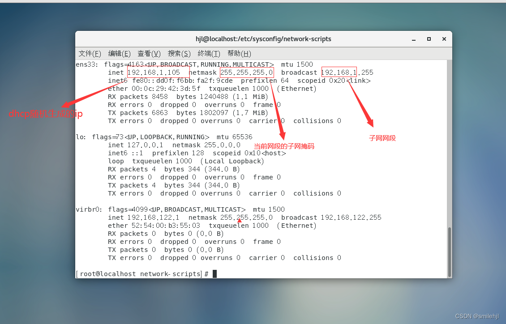
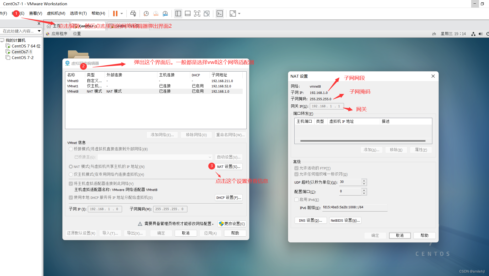
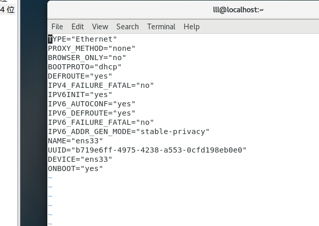
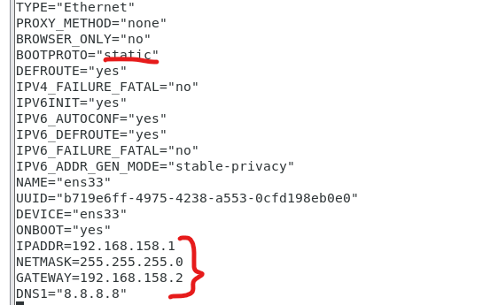

# 认识Linux

**操作系统**

 定义：操作系统(Operating System，简称OS)是管理计算机硬件与软件资源的计算机程序

 作用：是把计算机系统中对硬件设备的操作封装起来，供应用软件调用，也是提供一个让用户与系统交互的操作界面。

**操作系统简单分类**

- **Windows:** 目前最流行的个人桌面操作系统 ，不做多的介绍，大家都清楚。
- **Unix：** 最早的多用户、多任务操作系统 .按照操作系统的分类，属于分时操作系统。Unix 大多被用在服务器、工作站，现在也有用在个人计算机上。它在创建互联网、计算机网络或客户端/服务器模型方面发挥着非常重要的作用。
- **Linux:** Linux是一套免费使用和自由传播的类Unix操作系统.Linux存在着许多不同的Linux版本，但它们都使用了 **Linux内核** 。Linux可安装在各种计算机硬件设备中，比如手机、平板电脑、路由器、视频游戏控制台、台式计算机、大型机和超级计算机。严格来讲，Linux这个词本身只表示Linux内核，但实际上人们已经习惯了用Linux来形容整个基于Linux内核，并且使用GNU 工程各种工具和数据库的操作系统。

**Linux的分类**

- **内核版本：** Linux不是一个操作系统，严格来讲，Linux只是一个操作系统中的内核。内核是什么？内核建立了计算机软件与硬件之间通讯的平台，内核提供系统服务，比如文件管理、虚拟内存、设备I/O等；
- **发行版本：** 一些组织或公司在内核版基础上进行二次开发而重新发行的版本。Linux发行版本有很多种（ubuntu和CentOS用的都很多，初学建议选择CentOS）

# vmware和centos安装与配置

[vm和linux的安装](https://blog.csdn.net/weixin_52799373/article/details/124324077?ops_request_misc=%257B%2522request%255Fid%2522%253A%2522171506120616800182745117%2522%252C%2522scm%2522%253A%252220140713.130102334..%2522%257D&request_id=171506120616800182745117&biz_id=0&utm_medium=distribute.pc_search_result.none-task-blog-2~all~top_positive~default-1-124324077-null-null.142^v100^pc_search_result_base2&utm_term=vmware%E8%99%9A%E6%8B%9F%E6%9C%BA%E5%AE%89%E8%A3%85%E6%95%99%E7%A8%8B&spm=1018.2226.3001.4187)

## 静态ip配置

**为什么要设置静态ip**

设置静态ip的必要性：一般我们的虚拟机默认使用的是dhcp协议（根据网段自动分配ip），所以如果我们不设置静态ip的话，虚拟机会自动分配一个IP，虽然可以联网，但当网络断开或者电脑关机后ip地址就会随机改变，这显然不是我们想要的。而设置静态ip，ip会一直不变，方便我们连接虚拟机。

### 1.获取配置静态ip需要知道的信息

设置静态ip我们需要知道的信息

- 子网的网段
- 子网掩码
- 子网网关
- DNS

具体步骤如下：

首先使用命令：ifconfig

**查看当前网段的信息**



通过这个命令可以大概确定子网网段等信息，但网关等其他信息没有。

**编辑网络编辑器查看具体信息**



在图中三个网络适配器中，很明显第三个vwnet8这个网段和随机ip的网段时一样的，所以选择这个网络适配器，然后点开里面的NAT配置，就可以看到我们需要的网段信息和网关信息了

注意（重点）：一般默认的网络适配器只有vwnet8和vwnet1这二个，如果这二个原本对应的网段没有和随机ip的网段一样的话，就修改vwnet8这个网段的信息，配置成和随机ip的一样的网段

这里因为我以前配置过，当前适配器网段和随机ip网段一样，就可以用了

这里得到的信息如下：

子网网段：192.168.1. 0（最后一位0-255的数都可以）

子网掩码：255.255.255.0

子网网关：192.168.1.1     #这个你可以自己自定义（只能改最后的那个数）

DNS:域名解析协议（一般使用8.8.8.8 和当前wifi的DNS就可以了）

### 2.修改配置文件

打开命令行，使用su命令切换到root用户执行：`vim /etc/sysconfig/network-scripts/ifcfg-ens





### 3.重启网络

命令：`systemctl restart network`

重启后可以看到ip变成我们自己设置的，还有可以ping 通百度，就代表完成了

# linux文件与路径

linux没有盘符，只有一个根目录/，所有文件都在它下面。如下图所示：


## 1.HOME目录

每一个用户在Linux系统中都有自己的专属工作目录，称之为HOME目录。

- 普通用户的HOME目录，默认在：`/home/用户名`

- root用户的HOME目录，在：`/root`

FinalShell登陆终端后，默认的工作目录就是用户的HOME目录

## 2.相对路径、绝对路径

- 相对路径，非`/`开头的称之为相对路径

  相对路径表示以`当前目录`作为起点，去描述路径，如`test/a.txt`，表示当前工作目录内的test文件夹内的a.txt文件

- 绝对路径，以`/`开头的称之为绝对路径

  绝对路径从`根`开始描述路径

## 3.特殊路径符

- `.`，表示当前，比如./a.txt，表示当前文件夹内的`a.txt`文件
- `..`，表示上级目录，比如`../`表示上级目录，`../../`表示上级的上级目录
- `~`，表示用户的HOME目录，比如`cd ~`，即可切回用户HOME目录

# 基本命令1

[指令大全](https://blog.csdn.net/weixin_43424363/article/details/124237304?ops_request_misc=%257B%2522request%255Fid%2522%253A%2522171507983116800178513589%2522%252C%2522scm%2522%253A%252220140713.130102334..%2522%257D&request_id=171507983116800178513589&biz_id=0&utm_medium=distribute.pc_search_result.none-task-blog-2~all~top_positive~default-1-124237304-null-null.142^v100^pc_search_result_base2&utm_term=linux%E5%91%BD%E4%BB%A4&spm=1018.2226.3001.4187)

## cd/ls/pwd

**cd命令**

功能：切换工作目录

语法：`cd [目标目录]`

参数：目标目录，要切换去的地方，不提供默认切换到`当前登录用户HOME目录`

**pwd命令**

功能：展示当前工作目录

语法：`pwd`

**ls命令**

功能：列出文件夹信息

语法：`ls [-l -h -a] [参数]`

- 参数：被查看的文件夹，不提供参数，表示查看当前工作目录
- -l，以列表形式查看，**或者直接使用ll命令**
- -h，配合-l，以更加人性化的方式显示文件大小
- -a，显示隐藏文件

## touch/mkdir

**touch命令**

功能：创建文件

语法：`touch 参数`

- 参数：被创建的文件路径

**mkdir命令**

功能：创建文件夹

语法：`mkdir [-p] 参数`

- 参数：被创建文件夹的路径
- 选项：-p，可选，添加路径，自动建立好那些尚不存在的目录

## rm/mv/cp

**rm命令**

功能：删除文件，每次删除默认后有提示,输入（y/n）确定

语法：`rm [-r -f] 参数...参数`

- 参数：支持多个，每一个表示被删除的，空格进行分隔
- 选项：-r，**删除文件夹**使用，递归
- 选项：-f，强制删除，不会给出确认提示，一般root用户会用到

**mv命令**

功能：移动文件、文件夹

语法：`mv 参数1 参数2`

- 参数1：被移动的
- 参数2：要移动去的地方，参数2如果不存在，则会进行改名

**cp命令**

功能：复制文件、文件夹

语法：`cp [-r] 参数1 参数2`

- 参数1，被复制的
- 参数2，要复制去的地方
- 选项：**-r，可选，复制文件夹使用**

示例：

- cp a.txt b.txt，复制当前目录下a.txt为b.txt
- cp a.txt test/，复制当前目录a.txt到test文件夹内
- cp -r test test2，复制文件夹test到当前文件夹内为test2存在

## cat/more/grep

**cat命令**

功能：查看文件内容

语法：`cat 参数`

- 参数：被查看的文件路径

**more命令**

功能：查看文件，可以支持翻页查看

语法：`more 参数`

- 参数：被查看的文件路径
- 在查看过程中：
  - `空格`键翻页
  - `q`退出查看

**grep命令**

功能：过滤关键字

语法：`grep [-n] 关键字 文件路径`

- 选项-n，可选，表示在结果中显示匹配的行的行号。
- 参数，关键字，必填，表示过滤的关键字，带有空格或其它特殊符号，建议使用””将关键字包围起来
- 参数，文件路径，必填，表示要过滤内容的文件路径，可作为内容输入端口


# 基本命令2

## chmod/chown

**chmod命令**

功能：修改文件、文件夹权限

语法：`chmod [-R] 权限 参数`

- 权限，要设置的权限，比如755，表示：`rwxr-xr-x`
- 参数，被修改的文件、文件夹
- 选项-R，设置文件夹和其内部全部内容一样生效

**chown命令**

功能：修改文件、文件夹所属用户、组

语法：`chown [-R] [用户][:][用户组] 文件或文件夹`

- 选项-R，通chmod
- 选项，用户，修改所属用户
- 选项，用户组，修改所属用户组
- ：用于分隔用户和用户组

## which/find 

**which命令**

功能：查看某个命令的程序本体文件路径

语法：`which 参数`

- 参数：被查看的命令

**find命令**

功能：搜索文件

语法1按文件名搜索：`find 路径 -name 参数`

- 路径，搜索的起始路径
- 参数，搜索的关键字，支持通配符*， 比如：`*`txt表示搜索任意以txt结尾的文件

## wc 统计

**wc命令**

功能：统计

语法：`wc [-c -m -l -w] 文件路径`

- 选项，-c，统计bytes数量
- 选项，-m，统计字符数量
- 选项，-l，统计行数
- 选项，-w，统计单词数量
- 参数，文件路径，被统计的文件，可作为内容输入端口

## 管道符|

写法：`|`

功能：将符号左边的结果，作为符号右边的输入

示例：`cat a.txt | grep itheima`，将cat a.txt的结果，作为grep命令的输入，用来过滤`itheima`关键字

## echo命令

功能：输出内容

语法：`echo 参数`

- 参数：被输出的内容


## env

功能：查看系统全部的环境变量

语法：`env`

# 常用操作

## su/sudo

**su命令**

功能：切换用户

语法：`su [-] [用户]`

- -表示切换后加载环境变量，建议带上
- 用户可以省略，默认为root用户

**sudo命令**

功能：让一条普通命令带有root权限

语法：`sudo 其他命令`

## ifconfig/hostname

ifconfig命令

查看ip：`ifconfig`

**主机名**

功能：Linux系统的名称

查看：`hostname`

设置：`hostnamectl set-hostname 主机名`

## ps/kill/lsof/nmap/netstat 进程操作

**ps命令**

功能：查看进程信息

语法：`ps -ef`，查看全部进程信息，可以搭配grep做过滤：`ps -ef | grep xxx`

**lsof -i:80**

查看端口占用的进程

**kill命令**

功能：关闭进程

语法：kill [-9] 进程ID

- 选项-9，表示强制关闭进程。不使用此选项会向进程发送信号要求其关闭，是否关闭要看进程自身

**nmap命令**

功能：查看端口的占用情况

语法：nmap 被查看的IP地址

**netstat命令**

功能：查看端口占用

用法：`netstat -anp|grep 端口号`

windows

netstat -ano|findstr 8080

## ping

**ping命令**

测试网络是否联通

语法：`ping [-c num] 参数`

- 选项：-c，检查的次数，不使用将无限次数的检查
- 参数：ip或主机名，被检查的IP地址或主机名地址

## 压缩解压

`tar -zcvf 压缩包 被压缩1...被压缩2...被压缩N`

- -z，表示使用gzip，可以省略

`zip [-r] 参数1 参数2 参数N`

- -r，包含文件夹的压缩

`tar -zxvf 被解压的文件 -C 要解压去的地方`

- -z表示使用gzip，可以省略
- -C，可以省略，指定要解压去的地方，不写解压到当前目录

`unzip [-d] 参数`

- -d，指定要解压去的位置
- 参数，被解压的压缩包文件

## **暴露端口**

**防火墙需要开启，修改后，需要重启防火墙**

查看暴露的端口号：`iptables-save`

开放端口号：`firewall-cmd --zone=public --add-port=80/tcp --permanent`

重新加载：`firewall-cmd --reload`

## 防火墙

通过systemctl status firewalld 查看防火墙状态

通过systemctl stop firewalld 暂时关闭防火墙，就可以访问了

**查看firewall服务状态**

执行命令：`systemctl status firewalld`

出现Active: active (running)且高亮显示则表示是启动状态
出现Active: inactive (dead)灰色表示停止

查看firewall的状态

执行命令：firewall-cmd --state

**开启\重启\关闭firewalld.service服务**

开启：`service firewalld start`
重启：`service firewalld restart`
关闭：`service firewalld stop`

**查询、开放、关闭端口**

查询80端口是否开放：firewall-cmd --query-port=80/tcp
no表示不开放
yes表示开放

开放80端口：firewall-cmd --permanent --add-port=80/tcp

移除开放的80端口：firewall-cmd --permanent --remove-port=80/tcp

重启防火墙(修改配置后要重启防火墙)：firewall-cmd --reload


# vi编辑器

## 1.基本使用

vi filename

- i 进入编辑模式
- esc退出编辑模式
- :wq保存并退出
- :q!不保存直接退出

vim 有三种模式：

**命令模式（默认的模式）**

可以查看文件内容，移动光标

通过vim进入的默认就是这种模式

另外二种模式都需要进入命令模式后，才能进去彼此

**插入模式：**

在插入模式下可以对文本进行编辑

在命令模式下按a，i，o任意的键，可以进入插入模式

在插入模式在按Esc回到命令模式

**底行模式**

底行模式可以对文本进行查找，显示行号，退出等操作

按：或 /任意一个可以进入底行模式

通过/方式进入的底行模式后，可以对文件内容进行修改

通过：方式进入底行模式后，可以输入wq保存退出，输入q!不保存退出

## 2.插入命令

| 命令 | 作用                 |
| ---- | -------------------- |
| a    | 在光标所在字符后插入 |
| A    | 在光标所在行尾插入   |
| i    | 在光标所在字符前插入 |
| I    | 在光标所在行行首插入 |
| o    | 在光标下插入新行     |
| O    | 在光标上插入新行     |

## 3.定位命令 

| 命令       | 作用       |
| ---------- | ---------- |
| ：set nu   | 设置行号   |
| ：set nonu | 取消行号   |
| gg         | 到第一行   |
| GG         | 到最后一行 |
| nG         | 到第n行    |
| ：n        | 到第n行    |
| $          | 移至行尾   |
| 0          | 移至行首   |

## 4.删除命令

| 命令    | 作用                         |
| ------- | ---------------------------- |
| x       | 删除光标所在处字符           |
| nx      | 删除光标所在处后n个字符      |
| dd      | 删除光标所在行，ndd删除n行   |
| dG      | 删除光标所在行到文件末尾内容 |
| D       | 删除光标所在处到行尾内容     |
| :n1,n2d | 删除指定范围的行             |

## 5.复制和剪切命令

| 命令 | 作用                           |
| ---- | ------------------------------ |
| yy   | 复制当前行                     |
| nyy  | 复制当前行以下n行              |
| dd   | 剪切当前行                     |
| ndd  | 剪切当前行以下n行              |
| p、P | 粘贴在当前光标所在行下或者行上 |

## 6.保存和退出命令

| 命令       | 作用                                                     |
| ---------- | -------------------------------------------------------- |
| ：w        | 保存修改                                                 |
| ：w 文件名 | 另存为指定文件                                           |
| ：wq       | 保存修改并退出                                           |
| ZZ         | 快捷键，保存修改并退出                                   |
| ：q！      | 不保存修改退出                                           |
| ：wq！     | 保存修改退出（文件所有者和root均可忽略只读权限强制写入） |

# 快照和克隆


# shell命令


# 问题

linux共享文件夹失效

#### 安装vm-tools命令包

```vim
sudo apt-get install open-vm-tools
```

#### 挂载

```jboss-cli
sudo vmhgfs-fuse .host:/ /mnt/hgfs -o allow_other
```
