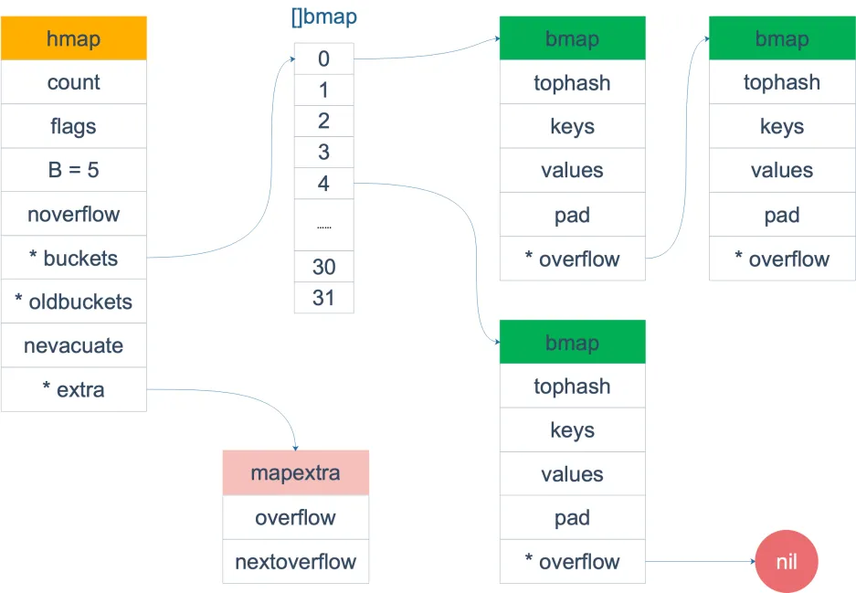
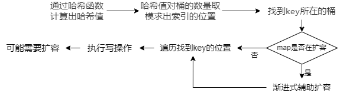
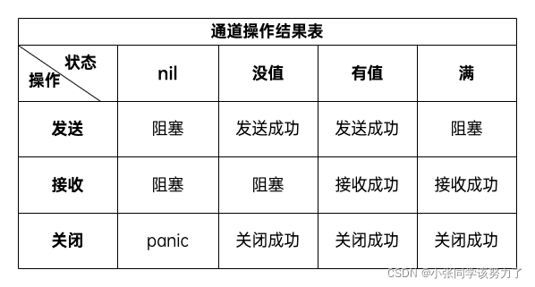

# MySQL

## 基础

### 数据库三大范式是什么？

第一范式（1NF）：表红每一列都是不可分割的原子项

第二范式（2NF）：在满足1NF的基础上，主要是说在联合主键的情况下，非主键列不能只依赖于主键的一部分，要完全依赖所有主键。

第三范式（3NF）：在满足2NF的基础上，要求表中的非主键属性之间**没有传递依赖关系。**

### MySQL的执行流程

- **建立连接**：mysql是基于tcp协议传输数据的，所以要进行tcp三次握手与服务器建立连接
- **查询缓存**：如果是查询语句，就先会根据sql语句先去缓存中查找结果，找到了直接返回结果，没找到就继续执行。MySQL 8.0 版本直接将查询缓存删掉了
- **解析SQL**：通过分析器进行**词法分析和语法分析**，提取出SQL语句中的关键字，构建出语法树，根据提取出的关键字判断sql语句是否正确
- **执行SQL**：在执行前先要进行**预处理以及优化阶段**，预处理阶段先检查字段是否存在，将select的*扩展成所有的列，优化阶段通过优化器选择合适的索引，最后执行器里执行操作，返回结果。

### InnoDB Compat行格式


**记录的额外信息**

- **变长字段长度列表**：记录各个变长字段varchar(n)真实占用字节数

- **NULL值列表**：每个非NOT NULL字段组成的二进制bit位，1表示为NULL,0表示不是NULL。注意NULL 值列表必须用整数个字节的位表示（1字节8位），如果使用的二进制位个数不足整数个字节，则在字节的高位补0。`当数据表的字段都定义成 NOT NULL 的时候，这时候表里的行格式就不会有 NULL 值列表了`。

- **记录头信息**：包含多个字段，delete_mask、delete_mask，record_type等

**记录的真实数据**

  **包含三个隐藏字段和记录中每个列的值**

  - row_id 如果我们建表的时候指定了主键或者唯一约束列，那么就没有 row_id 隐藏字段了。如果既没有指定主键，又没有唯一约束，那么 InnoDB 就会为记录添加 row_id 隐藏字段。row_id不是必需的，占用 6 个字节。
  - trx_id 这个数据是由哪个事务生成的，占用 6 个字节
  - roll_pointer 记录上一个版本的指针。占用 7 个字节

### MyISAM与InnoDB存储引擎有什么区别？

myisam不支持事务、外键、行级锁

**MyISAM只支持表级锁**，更新时会锁住整张表，导致其它查询和更新都会被阻塞，**InnoDB支持行级锁**。

### 数据库优化方式

## 索引

### 什么是索引？

索引就是一种**将数据库中的记录按照特殊形式存储的一种有序的数据结构**。就类似一本书的目录（举例），它维护了表中某些列的值以及对应的行指针。能够显著地提高数据查询的效率。

### 索引有哪些种类？

#### 从数据结构的角度

- **B+树索引**:所有数据存储在叶⼦节点，复杂度为O(logn)，适合范围查询。
- **哈希索引**:适合等值查询，检索效率⾼，⼀次到位
- **全⽂索引**: MyISAM 和 InnoDB 中都⽀持使⽤全⽂索引，⼀般在⽂本类型char，text，varchar
  类型上创建

#### 从物理存储的角度

- **聚簇存储**： B+Tree 的叶子节点存放的是实际数据，所有完整的用户记录都存放在主键索引的 B+Tree 的叶子节点里；**`聚簇索引在创建表时自动创建，默认就是主键索引`**，聚簇索引只能有一个。
- **二级存储**： B+Tree 的叶子节点存放的是主键值，而不是实际数据，**要进行回表**。**`手动创建的索引都是是二级存储的。`**

#### 基本类型分类

- **主键索引**:建立在主键字段上的索引，一张表只能有一个主键索引，主键值不允许有空值。
- **唯⼀索引**:索引列中的值必须是唯⼀的，一张表可以有多个，但是允许为空值
- **普通索引**:MySQL中基本索引类型，允许空值和重复值
- **联合索引**:为多个字段创建的索引，使⽤时遵循最左前缀原则


**覆盖索引**

在查询时使用了二级索引，**如果查询的列能在二级索引里查询的到，那么就不需要回表，这个过程就是覆盖索引**。如果查询的数据不在二级索引里，就会先检索二级索引，找到对应的叶子节点，**获取到主键值后，然后再检索主键索引，就能查询到数据了，这个过程就是回表**。

**索引下推**

在联合索引遍历过程中，对联合索引中包含的字段先做判断，直接过滤掉不满足条件的记录，减少回表次数。

### InnoDB 数据页查找，B+树查找过程

InnoDB 的数据是按「数据页」为单位来读写的，数据页的默认大小是 16KB

每一页包含一个**页目录**，通过通过页目录进行**二分查找**找到对应的记录。时间复杂度为O(logn)

在B+树中每个节点都是一个数据页，它们通过指针构成一个树结构，其中非叶子节点中的页是索引页，存的是索引，也就是其他页的定位信息。叶子节点是数据页，里面存的是实际的数据。

**找到对应记录的定位信息后就可以定位到下次层中的页节点**，直到叶子节点，然后根据页目录二分查找到对应记录

### 讲一讲索引数据结构，为什么使用B+树？

可以作为索引的数据结构有很多种，但最好的数据结构应在**尽可能少的磁盘IO完成查询，且能够高效的查询一个记录和范围查询。**

**二叉搜索树**是一种天然的二分结构，利用二分查找定位数据，但是它存在一种极端的情况，就会导致二分查找树**退化成一个链表**，此时查询复杂度就会从 O(logn)降低为 O(n)。

**平衡二叉树**。左右子树高度之差不超过1，它解决了二分查找树退化成链表的问题。但是它**本质上还是一个二叉树**，每个节点只能有 2 个子节点，随着元素的增多，**树的高度会越来越高**，**磁盘io次数也越多**。

**B树和B+树，**都是通过多叉树的方式，会将树的高度变矮，所以这两个数据结构非常适合检索存于磁盘中的数据。

- **B+ 树的非叶子节点不存放实际的记录数据，仅存放索引**，因此数据量相同的情况下，相比存储只存索引又存记录的 B 树，B+树的非叶子节点可以存放更多的索引，因此 **B+ 树可以比 B 树更「矮胖」**，查询底层节点的磁盘 I/O次数会更少。
- **B+ 树有大量的冗余节点**（**叶子节点包含了非叶子节点中的索引**），这些冗余索引让 B+ 树在**插入、删除时，结构变化不大，效率更高**，B树删除节点时，结构变化更复杂。
- **B+ 树节点之间用双向链表连接了起来**，**有利于范围查询**，而 B 树要实现范围查询，因此只能通过树的遍历来完成范围查询，这会涉及多个节点的磁盘 I/O 操作，范围查询效率不如 B+ 树。

### 页分裂


### 索引优缺点

优点就是提高了查询效率，但也有**缺点**：

- 需要**占用物理空间**，数据数量越大，索引占用空间越大；
- 会**降低表的增删改的效率**，因为每次增删改数据时都要修改索引，B+ 树为了保证索引有序性，都需要进行动态维护，而且数据量越大，性能损失越大。

### 什么时候需要/不需要索引？

以下情况需要创建索引

- **经常使用where查询**的字段，建立索引提高查询效率
- 查询时**字段需要通过ORDER BY对某个字段进行排序**，可以为其建立索引避免在查询时进行排序，因为建立索引之后在 B+Tree 中的记录都是排序好的。
- 某个字段需要**唯一性约束时**，必须对其创建唯一性索引

以下情况不需要创建索引

- **表记录太少**，使用索引优化不大
- **很少被where指定查询的列**不需要建立索引，创建索引可能没有明显的性能提升。
- **频繁插入更新删除的字段**不用创建索引，由于要维护 B+Tree的有序性，那么就需要频繁维护B+树，这个过程是会影响数据库性能的
- **字段中存在大量重复数据且分布平均**，不需要创建索引，比如性别字段，只有男女，如果数据库表中，男女的记录分布均匀，那么无论搜索哪个值都要查找一半的数据。

### 最左匹配原则与索引下推

#### 最左匹配原则

联合索引B+树叶子节点数据中只有第一个索引字段是有序的，后面的字段都是局部有序的，也就是只有在前面字段都相等的情况下才是有序的。因此联合索引查询有一个最左匹配原则

**`最左匹配原则`就是要求查询条件中的列必须按照联合索引中列的顺序从左到右依次出现，才能有效利用索引。联合索引查询中如果某个索引字段没有出现或者匹配失败，那么这个索引字段以及后面的索引字段都不会被利用到，而是通过当前查询到的id进行回表查询，然后再通过这些没判定过的字段进行过滤，增加了回表查询的工作量。**

注意：

- 范围查询会让后面的字段匹配失败，而左模糊或左右模糊匹配会让所有字段匹配失败，因为第一个字段无法匹配成功。
- 查询条件中的字段的顺序对匹配无影响，因为mysql的优化器会自动优化顺序选择索引。

#### 讲一下索引下推

**索引下推是mysql5.6推出的`联合索引`查询优化方案**，在5.6版本之前的联合索引查询中，如果某些字段最左匹配原则匹配失败，那么这些字段就不会走索引，而是在进行回表查询后，将查询到的数据交给server层通过这些查询条件进行进一步过滤，才得出最终的结果。而索引下推做出了优化，将查询条件下推到存储引擎层面进行处理，也就是直接通过索引字段的值进行判断是否符合条件进行筛选，然后再去执行回表查询。

- 减少了回表查询的次数，降低了磁盘IO开销。
- 避免将不符合条件的数据行读取到内存中，从而减少不必要的数据读取和传输。

### 索引优化方式？

#### 覆盖索引优化

**通过数据库二级索引查询只需要查询某些字段时，在索引 B+Tree 的叶子节点上就能得到所需字段的值**，从而得到记录，可以避免回表查询聚簇索引的操作，减少了大量的磁盘IO操作。

**假设我们现在有个业务需要查询商品的名称、价格（举例），**我们**可以建立一个联合索引**，即「商品ID、名称、价格」作为一个联合索引。因为叶子节点索引中存在我要的这些字段，查询将不会再次检索主键索引，而**避免回表**。

#### 前缀索引优化

前缀索引顾名思义就是**使用某个字段中字符串的前几个字符建立索引**，**减小索引字段大小，可以增加一个索引页中存储的索引值，B+树的层次也就更少，有效提高索引的查询速度。**通过可以为一些大字符串的字段建立前缀索引，但前缀索引无法用作覆盖索引；

#### 使用自增主键

**对于主键索引，尽量使用自增主键**，因为每次**插入一条新记录主键都是最大的，插入时都是追加操作，不需要重新移动数据**，因此这种插入数据的方法效率非常高。当页面写满，就会自动开辟一个新页面。

**如果我们使用非自增主键**，由于每次插入主键的索引值都是随机的，就可能会**插入到现有数据页中间的某个位置**，造成页分裂问题，这将不得不移动其它数据，甚至需要从一个页面复制数据到另外一个页面。`页分裂`**还有可能会造成大量的内存碎片，导致索引结构不紧凑，从而影响查询效率**。

#### 防止索引失效

使用sql查询语句时防止索引失效而全表扫描。

### 索引失效

#### 索引失效有哪些情况

- **最左匹配原则**：联合索引查询不符和**最左匹配原则**可能会有部分索引列失效，比如等值查询某些字段缺失或使用了<、>、like等范围查询，都会导致这个索引字段后面的字段失效
- **左模糊或左右模糊查询**：当我们使用**左或者左右模糊匹配**的时候，也就是 `like %xx` 或者 `like %xx%`这两种方式都会造成索引失效，不符和最左匹配原则；
- **or查询**：在 WHERE 子句中，如果在 OR 条件有字段不是索引，那只能全表扫描。
- **使用函数**：当我们在查询条件中**对索引列使用函数**，就会导致索引失效。`where length(name)=6;`因为索引保存的是索引字段的原始值，而不是经过函数计算后的值，自然就没办法走索引了
- **出现隐式类型转换**：查询条件中如果列类型不一致，就可能出现隐式类型转换，比如索引字段是整数，而将它与字符串进行比较。

## 事务

### 说说ACID/事务的特性

**原子性（Atomicity）**：事务的所有操作是一个整体，要么全部成功，要么全部失败，不能只完成一部分

**一致性（Consistency）**：数据从一个一致性的状态转移到另一个一致性的状态，不会存在中间状态，数据满足完整性约束，比如说向商家付款（举例），自己的账户余额要减少，而商家的账户余额会增加对应的数值。不会出现用户余额或商家余额未变化，或者变化不一致的情况。

**隔离性（Isolation）**：数据库允许多个并发事务同时对其数据进行读写和修改的能力。不会出现多个事务并发执行而导致数据不一致的情况。

**持久性（Durability）**：事务处理结束后，对数据的修改就是永久的。

### 并发事务会引发什么问题？

**脏读**：如果一个事务修改了数据还没有提交，此时另一个数据读到了这个未提交但是修改过的数据，就意味着发生了「脏读」现象。

**不可重复读**：**`在一个事务内`**多次读取**`同一个数据`**，`另一个事务修改了数据`，导致出现前后两次读到的数据不一样的情况，就意味着发生了「不可重复读」现象。

**幻读**：**`在一个事务内`**多次查询**`某一范围的数据`**，`另一个事务新增或删除了数据`，导致出现前后两次查询到的记录数量不一样的情况，就意味着发生了「幻读」现象。

### 事务的隔离级别，InnoDB使用哪种级别？

- **读未提交（read uncommitted）**，指一个事务还没提交时，它做的变更就能被其他事务看到；
- **读提交（read committed）**，指一个事务提交之后，它做的变更才能被其他事务看到；**避免了脏读**
- **可重复读（repeatable read）**，指一个事务执行过程中看到的数据，一直跟这个事务启动时看到的数据是一致的。**避免了不可重复读**
- **串行化（serializable）**，串行化隔离级别下，数据库系统确保事务之间的并发执行具有串行化的效果，即每个事务都像是按顺序执行一样，不存在并发执行的情况

InnoDB存储引擎使用的是可重复读级别

### 说一下你了解的MVCC

MVCC，**多版本并发控制**，是**读已提交**和**可重复读**事务隔离级别**无锁**的底层实现方式。主要由两部分组成一个是**`undo log版本控制以及readview快照隔离。`**

当一个事务每次对数据记录进行修改后，就会把旧版本的数据存进`undo日志`中，通过`roll_pointer回滚指针`连接起来构成一个链表，于是就可以通过它找到修改前的记录。

readview快照记录了创建当前快照时活跃中的事务id列表以及最小和最大的活跃事务id。当事务读取数据记录时会创建一个快照，并通过行记录中的**trx_id即最后修改该记录的事务id**与**快照中活跃的id列表**进行判断来决定是否可读。

- 如果trx_id小于当前活跃事务的最小id，表明创建这个版本的记录的事务已经提交了，可以读取这个数据
- 如果trx_id大于当前活跃事务的最大id，表明这个版本记录是在创建快照后生成的，不可以读取这个数据
- 如果trx_id在最小和最大活跃事务的id列表之间的话，就要判断它是否在活跃事务id列表中，如果在的话表明这个事务还未提交，不能读取，否则可以读取。

如果不能读取的话要**沿着undo log版本链往下找一个旧的记录，进行同样的判断，直到查找到一个合适的版本的记录。**

读提交和可重复读隔离级别的实现区别就在于生成read view的时机不同。

- 读提交隔离级别是在**每次读取数据前都会重新生成一个 `Read View`，**保证了每次读取到的数据都是别的事务已经提交后的数据。
- 可重复读隔离级别**是启动事务时生成一个 Read View，**然后整个事务期间都在用这个 Read View。保证了事务中每次重复读取得到的数据都是一样的。

### 幻读是怎么解决的？

- 针对**快照读**（普通 select 语句），是**通过 MVCC 方式读取旧版本的数据解决了幻读**，因为可重复读隔离级别下，事务执行过程中看到的数据，一直跟这个事务启动时看到的数据是一致的，即使中途有其他事务插入了一条数据，是查询不出来这条数据的，所以就很好了避免幻读问题。
- 针对**当前读**（select ... for update 等语句），因为当前读只会读取最新数据，**通过 next-key lock（记录锁+间隙锁）方式解决了幻读**，因为当执行 select ... for update 语句的时候，会加上 next-key lock，如果有其他事务在 next-key lock 锁范围内插入了一条记录，那么这个插入语句就会被阻塞，无法成功插入，所以就很好了避免幻读问题。

#### 可重复读隔离级别完全解决了幻读吗？

通过mvcc以及临建锁并没有完全解决幻读问题，还有一些特殊情况。

- **当前事务通过update，修改了另一个事务insert的新数据。**导致新数据的undo log版本链中的trx_id = 当前事务id。由于trx_id == creator_id，就让事务误以为这条数据是自己创建的，所以导致ReadView可以看见这条数据了。
- **如果当前事务第一次快照读之后，另一个事务插入了一条数据，而当前事务又进行当前读**，那么就可以读取到这条新插入的记录。

## 锁

### mysql有哪些锁作用是什么？

#### 表级锁

表级锁锁住的是一整张表，锁粒度最大，不会出现死锁问题，但是并发程度很低

- **元数据锁（MDL）**：**对数据库表进⾏操作时**，会⾃动给这个表加上元数据锁，防止crud操作时，变更表的结构，或者变更表的结构时，进行crud操作。

- **意向锁**：当我们需要给一个表加表锁的时候，我们需要根据去判断表中有没有数据行被锁定，以确定是否能加成功，通过意向锁这个表级锁可以**快速判断表里是否有记录被加锁**。当对行记录加上共享锁或独占锁时，需要在表级别加上意向共享锁或意向独占锁。

- **AUTO-INC 自增锁**：当表中主键设置成自增主键后，**在插入数据时，会加一个表级别的 AUTO-INC 锁**，然后为自增主键赋自增的值，执⾏完成后，才会把 AUTO-INC 锁释放掉。从⽽**保证插⼊数据时字段的值是连续递增的。**

#### 页级锁

它锁定的是数据库的某一”页”，页锁是介于表锁和行锁之间的锁策略，这个”页”中包含了很多行。页锁的开销和死锁可能性介于表锁和行锁之间。

#### 行级锁

锁住某些记录或某些间隙，行级锁锁的粒度很小，事务的并发度很高，但会出现死锁。

- **记录锁（record lock）**：锁住的是一条索引记录。防止记录被其他事务修改，解决不可重复读的问题。而且记录锁是有 S 锁和 X 锁之分的
- **间隙锁**：锁住的是一个范围，只存在于可重复读隔离级别，防止记录的解决可重复读隔离级别下幻读的现象。间隙锁之间是兼容的，两个事务可以同时持有包含共同间隙范围的间隙锁，并不存在互斥关系。
- **Next-Key Lock**：Next-Key Lock临键锁，是 Record Lock + Gap Lock 的组合，锁定⼀个范围，并且锁定记录本身。next-key lock 即能保护该记录，⼜能阻⽌其他事务将新纪录插⼊到被保护记录前⾯的间隙中。
- **插⼊意向锁**：⼀个事务在插⼊⼀条记录的时候，需要判断插⼊位置是否已被其他事务加了间隙锁（next-key lock 也包含间隙锁）。如果有的话，插⼊操作就会发⽣阻塞，直到拥有间隙锁的那个事务提交为⽌，在此期间会⽣成⼀个插⼊意向锁，表明有事务想在某个区间插⼊新记录，但是现在处于等待状态。

### mysql加锁规则

加锁规则要看具体的where条件，等值查询和范围查询会决定加临键锁还是记录锁还是间隙锁。

普通的查询操作不会加锁，共享读会加S型记录锁，当前读会加X型记录锁，

不仅是查询会加行锁，修改操作也会加行锁，而插入操作加插入意向锁，

### mysql锁全表

在线上在执行 update、delete、select ... for update 等具有加锁性质的语句，**如果没走索引而进行全表扫描的话，会对每一个记录加 next-key 锁，相当于把整个表锁住了，这是挺严重的问题**。

### mysql中的死锁，以及如何解决？

mysql中的死锁是因为多个事务互相操作已经被锁定的资源，都等待对方锁的释放以至无法继续执行。

- 首先事务a修改了记录1，对其加了记录锁
- 此时事务b修改了记录2，也对其加了记录锁
- 然后事务a去修改记录2，而记录2已经被事务b锁定，所以事务a只能阻塞
- 事务b这时也去修改记录1，而记录1已经被事务a锁定，所以事务b也会阻塞

## 日志

### 事务是如何通过日志实现的？

以数据更新为例

- 首先查询InnoDB存储引擎中的buffer pool，缓存命中就直接返回给执行器，否则查询磁盘获取记录
- 开启事务，InnoDB 层**更新记录前**，首先要记录相应的 undo log，将其记录到buffer pool缓存中的undo log日志页中并标记为脏页，同时用redo log日志记录对undo log日志页的修改。
- 然后更新内存并标记为脏页，**更新记录后**将页面的修改记录到 redo log 里面，后续由后台线程选择一个合适的时机将脏页写入到磁盘。这就是 **WAL 技术**
- **事务提交的时候**，server层开始记录该语句对应的 binlog

### mysql有哪些日志文件？

- 错误日志（error log）：错误日志文件对MySQL的启动、运行、关闭过程进行了记录，能帮助定位MySQL问题。
- 慢查询日志（slow query log）：记录了执行时间超过指定阈值的查询语句。通过慢查询日志，可以知道哪些查询语句的执行效率很低，以便进行优化。
- 一般查询日志（general log）：一般查询日志记录了所有对MySQL数据库请求的信息，无论请求是否正确执行。
- 二进制日志（bin log）

还有两个 InnoDB 存储引擎特有的日志文件：

- 重做日志（redo log）
- 回滚日志（undo log）
  

### 讲一讲三种日志

#### undo log

每当对数据进行修改前，会把旧版本的数据信息记录到undo log中。**两大作用：**

- **保障事务的原子性**。事务处理过程中，如果出现了错误或者用户执行了 ROLLBACK 语句，MySQL 可以利用 undo log 中的历史数据执行相反的操作将数据恢复到事务开始之前的状态。
- **实现 MVCC（多版本并发控制）关键因素之一**。MySQL 在执行快照读（普通 select 语句）的时候，会根据事务的 Read View 里的信息，顺着 undo log 的版本链找到满足其可见性的旧的记录。控制数据记录对事务的可见性，从而解决事务并发中的不可重复读问题。

#### redo log

redolog 是重做日志，当事务对某页的数据进行修改后，会将这个页的修改**以 redo log 的形式记录下来**（对 XXX 表空间中的 YYY 数据页 ZZZ 偏移量的地方做了AAA 更新）

- **确保事务的持久化。**每次修改数据的时候，并不会立即修改磁盘中的数据，而是先修改当前的Buffer Pool缓存的数据页，后台再慢慢的将缓存中的脏页数据同步的磁盘。而缓存是基于内存，如果断电重启，那么脏页数据就丢失了，但数据库重启后通过redo log就可以读取到修改的操作，重做所有已记录的事务操作，这些已提交的记录就不会丢失，从而确保了事务的持久化，为mysql提供了崩溃恢复的能力。
- **提高性能**。每次修改数据，都是先写日志的策略，提高了事务响应的速度。因为数据页的刷盘操作通常是随机写，性能较差，而写Redo Log则是顺序写，性能较高。

#### bin log

它**记录了数据库中所有的执行语句**，包括数据库表的创建，和数据的增删改等sql语句，保存在二进制文件中。它与redo log很相似，它就相当于数据库的一个备份，可以用来进行主从复制。

### bin log与redo log有什么区别？

- **层次和存储引擎**：bin log是mysql server层的日志，**所有存储引擎都可以使用**，而redo log是innoDB存储引擎特有的，**只记录InnoDB存储引擎的日志**。
- **记录内容**：bin log是**逻辑日志**，记录的是一个事务执行的具体操作语句，而redo log是**物理日志**，记录的是每个数据页的更改情况。
- **写入方式不同**：bin log是**追加写**，写满一个文件，就创建一个新的文件继续写，不会覆盖以前的日志，保存的是全量的日志。redo log 是**循环写**，日志空间大小是固定，全部写满就从头开始覆盖写，保存未被刷入磁盘的脏页日志。
- **作用不同**：redo log用于掉电等故障恢复，bin log用于备份恢复、主从复制等。

### 主从复制（定义，原理）

**主从复制**是用来建立一个与主数据库完全一样的数据库环境，即从数据库。

**原理**

binlog 二进制文件，记录了数据可执行的所有 SQL 语句。主从同步的目标就是把主数据库的 binlog 文件中的 SQL 语句复制到从数据库，让其在从数据的 relaylog 文件中再执行一次这些 SQL 语句即可。

需要三个线程：

- **binlog输出线程**：每当有从库连接到主库时，主库都会创建一个binlog输出线程然后发送 binlog内 容到从库
- **从库IO线程：**当 `START SLAVE` 语句在从库开始执行之后，从库创建一个 IO 线程，该线程连接到主库并接收binlog 里面的更新记录到从库中的relay log中继日志中
- **从库 SQL 线程**：读取中继日志回放binlog，更新数据，实现主从数据库一致性

### 为什么要两阶段提交？两阶段提交过程

## 分库分表

# Redis

## 认识Redis

### Redis是什么？

Redis 是一种基于内存的数据库系统，对数据的读写操作都是在内存中完成，因此读写速度非常快，使用键值对存储数据，并支持多种数据结构.

### 关系型数据库和非关系型数据库有什么区别？

**存储方式**：关系型数据库以表格的形式**结构化存储数据**。非关系型数据库没有固定的格式

**性能**：关系型数据库在处理大量数据时可能会面临性能瓶颈，非关系型数据库处理能力更强。

**数据一致性**：关系型数据库支持事务，可以保证数据的一致性和可靠性

灵活性：结构化查询语言（SQL）进行数据查询和操作，支持复杂的数据查询和分析。非关系型数据库更灵活，不受数据格式限制。

### 常用数据类型及应用场景

#### **string**

内部有**int和SDS动态字符串**实现，常用于：

- 缓存对象：存对象的json，set user:1 '{"name":"xiaolin", "age":18}'
- 常规计数：
- 分布式锁：

#### **list**

内部由**双向列表和压缩列表实现（3.2版本quicklist）**，常用于：

- 消息队列

#### **hash**

内部由**哈希表和压缩列表**实现

**常用于缓存一个对象的各种属性**

- 缓存对象：set user name:zs age:10
- 购物车：用户 id 为 key，商品 id 为 field，商品数量为 value

#### **set**

内部由**哈希表和整数集合**实现，常用于：

- 点赞：因为不能重复点赞，为每个文章存点赞用户id，sadd article:1 user:1
- 共同关注：集合运算，交集计算

#### **zset**

内部由**哈希表和跳表（3.2版本listpack）**实现，常用于：

- 排行榜：
- 电话姓名排序（字典排序）：

### 跳表原理

跳表利用了二分查找的特性，就是一个多层级的链表，上一层的节点个数大概是下一层的一半，每次查找元素的时候从最顶层开始找到第一个大于等于查找值的节点，如果值不相等，就向下一层往回查找，到小于等于查找值的节点，然后顺序查找，重复这个过程。

### redis为什么那么快？

**基于内存**：Redis是一个内存数据库，所有数据都存储在内存中，读写操作在内存中完成，避免了磁盘I/O带来的延迟

**单线程模型**：redis是单线程模型，所有核心操作都是在一个线程中进行的，没有多线程竞争锁的性能消耗，也没有线程切换的开销。

**io多路复用**：通过iO多路复用，通过一个单独的线程管理多个连接，减少了线程创建和销毁的开销，降低了系统资源的占用。

## redis线程模型

### redis是单线程吗？

Redis 单线程指的是「**接收客户端请求->解析请求 ->进行数据读写等操作->发送数据给客户端**」这个过程是由一个线程（主线程）来完成的，这也是我们常说Redis 是单线程的原因。但是，Redis 程序并不是单线程的，Redis 在启动的时候，是会启动后台线程

### 为什么redis后面要有多线程？

## 持久化

### AOF日志原理/优缺点

**追加写操作**：当有写操作（增删改）发生时，Redis会将这些写操作以文本的形式追加到AOF文件末尾。

**文件同步**：Redis会通过系统调用将AOF文件的内容强制刷写到磁盘上，以保证数据的持久性。

**恢复数据**：在Redis重启的时候，会通过加载AOF文件中保存的写操作来恢复数据，重建内存中的数据状态。

**文件重写**：当AOF文件变得过大时，会触发AOF文件的重写。后台子线程会将当前内存中的数据重写到一个新的AOF文件中，并且优化写入操作，减小AOF文件的体积。

### RDB快照原理

redis可以将当前内存中的数据通过子线程保存在文件当中，每次重启redis，会通过加载RDB文件将数据重新读入内存中。

redis默认使用的是RDB持久化

### AOF与RDB的比较

时效性与性能

AOF持久化**时效性**更好，相比于RDB定期快照记录，AOF持久化会实时追加写到AOF文件中。避免了数据丢失的风险。每次写操作都要记录到AOF文件中，文件的体积很大，而且对**性能**有影响。

RDB持久化定期进行的，所以对redis的性能影响小，但如果发生故障还没来得及持久化可能会有数据的丢失

### 混合持久化机制

RDB 优点是**数据恢复速度快，但是快照的频率不好把握**。频率太低，丢失的数据就会比较多，频率太高，就会影响性能。

AOF 优点是**丢失数据少，但是数据恢复不快**。

为了集成了两者的优点， Redis 4.0 提出了混合使用 AOF 日志和内存快照，也叫混合持久化，AOF文件的**前半部分是 RDB 格式的全量数据，后半部分是 AOF 格式的增量数据**。**既保证了 Redis 重启速度，又降低数据丢失风险**

## 功能篇

### 过期删除怎么实现的？

Redis 会把该 key 带上过期时间存储到一个**过期字典**（expires dict）中，也就是说「过期字典」保存了数据库中所有 key 的过期时间。

字典实际上是哈希表，哈希表的最大好处就是让我们可以用 O(1) 的时间复杂度来快速查找。当我们查询一个 key 时，Redis 首先检查该 key 是否存在于过期字典中：

- 如果不在，则正常读取键值；
- 如果存在，则会获取该 key 的过期时间，然后与当前系统时间进行比对，如果比系统时间大，那就没有过期，否则判定该 key 已过期

**三种删除策略**

**定时删除：**在设置key的过期时间时，同时设置一个定时事件，当时间到达时，由事件处理器自动执行 key 的删除操作。

- 内存可以被尽快地释放
- 占用相当一部分 CPU 时间

**惰性删除：**不主动删除过期键，每次从数据库访问 key 时，都检测 key 是否过期，如果过期则删除该 key

- 对 CPU 时间最友好。
- 如果过期 key 一直没有被访问，它所占用的内存就不会释放，造成了一定的内存空间浪费

**定期删除：每隔一段时间「随机」从数据库中取出一定数量的 key 进行检查，并删除其中的过期key**

- 减少了删除操作对 CPU 的影响，同时减少了过期键对空间的无效占用。
- 内存清理方面没有定时删除效果好，同时没有惰性删除使用的系统资源少。

**Redis 选择「惰性删除+定期删除」这两种策略配和使用**，以求在合理使用 CPU 时间和避免内存浪费之间取得平衡。

### 内存淘汰策略

当redis内存满了后，内存淘汰策略删除符合条件的 key。具体有8中内存淘汰策略

- 默认策略不进行数据淘汰，直接返回错误

在过期时间数据中进行淘汰：

- 随机淘汰设置了过期时间的任意键值
- 优先淘汰更早过期的键值
- 淘汰所有设置了过期时间的键值中，最久未使用的键值（lru）
- 淘汰所有设置了过期时间的键值中，最少使用的键值(lfu)

在所有数据中进行淘汰：

- 随机淘汰任意键值
- 淘汰整个键值中最久未使用的键值（lru）
- 淘汰整个键值中最少使用的键值。(lfu)

### 3.Redis持久化怎么处理过期键的？

RDB方式再生成RDB文件时，会直接忽略已过期的键

AOF方式下，对于已过期键写入redis命令时，会加入一条del命令显示删除该键

### 4.主从模式下怎么处理过期键的？


## 高可用

### 1.Redis 如何实现服务高可用？

主从复制、哨兵、集群

### 2.主从复制（意义、策略）

如果数据只存储在一台服务器上，硬盘出现了故障，可能数据就都丢失了。要避免这种单点故障，最好的办法是将数据备份到其他服务器上。**主从复制**解决了多台服务器之间的数据一致性问题。

**主从复制策略**

首先建立连接进行第一次同步，也是**全量同步**，主服务器会执行 bgsave 命令来生成 RDB 文件，然后把文件发送给从服务器

完成第一次同步后，双方之间就会维护一个 TCP 连接。主服务器可以继续将写操作命令传播给从服务器，即**增量同步**

**增量同步失败可能是因为网络断开，从服务器与主服务器断开连接，而从服务器需要的同步缓冲已经被覆盖了。**然而主服务器任何时候都可以发起全量同步，其主要策略就是无论如何首先会尝试进行增量同步，如果失败则会要求 slave 进行全量同步。

### 3.哨兵模式原理

**哨兵**其实是主从模式下一个运行在特殊模式下的 Redis 进程，所以它也是一个节点。

**监控**

哨兵可以监控所有主从节点，判断它们是否正常运行。如果监控到主节点无响应，哨兵就会判断其为**主观下线**。然后向其它哨兵发起投票，达到某一票数后，主节点就会被标记为**客观下线**

**选主**

然后就通过vote投票算法从所有节点中再选出一个主节点。更改相关配置

**通知**

哨兵会通过发布者/订阅者模式通知客户端主节点已经发生变化。客户端就可以跟新主节点进行通信了。

## 缓存问题

### 什么是缓存雪崩、缓存击穿、缓存穿透，各自怎么解决？

#### 缓存雪崩

**大量缓存数据在同一时间过期或者Redis故障宕机**，大量请求直接访问数据库，从而导致数据库压力骤增，严重导致数据库宕机。

- **均匀设置过期时间**，避免数据都同一时间失效。
- **热点数据永不过期**，而是让热点数据缓存“永久有效”，并将更新缓存的工作交由后台线程定时更新。
- **启动服务熔断机制**，暂停业务应用对数据库的访问，直接返回错误

#### 缓存击穿

**某个热点数据过期**了，此时大量的请求访问了该热点数据，就无法从缓存中读取，直接访问数据库，**数据库很容易就被高并发的请求冲垮**

同雪崩

- **热点数据永不过期**，而是让热点数据缓存“永久有效”，并将更新缓存的工作交由后台线程定时更新。

- **启动服务熔断机制**，暂停业务应用对数据库的访问，直接返回错误
- **限流**，限流机制则可以限制对某个热点数据的访问频率，以减轻数据库压力。

#### 缓存穿透

当大量请求查询不存在的数据，缓存未命中，查询数据库，但是数据库不能回写缓存，导致不存在的数据的一直会去访问数据库，导致数据库崩溃。

- **使用布隆过滤器快速判断数据是否存在**，避免通过查询数据库来判断数据是否存在。
- **回写缓存空值**，当某个请求查询的数据不存在时，将空对象或者null放入缓存，以防止相同的请求频繁查询数据库。
- **限流**，限流机制则可以限制数据库的访问频率，以减轻数据库压力。

### 布隆过滤器简单原理

有一个哈希表，首先所有的元素的值都为0，有多个哈希函数，写入数据的时候，通过这几个哈希函数计算出多个下标，将这几个下标对应位置1。读取数据时可以先读取到对应位置的地方的值，只要有一个位置为0，就说明数据不在集合中，全为1就说明在集合中

**优点：**

- **节省内存**：相比于使用散列表或集合等数据结构，布隆过滤器占用的内存较少，因为它只需要维护位数组。
- **快速查询**：布隆过滤器的查询操作非常快速，通常只需要几个哈希函数的计算和位的检查。

**缺点**：

- **误判率**：布隆过滤器可能会产生误判，本来不存在的，误判未存在。多个数据修改了同一个下标的值
- **不支持删除**：由于布隆过滤器的位数组只能设置为1，不能删除元素。如果需要删除元素，需要重新构建布隆过滤器。


快速判断数据是否在数据库中，而不用去查询

布隆过滤器会通过 3 个操作完成标记：

- 第一步，使用 **N 个哈希函数分别对数据做哈希计算**，得到 N 个哈希值；
- 第二步，将第一步得到的 N 个哈希值对位图数组的长度取模，得到每个哈希值在位图数组的对应位置。
- 第三步，将每个哈希值**在位图数组的对应位置的值设置为 1**；

例如当应用要查询数据 x 是否数据库时，通过布隆过滤器的3个哈希函数得到3个哈希值，再得到位图数组的3个位置，只要查到位图数组的这3个位置的值是否全为 1，**只要有一个为 0，就认为数据 x 不在数据库中**。

### 缓存一致性问题?（先删后写还是先写后删）

在更新数据时，无论是先更新数据库，再更新缓存，还是先更新缓存，再更新数据库，这两个方案都可能会出现缓存和数据库中的数据不一致的现象。因此不更新缓存，而是删除缓存中的数据。

**先删缓存后写DB**：

**产生脏数据的概率较大**（若出现脏数据，则意味着再不更新的情况下，查询得到的数据均为旧的数据）。

比如两个并发操作，一个更新一个查询，当更新操作删除缓存后还没有修改数据库，查询操作未命中查询数据库后将数据读取到了缓存中，然后更新操作这时修改了数据库，**缓存与数据库数据不一致**

**先写DB再删缓存**：

**产生脏数据的概率较小，但是会出现一致性的问题**；若更新操作的时候，同时进行查询操作并命中，则查询得到的数据是旧的数据。但是不会影响后面的查询。

并发操作，一个读一个写，首先缓存无数据读取未命中，在将数据库数据读取到缓存之前，写操作修改了数据库并删除缓存后，读操作将旧数据读到缓存，**缓存与数据库数据不一致**，但出现概率较小。

`所以，先更新数据库再删除缓存的方案，是可以保证数据一致性的`

## 分布式锁

通过redis的string类型实现，加锁的时候通过set设置一个键代表锁，一个唯一值标识加锁的客户端。然后指定nx参数，只有key存在的时候才会加锁成功，否则就加锁失败，需要等待或者重试。还要设置锁的过期时间，防止客户端崩溃导致死锁。

解锁的时候直接删除这个键，先判断锁的值是否是加锁的客户端，是的话就去删除。

因为锁设置了过期时间，在锁被持有后，通过set命令来续期。

# 网络

## 基础

**H**yper**T**ext **T**ransfer **P**rotocol 超文本传输协议

### 请求报文结构

- 第一行是包含了请求方法、URL、协议版本；
- 接下来的多行都是请求首部 Header，每个首部都有一个首部名称，以及对应的值。
- 一个空行用来分隔首部和内容主体 Body
- 最后是请求的内容主体

### **http状态码**

- `1xx` 类状态码属于**提示信息**，**表明服务器向客户端发送一些提示信息**
  - 101 切换请求协议，服务端告诉客户端要切换http切换到其他协议
- `2xx` 类状态码表示服务器**成功处理了客户端的请求**
  - 200 OK 请求已成功处理，并返回所请求的资源
- `3xx` 类状态码表示客户端请求的资源发生了变动，需要客户端用新的 URL 重新发送请求获取资源，也就是**重定向**。
  - **301 永久重定向**，请求的资源已经不存在了，被永久移动到新的URL
  - **302 临时重定向**，请求的资源还在，暂时被移动到了新的URL
- `4xx` 类状态码表示**客户端发送的报文有误**，服务器无法处理，也就是错误码的含义。
  - 400 **请求报文错误**，请求报文中存在语法错误，服务器无法理解请求的语法
  - 404 请求的资源在服务器上不存在或未找到
- `5xx` 类状态码表示客户端请求报文正确，但是**服务器处理时内部发生了错误**，属于服务器端的错误码。
  - 500 服务器在执行请求时发生了错误


### **http首部字段**

`Host字段`，客户端发送请求时，用来**指定服务器的域名。**

`Connection` 字段最常用于**客户端要求服务器使用「HTTP 长连接」机制**，以便其他请求复用。

`Content-Length` 字段，表明**本次回应的数据长度。**

`Content-Type` 字段用于服务器回应时，**告诉客户端，本次数据是什么格式。**

`Content-Encoding` 字段说明**数据的压缩方法。**

### 计算机网络五层模型分别负责什么？

**物理层**：负责把**两台计算机用物理缆线连接起来**，传输0,1这样的电信号。

**链路层**：这一层主要就是**负责数据的通信**。将比特流组装成帧，进行物理寻址，将数据从一个物理节点转发到另一个物理节点。

**网络层**：网络层通过路由选择**把数据包从一个网络传递到另外一个网络**。

**传输层**：传输层的功能就是**建立端口到端口的通信**，提供可靠传输，将数据传输到对应主机的对应端口。

**应用层**：**为应用软件提供网络服务接口，定义数据格式**

### TCP/IP四层模型与OSI七层模型的区别

#### 应用层

我们能直接接触到的就是应用层，我们电脑或手机使用的应用软件都是在应用层实现。

所以，应用层**只需要专注于为用户提供应用功能**，比如 HTTP、FTP、Telnet、DNS、SMTP等。

工作在操作系统中的用户态，传输层及以下则工作在内核态。

#### 传输层

传输层会有两个传输协议，分别是 TCP 和 UDP。

UDP 相对来说就很简单，简单到只负责发送数据包，不保证数据包是否能抵达对方，但它实时性相对更好，传输效率也高。

TCP 的全称叫传输控制协议（*Transmission Control Protocol*），大部分应用使用的正是 TCP 传输层协议，比如 HTTP 应用层协议。TCP 相比 UDP 多了很多特性，比如流量控制、超时重传、拥塞控制等，这些都是为了保证数据包能可靠地传输给对方。

#### 网络层

网络层最常使用的是 IP 协议（*Internet Protocol*），IP 协议会将传输层的报文作为数据部分，再加上 IP 包头组装成 IP 报文，如果 IP 报文大小超过 MTU（以太网中一般为 1500 字节）就会**再次进行分片**，得到一个即将发送到网络的 IP 报文。

#### 网络接口层

生成了 IP 头部之后，接下来要交给**网络接口层**（*Link Layer*）在 IP 头部的前面加上 MAC 头部，并封装成数据帧（Data frame）发送到网络上。

### 键入网址到网页显示，期间发生了什么？

DNS解析，TCP连接，构造请求报文，请求并获取响应，解析响应

- **url解析**：浏览器做的第一步工作就是要**对 `URL` 进行解析**，根据解析出协议、域名、路径等信息，生成http请求信息
- **DNS查询**：向本地DNS域名服务器发送查询请求，**获取对方域名的ip地址**
- **连接建立**：与服务器三次握手建立tcp连接，发送http请求。
- **请求发送**：发送http请求
- **获取响应**：服务器处理完请求后返回响应，浏览器解析响应渲染页面内容。
- **连接释放**：四次挥手释放连接

### ip地址与mac地址的区别

- IP地址是逻辑地址，是在网络层使用的地址，用于标识网络上的主机或路由器，MAC地址是物理地址，是在数据链路层使用的地址，用于标识网络上的网卡或其他物理设备。
- IP地址是可变的，可以在**网络上动态分配或更改**，而MAC地址是固定的，**在出厂时就设定好的**。

### get请求中url编码的意义

为了避免歧义，数值中就包含 = 或 & 这种特殊字符，通过编码进行转义就可以进行区分。

### ARP协议原理

ARP（地址解析协议）协议完成了 **IP 地址与物理地址的映射**。通过arp在局域网就可以通过目标IP地址获取到对应的MAC地址。

每个主机都会有一个缓存列表缓存ip与mac地址的映射，当源主机要发送数据到目的主机时，会首先检查自己ARP列表中是否存在该IP地址对应的MAC地址，如果有就直接将数据包发送到这个MAC地址，如果没有，就向本地网段发起一个 ARP 请求的广播包，查询此目的主机对应的MAC地址。局域网中的各主机收到这个广播请求后，会检查数据包中的目的 IP 是否和自己的 IP 地址一致。如果不相同就忽略此数据包，相同的话就给源主机返回自己的mac地址

### url和uri

一个是统一资源定位符，用于定位找到服务器上的特定资源

一个是统一资源标识符，用来描述服务器上某个资源的地址

### websocket

websocket是一个应用层协议，允许单个TCP连接上进行全双工通信。

#### websocket优点

全双工通信：允许客户端和服务器同时发送消息，实时性更好。

持久化连接：避免了为每个请求重新建立连接的开销

## HTTP篇

### Cookie和Session

#### 基本概念

http是无状态的，Cookie 和 Session 都⽤于管理⽤户的状态和身份。

- **session**：当用户客户端第一次访问服务器时，服务器会生成一个session以某种形式记录客户端的信息，并将该sessionID发送给用户储存在cookie中，当后续发送请求时，sessionID就随着cookie一起发送，服务器就可以识别出是谁发送的请求。
- **cookie**：保存在浏览器中的用于存储服务器返回给客服端的信息的**小型文本文件**，客户端进行保存。在下一次访问该网站时，客户端会将保存的cookie一同发给服务器

#### **cookie与session的区别**

**储存位置**：cookie储存在浏览器，session储存在服务器

**安全性**：session比cookie更加安全，cookie存储在浏览器，因此可以被⽤户读取和篡改

**容量**不同：单个cookie的数据不能超过4KB，session储存的数据内容可以更大，但是session过多会占用更多的服务器资源

**有效期**不同：**cookie存活时间可设置较长时间**，而session存活时间相对较短，服务端关闭等都会丢失session

### DNS是什么，及其查询过程

DNS（Domain Name System）域名管理系统，是当⽤户使⽤浏览器访问⽹址之后，使⽤的第⼀个重
要协议。DNS 要解决的是域名和 IP 地址的映射问题。

- 根据输入的域名首先查找**浏览器或操作系统host文件**有没有这个域名的缓存

- 没有就**向本地域名服务器发起DNS请求看看能不能获取到对应ip**，如果本地域名服务器能找到对应IP就直接返回，否则就要向根域名服务器发起DNS请求。

- **根域名服务器收到来自本地 DNS 的请求后，根据请求中的域名后缀，提供顶级域名服务器的地址**。本地域名服务器再次向顶级域名服务器发送一个递归查询请求

- **顶级域名服务器收到递归查询请求后，根据请求中的域名提供权威域名服务器的IP地址。**本地域名服务器再次向权限域名服务器发送一个递归查询请求

- 权威域名服务器查询后将对应的IP地址告诉本地DNS，本地 DNS 再将 IP 地址返回客户端

### GET和POST的区别

#### 作⽤不同

GET⽤于从服务端获取资源

POST⼀般⽤来向服务器端提交数据

#### 参数传递⽅式不同

GET请求的参数⼀般写在URL中，且只接受ASCII字符，更不安全，不能⽤来传递敏感信息。
POST请求参数⼀般放在请求体中，对于数据类型也没有限制，也更安全。

#### 参数⻓度限制不同

GET传送的数据量较⼩，不能⼤于2KB。
POST传送的数据量较⼤，⼀般被默认为不受限制。

#### 安全与幂等

get方式是安全且幂等的，而post方式是不安全且不幂等的

### http协议的优点

简单

灵活

应用广泛

### HTTP缓存技术

#### 什么是强缓存和协商缓存？

强缓存和协商缓存是浏览器对静态资源文件的两种缓存机制。

**强缓存**

**强缓存是指浏览器在请求资源时，会先检查本地缓存是否存在该资源的副本，并且判断该副本是否有效。**如果有效，就直接从缓存中获取资源，而不会发送请求到服务器。这种缓存机制依赖于缓存响应头中的`Cache-Control`和`Expires`字段。

- `Cache-Control`字段用于指定缓存资源的**有效期**，
- `Expires`字段则用于指定缓存资源的**过期时间**

**协商缓存**

是指**当浏览器发现本地缓存中的资源已经过期时，它会发送一个请求到服务器，询问该资源是否仍然有效。**服务器会根据请求头中的条件标签来判断资源是否发生了变化。

- 没变化，它会返回一个304 Not Modified响应，告诉浏览器可以继续使用本地缓存。
- 已经发生了变化，它会返回新的资源

协商缓存依赖于请求头以及响应头中的字段。

- `If-Modified-Since`浏览器缓存的资源的**最后修改时间**。`Last-Modified`字段是服务器响应中指定的资源**最后修改时间**。
- `If-None-Match`字浏览器缓存的资源的**唯一标识符（ETag）**。`ETag`字段则是服务器为资源生成的一个**唯一标识符**，用于标识资源的版本

### HTTP长连接

#### 如何实现

通过在请求头和响应头设置**Connection**字段指定为`keep-alive`，只要任意一端没有明确提出断开连接，则保持 TCP 连接状态。一个连接中可以有多个请求和响应，减少连接建立和释放的开销

http1.0支持长连接，http1.1默认开启

#### TCP 的 Keepalive 和 HTTP 的 Keep-Alive 是⼀个东⻄吗？

不是一个东西

TCP的keepalive是**TCP 的保活机制**，如果两端的 TCP 连接一直没有数据交互，超过一定时间就会触发，内容是发送⼀个探测报⽂给对端，⽤来判断对端是否存活。

### HTTP与HTTPS

#### HTTP与HTTPS的区别

- http是明文传输，存在安全风险，而https引入了ssl/tls进行**加密传输**，而且https有数据的**完整性校验**。

- HTTP 连接建立相对简单，TCP 三次握手之后便可进行 HTTP 的报文传输。而HTTPS 在 TCP 三次握手之后，还需进行 **SSL/TLS 的握手**过程，才可进入加密报文传输。

- HTTPS 需要到 **CA 申请证书**，来确保服务器的身份是可信的。

- **默认端口号**80，443

#### http有哪些缺陷

- 通信内容没有加密，数据可能被截获读取
- 不能保证数据完整性，数据可能会被篡改
- 服务器身份不能够保证，比如攻击者可能会冒充某些网站诱导用户点击

#### HTTPS工作原理

##### 背景知识

HTTPS在HTTP 与 TCP 层之间加入了 `SSL/TLS` 协议提高了安全性。引入了三个功能

- **数据加密**：HTTPS使用SSL/TLS协议对传输的数据进行加密，确保传输过程中的机密性。这意味着即使数据被拦截，也无法被解读，从而保护了用户的隐私和敏感信息。
- **数据完整性**：HTTPS使用消息摘要算法来保证传输的数据没有被篡改。服务器在接收到数据后会使用相同的算法进行校验，以确保数据的完整性。
- **身份验证**：HTTPS利用数字证书验证服务器的身份，确保客户端与服务器之间的通信是安全的，并且不会受到中间人攻击的威胁。这有助于防止恶意用户伪造网站，保护用户的隐私和财产安全。

对称加密：加密密钥和解密密钥是相同的

非对称加密：使用两个密钥公钥和私钥，有两种加密方式，公钥加密只能由私钥解密因此攻击者即使截获了数据也不能解密出来，因为这个公钥对应的私钥只有服务器才有，私钥加密只能由公钥解密。https使用的是客户端使用服务器公钥加密，然后服务器私钥解密的方式。

**https使用的是混合加密的方式：**

- 采用**非对称加密**的方式交换「会话秘钥」，后续就不再使用非对称加密。
- 在通信过程中全部使用**对称加密**的「会话秘钥」的方式加密明文数据。


##### 工作原理

先讲过程，再讲原理

- http是明文传输，数据就可能会被其他人拦截读取。而且因为没有完整性校验，接收方接收数据被篡改了也无法感知到。所以https就使用了摘要算法和数据加密算法解决了这两个问题。

- 数据加密算法有**对称加密和非对称加密**，通过秘钥对数据进行加密传输，但是这两种算法都有一个问题，就是**秘钥会在传输给对方的时候会被截取**。

- 使用对称加密与非对称加密的混合加密算法解决了这个问题。也就是**客户端用非对称算法加密秘钥，安全传输给服务器**，然后双发就可以通过这个秘钥进行对称加密数据传输了。

- 最后还有一个问题，就是服务器在发送公钥给客户端的时候，客户端不能保证这个公钥就是服务器的公钥，因此，**数字证书来验证公钥是否正确，解决身份冒用的问题。**

**加密流程：**

首先客户端向服务端发送请求报文，请求建立连接。

服务端生成一对公私钥，将公钥交给CA机构处理，CA机构通过自己的私钥对服务端公钥进行加密生成数字证书。服务端响应客户端，**将这个数字证书发送给客户端**。

客户端通过浏览器中CA公钥解析数字证书，验证证书的合法性，如果合法，就说明这个公钥确实来自服务器。**然后客户端生成一个秘钥，使用服务器的公钥加密传输给服务器。**

然后，双方就可以通过这个秘钥进行加密数据传输了。

#### HTTPS的优缺点

#### 对称加密与非对称加密的区别和原理


### HTTP/1.0 HTTP/1.1 HTTP/2.0 HTTP/3.0

#### HTTP1.0和HTTP1.1的区别？

**长连接**：HTTP1.1 ⽀持长连接，每⼀个TCP连接上可以传送多个HTTP请求和响应，但是服务器必须以**fifo的方式串行处理请求**，当一个请求处理时间较长时，那么后续请求的响应就会阻塞，这就是**队头阻塞**

**管道化**：支持管道（pipeline）网络传输，只要第一个请求发出去了，不必等其回来，就可以发第二个请求使得请求能够“并⾏”传输，但是响应必须按照请求发出的顺序依次返回，性能在⼀定程度上得到了改善。

**缓存**：增加了一些请求响应头，以更好的实现对缓存的控制。新增 Cache-Control 代替原先的 Expires。新增 If-None-Match 和 Etag 代替原先的 If-Modified-Since和 Last-Modified 。

#### HTTP1.1与HTTP2.0的区别？

- **头部压缩：**如果多个请求的header头是一样的或是相似的，那么，协议会**通过缓存表提取出公共首部，避免重复的部分传输，提高速度**。
- **二进制格式：**头信息和数据体都是二进制，并且统称为帧**（frame）：头信息帧和数据帧。对计算机友好，**增加了数据传输的效率
- **多路复用（并发传输）：**在同一个连接上使用多个请求和响应双向数据流，服务端可以并行交错而不是按序处理的发送响应，解决了队头阻塞问题
- **服务器主动推送资源：**改善了传统的「请求-应答」工作模式，服务端不再是被动地响应，可以主动向客户端发送消息。

### http有哪些字段不可见

Authorization包含了一些身份验证的东西

## TCP篇

### 三次握手建立连接

#### 三次握手过程

- 客户端发送SYN同步报文，并初始化序列号为x，进入SYN_SEND同步已发送状态
- 服务端发送SYN-ACK同步确认报文(ack=x+1)，并初始化序列号为y，进入SYN_RECV同步已接收状态。
- 客户端收到这个报文后，发送确认报文ack=y+1，序列号加1，至此客户端和服务端都进入ESTABLISHED状态。

#### 三次握手为什么是三次？

一次握手完全不行，不能同步序列号，没有确认消息，无法知道服务端是否收到了连接请求。

而两次握手中，客户端发送SYN同步请求，服务端返回SYN-ACK同步确认报文，没有第三步客户端的确认。这样也不行

- 三次握手才可以**同步双方的初始序列号（可靠传输的关键）以及确认双发的接收和发送能力。**两次握手中客户端没有返回确认，服务端不知道客户端是否同步成功以及服务端也不能确认客户端的收发能力。
- 三次握手才可以**阻止重复历史连接的初始化（主要原因）并且避免资源浪费。**两次握手中，如果客户端先前已经发送了syn请求，客户端重启后又发送一个syn请求，如果服务端先收到旧的syn同步请求后，就会立刻建立连接，**造成网络异常**。三次握手的话，服务端回复syn+ack包，客户端会对比应答确认号和当前序号，如果发现是旧的报文就会**返回一个rst报文，重新建立连接**。同时**保证了服务端不会收到了syn同步包就建立连接，造成资源浪费**。

### 四次挥手释放连接

#### 四次挥手过程

- 当客户端要断开连接时发送FIN报文，初始化序列号为x，进入FIN-WAIT-1状态。
- 服务端搜到FIN报文后，回复确认报文ack=x+1，服务端进入CLOSE-WAIT状态，客户端进入FIN-WAIT-2状态。
- 当服务端要断开连接时发送FIN报文，初始化序列号为y，进入LAST-ACK状态。
- 客户端收到FIN报文后，发送确认报文ack=y+1，进入TIME-WAIT状态。客户端等待 2MSL 没有收到回复，才关闭连接。服务端如果收到了ack就直接进入CLOSE状态。

#### 为什么需要四次？

TCP 是全双⼯通信，可以双向传输数据。当一方需要关闭连接时，需要发送请求并获得对方的确认，因此两次握⼿可以释放⼀端到另⼀端的 TCP 连接，完全释放连接⼀共需要四次握⼿。

#### 为什么需要TIME-WAIT?，等待时间为什么是2MSL?

##### **为什么需要等待一段时间？**

- 网络中可能存在来自发送方的数据包等待被接收。
- 主动关闭方不能保证最后一次挥手ack包到达被动关闭方，所以还要等待一段时间来确认没有被动关闭方的FIN包的超时重传。（如果收到了FIN报文的重传，就重新计时）

##### **为什么是2MSL？**

MSL是报文最大生存时间，等待2MSL一方面确保网络中所有数据包都被丢弃，不会保留到下一次连接。另一方面，**如果被动关闭方没有收到主动关闭方的ACK确认进行而超时重传，那么从主动关闭方发送ack到被动关闭方进行超时重传这样一来一回最多就是2MSL。**


**`注意ack不会重传，重传的是FIN请求。`**

### TCP与UDP的概念，特点，区别和对应的使⽤场景？

#### tcp/udp概念

tcp：(传输控制协议)，是一种面向连接的、可靠的、基于字节流的传输层通信协议

udp:（⽤户数据报协议）为应⽤程序提供了⼀种⽆需建⽴连接就可以发送封装的IP数据包的⽅法。

#### 两者特点和区别

tcp：面向连接、传输可靠、效率低

udp：无连接、传输不可靠、效率高

##### **连接**

tcp传输数据需要先建立连接，udp不需要

##### 可靠性

tcp是可靠交付，防止数据失序、差错、丢失、重复。

udp是尽最大努力交付，不保证可靠传输。但是传输效率更高

##### 服务对象

- TCP 是一对一的两点服务，即一条连接只有两个端点。
- UDP 支持一对一、一对多、多对多的交互通信

##### 拥塞控制和流量控制

- TCP 有拥塞控制和流量控制机制，保证数据传输的安全性。
- UDP 则没有，即使网络非常拥堵了，也不会影响 UDP 的发送速率。

##### 传输形式

tcp面向字节流，而udp面向报文

##### 首部开销

tcp首部开销更小（20-60字节），udp(8字节)

#### 使用场景

tcp：网页浏览、文件传输等

udp：广播通信、视频直播、实时游戏

### TCP如何确保连接的可靠性？

- **字节流传输**：将应用层的数据划分为以字节为单位的报文段，并进行序列号标记，**保证数据能够被按序接收。**

- **数据校验**：TCP传输过程中，每个报文段都会添加一个头部校验和。这是为了检测数据在传输过程中是否**损坏或者被篡改。**
- **超时重传**： 当TCP发出⼀个数据段后，它启动⼀个定时器，等待⽬的端确认收到这个报⽂段。如果不能及时收到⼀个确认，将重发这个报⽂段。
- **滑动窗口：**通过滑动窗口实现了流量控制和拥塞控制。既控制了发送方的发送速率防止接收方来不及接收数据，又根据网络拥塞程度，动态调整窗口大小，提高了网络的稳定性和可靠性。

### TCP流量控制、拥塞控制

#### 流量控制

TCP流量控制主要关注的是发送方和接收方之间的数据传输速率，确保发送方不会发送数据过快，以至于接收方来不及处理。

- 接收方维护了一个接收窗口，表示当前最多可接收多少数据，接收方会将接收窗口的大小通知给发送方。
- 发送方接收到的接收窗口大小来调整其发送速率。如果接收窗口的大小变为零，发送方将停止发送数据。

#### 拥塞控制

发送方根据网络拥塞程度，动态调整发送窗口大小，提高了网络的稳定性和可靠性。拥塞控制由四个算法组成：慢启动、拥塞避免、快重传、快速恢复

- **慢启动**：首先是慢启动阶段，拥塞窗口初始化为1，发送方每收到一个ack，拥塞窗口就翻倍
- **拥塞避免**：当拥塞窗口大于慢开始门限ssthresh时，就启动拥塞避免算法。拥塞窗口线性增长。
- **快重传**：如果发生了超时即出现了网络拥塞，就进入快重传阶段，拥塞窗口大小减半，cwnd = cwnd/2，慢开始门限设置为拥塞窗口同样大小，ssthresh = cwnd。
- **快恢复**：进行快重传后，因为连续收到 3 个重复 ACK 说明网络也不那么糟糕，cwnd = ssthresh + 3并重传丢失的数据包，拥塞窗口线性增加。当收到新的ACK（确认新数据）时，将拥塞窗口设置为慢开始门限，进入拥塞避免阶段。

### TCP粘包和拆包

#### 基本概念

- **TCP粘包**：指发送方在发送数据时，将**多个逻辑上独立的数据包粘合在一起**发送，导致接收方在接收时无法正确地区分这些数据包。
- **TCP拆包**：指发送方在发送数据时，将**一个逻辑上独立的数据包拆分成多个小的数据包**发送，导致接收方在接收时无法正确地组装这些数据包。

#### 出现原因

- 粘包原因：要发送的数据小于TCP发送缓冲区，TCP为提高传输效率，发送方往往要收集到足够多的数据合并成一个包进行发送
- 拆包原因：要发送的数据大于TCP发送缓冲区或MSS最大报文段长度，在传输前会进行拆包。

#### tcp解决方法

- **给每个数据包添加包首部，首部中应该至少包含数据包的长度**，这样接收方在收到数据后，通过读取包首部的长度字段，便知道每一个数据包的实际长度了。
- 发送方**将每个数据包封装为固定长度**（不够的可以通过补0填充），这样接收方每次从接收缓冲区中读取固定长度的数据，就自然而然的把每个数据包拆分开来
- 使用**特殊的分隔符来标识数据包的结束位置**，从而接收端可以分割或者组合数据包

### udp怎么保证可靠性

按照tcp的可靠性实现方法来

**序号和确认机制**：为每个UDP数据包添加一个序列号，以确保数据包可以按顺序被接收和处理。接收方在收到数据包后，通过发送确认消息（ACK）来告知发送方数据包已成功接收。

**超时重传**：发送方在发送数据包后启动一个定时器。如果在规定的时间内未收到接收方的确认消息，则断定数据包丢失，并进行重传。

**数据校验：**在数据包中添加校验和字段，用于检测数据在传输过程中是否发生错误

# 操作系统

## 基础

### 用户态与核心态

⽤户态 User Mode 和核⼼态 Kernel Mode ，**是操作系统中两种不同的执⾏模式**，⽤于控制进程或程序**对计算机硬件资源的访问权限和操作范围。**

- ⽤户态：在⽤户态下，进程或程序**只能访问受限的资源和执⾏受限的指令集，**不能直接访问操作系统的**核⼼部分以及硬件资源**
- 核⼼态：核⼼态是操作系统的特权级别，允许进程或程序**执⾏特权指令和访问操作系统的核⼼部分。**在核⼼态下，进程**可以直接访问硬件资源，执⾏系统调⽤，管理内存、⽂件系统等操作。**

### 中断和异常

#### 什么是中断和异常？它们有什么区别？

中断和异常是两种不同的事件，它们都会导致CPU暂停当前的程序执⾏，转⽽去执⾏中断或异常处理逻辑

- 中断：中断是**系统用来响应硬件设备请求的一种机制**，CPU在执行指令时，收到硬件的中断请求，会打断正在执行的进程，保存当前状态，然后调用内核中的中断处理程序来响应请求。
- 异常：异常是指由于**CPU执行指令时发生了错误而引发的事件**。例如除以零、访问非法内存、执行非法指令等。当异常发生时，CPU会立即暂停当前执行的程序，保存当前状态，并转到异常处理程序执行相应的处理逻辑

它们的区别：

**触发原因**：中断是由外部设备或系统事件触发的产生是异步的，也就是任何时刻都可能发生，与CPU当前执行的指令无关。而异常则是由CPU执行指令时发生的错误或非正常情况导致的，是同步产生。

**中断可以被屏蔽或禁止：**CPU可以通过**设置某些标志位或寄存器来忽略或延迟响应某些中断信号**。这样可以避免中断过于频繁或⼲扰重要的任务。但是异常必须⽴即响应，并进⾏相应的处理。这样可以保证程序的正确性和系统的稳定性。

## 内存管理

### 什么是虚拟内存？为什么要有虚拟内存？

**操作系统会为每个新创建的进程分配一段连续的地址空间，它不是真实的物理地址，而是通过映射与实际物理地址对应**。这样每个进程就都有自己的独立的内存空间，而不是共用实际物理内存，造成冲突

使用虚拟内存的总结如下：

**内存隔离**：虚拟内存让进程之间内存隔离。每个进程都有⾃⼰的虚拟地址空间，因此⼀个进程⽆法直接访问另⼀个进程的内存，解决了地址冲突的问题。

**内存扩展**： 虚拟内存利用磁盘暂存数据，使得每个程序都可以使⽤⽐实际可⽤内存更多的内存，从⽽允许运⾏更⼤的程序或处理更多的数据。

**高效管理内存**：允许操作系统更加灵活地管理和分配内存资源，通过内存映射可以将物理内存分配给多个进程。内存分页和页面置换算法等机制，**实现内存资源的动态调配和优化利用。**

### 内存分段和分页

#### 什么是内存分段与分页？作用是什么？

**内存分段**是将⼀个程序的内存空间分为不同的逻辑段 segments ，每个段代表程序的⼀个功能模块
或数据类型，如代码段、数据段、堆栈段等。每个段都有其⾃⼰的⼤⼩和权限。

**内存分⻚**是把整个虚拟和物理内存空间分成固定⼤⼩的⻚(如4KB)。这样⼀个连续并且尺⼨固定的内
存空间，我们叫⻚ Page

内存隔离、内存扩展

分段**更符合程序的逻辑结构，便于程序管理**；分页因为**页面大小固定，因此易于部分内存部分加载和交换，**减少了外部碎片，提高了内存利用率。

### 页面置换算法

- LRU（最近最久未使⽤）算法：发生缺页时，**选择最长时间没有被访问的页面进行置换**
- FIFO（先进先出）算法：**每次选择最早进⼊内存的页面进⾏切换。**
- OPT 最佳⻚⾯置换算法：置换在「未来」最⻓时间不访问的⻚⾯,但是实际系统中⽆法实现，因为程序访问⻚⾯时是动态的我们是⽆法预知每个⻚⾯在「下⼀次」访问前的等待时间
- 时钟置换算法：fifo先进先出算法的改进。

## 进程管理

### 进程与线程的区别

进程是是程序的一次执行过程，是系统进⾏**资源分配和调度的基本单位**。线程 Thread 是**操作系统能够进⾏运算调度的最⼩单位**，线程是进程的⼦任务。 ⼀个进程可以运⾏多个线程，这些线程共享同⼀块内存。

- **通信**：由于**进程与进程之间是相互隔离的，进程之间的通信需要使⽤⼀些特殊机制**，如管道、消息队列、信号量等。由于线程共享相同的内存空间，它们之间可以直接访问共享数据，**线程间通信更加⽅便**。
- **开销**：由于每个进程都有独⽴的内存空间，**创建和销毁进程的开销较⼤**。进程间切换需要保存和恢复整个进程的状态，因此**上下⽂切换的开销较⾼**。线程共享相同的内存空间，创建和销毁线程的开销较⼩。而**线程间切换只需要保存和恢复少量的线程上下文**，因此上下⽂切换的开销较⼩。
- **安全性：**由于进程间相互隔离，⼀个进程的崩溃不会直接影响其他进程的稳定性。线程共享相同的内存空间，⼀个线程的错误可能会影响整个进程的稳定性。

### 进程调度算法

- **先来先服务算法（FCFS）**：按照进程到达的先后顺序进⾏调度，即最早到达的进程先执⾏，直到完成或阻塞。
- **最短作业优先调度算法**：优先选择运⾏时间最短的进程来运⾏。
- **高响应比优先调度算法**：综合考虑等待时间和服务时间的⽐率，选择具有最⾼响应⽐的进程来执⾏
- **时间片轮转调度算法**：将 CPU 时间划分为一个个的时间⽚（时间量），每个进程在⼀个时间⽚内运⾏，然后切换到下⼀个进程。
- **最⾼优先级调度算法**：为每个进程分配⼀个优先级，优先级较⾼的进程先执⾏。这可能导致低优先级进程⻓时间等待，可能引发饥饿问题。
- **多级反馈队列调度算法**：将进程划分到多个队列中，**每个队列具有不同的优先级，进程在队列之间移动。**具有更⾼优先级的队列的进程会更早执⾏，⽽⻓时间等待的进程会被提升到更⾼优先级队列。**相比于最高优先级调度避免了饥饿的问题。**

### 进程有哪些通信方式

- **管道**：**是⼀种半双⼯的通信⽅式，遵循先进先出的原则，传输数据是无格式的字节流**。常在具有⽗⼦进程关系的进程间使⽤。通信效率很低，不适合频繁交换大量数据。
- **消息队列**：**消息队列是存放在内核中的消息的链表**。允许进程向其中发送和接收消息进行通信。解决了管道只能承载⽆格式字节流以及缓冲区⼤⼩受限等问题。可以传输更多数据。
- **共享内存**：**允许多个进程访问同一块内存区域，从而实现快速的数据交换**。这种方式是效率最高的进程间通信方式，但是需要互斥与同步操作，比如说加锁或信号量控制，以防止数据冲突与竞争。
- **信号量**：**是⼀个计数器，可以⽤来控制多个进程对共享资源的访问**，通过PV操作进程阻塞与换醒，实现进程之间的同步与互斥。

#### 为什么共享内存最高效

无需频繁地进行系统调用。

### 进程同步和互斥

#### 解释一下什么是进程同步和互斥

进程同步是指多个并发执⾏的进程之间协调和管理它们的执⾏顺序，**以确保它们按照⼀定的顺序或时**
**间间隔执⾏。**

互斥指的是在某⼀时刻只允许⼀个进程访问某个共享资源。当⼀个进程正在使⽤共享资源时，其他进
程不能同时访问该资源。

#### pv操作实现

举个例子

### 死锁

#### 什么是死锁？死锁产生的条件？如何避免死锁？

**死锁**：**`两个或多个进程在争夺系统资源时，由于互相等待对⽅释放资源⽽自己⽆法继续执⾏的状态。`**

死锁只有同时满⾜以下四个条件才会发⽣：

- **互斥条件**：⼀个进程占⽤了某个资源时，其他进程⽆法同时占⽤该资源。
- **占有等待条件**：⼀个线程因为请求资源⽽阻塞的时候，不会释放⾃⼰的资源。
- **不可剥夺条件**：资源不能被强制性地从⼀个进程中剥夺，只能由持有者⾃愿释放。
- **环路等待条件**：多个进程之间形成⼀个循环等待资源的循环链，每个进程都在等待下⼀个进程所占有的资源。

只需要破坏上⾯⼀个条件就可以破坏死锁。

- 破坏请求与保持条件：**⼀次性申请所有的资源。**
- 破坏不可剥夺条件：占⽤部分资源的线程进⼀步申请其他资源时，如果申请不到，可以主动释放它占有的资源。
- 破坏环路等待条件：靠**按序申请资源**来预防。让所有进程按照相同的顺序请求资源，释放资源则反序释放。

### 几种典型的锁

#### 互斥锁与自旋锁

互斥锁与自旋锁是最基础的锁，其他锁都是基于这两种锁实现的。

**互斥锁**

- 当一个线程尝试获取锁时，如果锁已经被其他线程持有，**当前线程会被挂起进入阻塞状态，直到锁被释放，系统会唤醒该线程并让它继续执行。**
- **上下文切换的开销较大**，频繁的上下文切换可能导致性能下降。**但互斥锁能够更好的利用CPU资源**。
- 互斥锁适用于锁定时间较长的临界区，以及当线程竞争资源时的情况，

**自旋锁**

- 自旋锁：当一个线程尝试获取锁时，如果锁已经被其他线程持有，当前线程不会进入休眠或阻塞状态，而是**占用CPU不断地循环检查（“自旋”）锁是否已经释放，直到获取锁为止。**
- 相比于互斥锁没有线程切换中上下文切换的开销，但自旋会**消耗大量的CPU资源**，可能导致性能下降。
- **适合于加锁时间短的场景。**

#### 悲观锁与乐观锁

**悲观锁**

悲观锁是一种悲观的思想，它总是认为最坏的情况会出现，也就是共享数据会被其他线程修改，所以悲观锁在操作共享数据的时候，会将数据锁住，其他线程再访问这个共享数据的时候就会被阻塞，直到锁释放。

**乐观锁**

乐观锁正好与悲观锁相反，它总认为资源和数据不会被别人所修改，所以不会进行上锁操作。乐观锁是通过CAS操作实现，CAS操作首先需要读取数据，通过比较当前值与读取的值判断数据是否已经被其他线程修改，如果没被修改就可以正常进行操作，否则循环重复判断，直到修改成功。

#### 乐观锁实现方式

### 进程、线程、协程上下文切换开销？

进程上下文需哟保存**CPU寄存器和程序计数器PC，以及内存管理信息比如页表、段表**。进程切换涉及到段表、页表的更新，进程地址的切换，增加了开销。

线程上下文只需要保存线程的独有的信息，比如**堆栈信息，寄存器状态**。

协程切换只需要保存和恢复**协程的栈帧信息，以及一些额外的状态信息，如指令指针**等。由于协程是在用户态管理的，无需涉及操作系统的内核调度和内存管理，因此协程切换的开销最小。

程序计数器保存当前CPU执行的指令

### 为什么内核态的切换比用户态慢？

# golang

## 基础（函数/语法/细节）

### go语言特色

#### go的优势

- **语法简单**：代码易于阅读和理解，学习成本很低。

- **并发能力很强**：通过goroutine和channel很简单就可以写出高并发的程序。
- **内存管理**：Go语言的自动垃圾回收机制减少了内存泄漏的风险，使得开发者无需手动管理内存(c/c++需手动管理)。这降低了开发难度，并提高了代码的可靠性。

#### go有哪些很不错的地方（举例/具体）

函数可以有多个返回值，对某些场景很有用

defer使用起来很方便，比如文件的关闭，网络连接的关闭，或者结合recover进行错误处理

并发编程很方便，通过goroutines和channels等机制，开发者可以轻松地编写高效的并发程序。

GC自动内存管理，不需要关注内存的申请和释放

### golang数据类型

基本数据类型：int/byte/rune/float64/complex6，string，boolean

结构体，数组

切片slice，map，channel，函数function，指针pointer，Interface

#### 简述一下rune类型

`rune`是`int32`的别名，通常用于处理Unicode字符。Unicode是一种字符集，它可以表示世界上大多数的文字字符，包括各种符号、表情符号等。

### 各数据类型的比较操作

**除了基本数据类型外的其他类型最多只能使用==和!=进行比较**

#### **基本数据类型**

整数、浮点数、复数支持==和!=比较，除了复数外，其余的数值类型还可以使用 < 、> 、<= 和 >= 进行大小比较。

字符串是基于字典序进行比较的，因此也可以使用 < 、> 、<= 和 >= 来比较大小。

布尔值可以使用 == 和 != 进行比较

#### **数组**

**数组长度相同**的时候，这两个数组才是可比较==和!=的。数组间的比较是逐个元素进行的，一旦遇到不相等的元素则停止比较并返回false

#### **结构体**

如果结构体的**所有字段都是可比较的**，则该结构体类型也是可比较的

注意不同结构体是不同的类型，即使字段一样，也不可以比较。

#### **指针**

可以比较，比较的是存储的内存地址是否相同，即两个指针是否指向同一个变量

#### interface

接口的动态值为可比较类型并且具体类型一致时，才可进行比较

#### 切片/映射/通道/函数

切片（slice）、映射（map）、函数（func）、通道（chan），不可比较，除了与 nil 进行比较之外

### 深拷贝和浅拷贝/值传递与引用传递

值传递/深拷贝：传递的是数据的值，两个变量不共享内存，各占了一块内存空间。

引用传递/浅拷贝：传递的是数据地址，新老对象指向同一个内存，比如传递指针、切片这些引用数据类型的传递。

### 字符串

#### “”和``

- 双引号`""`通常用于定义简单的、不需要包含换行符或特殊转义字符的字符串。
- 反引号```则常用于定义**包含换行符、特殊字符**或需要避免转义字符的复杂字符串，如正则表达式、HTML模板、SQL查询等。

#### 如何高效拼接字符串

使用`strings.Builder`，可以避免内存分配和复制，提高性能。

```go
func main() {
    var builder strings.Builder

    for i := 0; i < 10; i++ {
        builder.WriteString("Go ")
    }

    result := builder.String() // Get the concatenated string
    fmt.Println(result)
}
```

#### 字符串转成byte切片，会发生内存拷贝吗？

会发生内存拷贝。这是因为在Go中，字符串是不可变的，而字节切片是可变的。为了防止通过修改字节切片而间接修改字符串，Go在将字符串转换为字节切片时，会创建一个新的字节数组来存储数据。

```go
s := "afsdf"
b := []byte(s)
```


### make和new的区别

两个内置函数都用来为变量分配内存

- 类型：make 只能用来分配及初始化类型为slice、map、chan 的数据。new 可以分配任意类型的数据；

- 返回值：new 返回为对应类型的指针。make返回的是引用类型本省。
- 初始化：new 分配内存的时候，将内存直接置为零值。make分配空间后，会初始化引用数据类型，比如给切片底层数组设置长度和容量，初始化映射的哈希表结构等；

### 结构体

#### 空结构体

使用unsafe.SizeOf()知道空结构体不占任何空间，所有空结构体都是同一个地址

使用场景：

- **实现集合类型set**，`type set map[string]struct{}`节省空间
- **空通道chan struct{}**，用于协调Goroutine的运行
- 作为方法接收者

**只用占位不用实际含义，那么我们就都可以使用空结构体**，可以极大的节省不必要的内存开销。

### interface

空接口类型，go中所有类型都实现了这个接口，因此interface{}可以用于存储任何类型的值

#### 底层实现

底层有两个指针，一个指向具体类型的信息，一个指向接口类型原始数据

#### interface可以比较吗？

- 如果两个`interface`变量都是`nil`，则它们相等。
- 如果只有一个`interface`变量是`nil`，则它们不相等。
- 如果两个`interface`变量都非`nil`，则Go会比较它们的类型信息和指向的数据。如果底层类型信息和指向的数据都相等，则interface相等，否则不相等。

#### nil interface和空interface

nil interface没有初始化，类型和值都为nil

空interface，比如将一个空结构体变量赋给了接口变量，那么接口变量的类型不为空，但值为nil

#### 类型断言

也就是向下转型，**只有接口类型**的变量可以使用类型断言。类型断言是一种机制，允许你**从接口类型中提取其底层具体类型的值**。目的就是访问这个变量所持有的具体类型的值时，你就会使用类型断言。

### defer

#### defer原理

defer 执行的时候会把它后面的函数压入一个栈里面。当外部函数准备返回的时候，go就会按照先进先出的顺序调用这个栈中的函数。

#### 应用场景

比如文件的关闭，网络连接的关闭，锁的释放，或者结合recover进行错误处理

#### defer特性

**后进先出（LIFO）**：当在一个函数中存在多个 `defer` 语句时，它们将会以后进先出的顺序执行。也就是说，最后一个 `defer` 语句最先被执行，第一个 `defer` 语句最后被执行。

**参数在 defer 语句中立即求值**：在 `defer` 语句中，函数的参数变量会立即被计算并保存，即时外部修改了这个变量也不会对defer函数有影响。

defer与return：对于有返回值的函数，先给返回值赋值，在执行defer，最后再返回

#### 介绍一下panic和recover

panic：会抛出一个异常，然后**中断当前函数的执行，沿着函数的调用栈向上搜寻，执行所有的defer函数。**

recover：**可以捕获panic的错误并恢复当前程序的执行**，只能在defer的函数中使用

```go
func throwErr() {
	defer func() {
		if err := recover(); err != nil {
			fmt.Println(err)
		}
	}()
	panic("111")
}

func main() {
	throwErr()
	fmt.Println("recover后，可以继续执行")
}
```

### select原理

select使用起来类似switch语句，每个case语句绑定一个channel的读写操作，select会挑选一个没有阻塞的操作执行。这样一个goroutine就可以监听多个channel操作，只有所有的case都阻塞了，这个goroutine才会阻塞。

### init函数

在包导入的时候由runtime执行，用于初始化包，如果一个包被导入多次，init()函数只会执行一次

### 闭包

#### 闭包引用外部变量的问题

闭包引用外部变量的时候，引用的是地址，外部变量的改变，同样会影响闭包中的行为

```go
func Test1(t *testing.T) {
	var a = 1
	f := func() {
		fmt.Println(a)
	}
	a++
	f() //输出2
}
```


### CSP并发模型

CSP（Communicating Sequential Processes），通信顺序进程，强调通过通信来共享内存，而不是通过共享内存来通信。go语言是通过channel实现的。

- **避免了复杂的锁机制和共享内存问题。**
- 使用channel可以清晰地表达goroutine之间的通信流程，**使程序更加易于理解和维护**

### goroutine内存泄露有哪些情况？

gorutine泄露，Goroutine没有正确管理和销毁，导致这些Goroutine无法被垃圾回收器回收。

channel未关闭，导致接收该channel的goroutine阻塞。

死锁，当多个Goroutine相互等待对方的资源，形成死锁状态时，这些Goroutine将无法继续执行，也无法被垃圾回收器回收。

### 内存对齐

使用空间换时间，提高读取内存数据时的效率，数据结构应该尽可能地在自然边界上对齐，如果访问未对齐的内存，处理器可能需要做两次内存访问，而对齐的内存访问仅需要一次访问


## 切片

### 底层实现

切片它不是动态数组或者数组指针，它底层就是一个slice结构体，通过一个指针指向了底层数组，如果数组满了就会通过扩容机制创建新的且更大的底层数组，从而实现切片长度的动态增长。

```go
type slice struct {
	array unsafe.Pointer	//指向底层数组的指针
	len int					//切片长度
	cap int					//切片容量
}
```

- 指针：指向 slice 可以访问到的第一个元素。
- 长度：slice 中元素个数。
- 容量（底层数组长度）： slice 起始元素到**底层数组**最后一个元素间的元素个数。

### 数组和切片的区别

- 数组是值类型，而切片是引用类型，其底层数据结构包含一个数组，切片也可以被看作对数组某一连续片段的引用
- 切片的容量会动态变化，而数组没有容量的概念，只有一个固定的长度。

### 切片扩容机制

在执行append操作追加若干元素的时候，如果切片没有足够的容量来容纳这些元素，那么就会扩容，首先要根据当前容量和预期想要的容量来确定一个新的容量，如果预期容量大于当前容量的两倍，那么新的容量就是预期容量，否则的话，如果当前容量小于阈值，当前容量翻倍增长，如果当前容量大于阈值，那么当前容量大概按一个1/4的比率循环增长，直到大于预期容量。

确定了容量后，底层创建一个这个容量大小的一个数组，然后把旧的数据复制过来，切片底层指针再指向这个数组，扩容完成。旧的数组会被垃圾回收掉。


具体流程为

- 根据**扩容原理**确定新切片的容量，
- 创建一个新的切片
- 将旧切片的元素和追加的元素复制到新的切片中，
- 切片的引用会指向新的底层数组，原数组会被垃圾回收。

**Go 1.18版本之前容量确定**

**1.** 如果期望容量大于当前容量的两倍就会使用期望容量；

**2**. 否则如果当前切片的长度小于 1024 就会将容量翻倍；

**3.** 如果当前切片的长度大于等于 1024 就会循环增加 25% 的容量，直到新容量大于期望容量；

**Go 1.18版本之后容量确定**

**1.** 如果期望容量大于当前容量的两倍就会使用期望容量；

**2.** 如果当前切片的长度小于阈值（默认 256）就会将容量翻倍；

**3.** 如果当前切片的长度大于等于阈值（默认 256），就会循环增加 25% 的容量，基准是 newcap + 3*256，直到新容量大于期望容量；

**Go的设计者不断优化切片扩容的机制，其目的只有一个：就是控制让小的切片容量增长速度快一点，减少内存分配次数，而让大切片容量增长率小一点，更好地节省内存。**

### 切片有什么坑？原理是什么

多个切片指向同一个地址，当某一个切片执行append操作发生了扩容，那么它指向的地址会改变

### 切片内存泄漏场景

### 为什么切片没有缩容机制

## map

### 底层实现

#### 概括

map的底层是一个hmap结构体。里面包含了一个**桶数组**来存储键值对，其实就是一个哈希表。每个桶都是一个链表，其实就是通过拉链法来解决哈希冲突，每个桶底层都是bmap结构体，可以存8个键值对。读写数据的时候，首先通过哈希函数计算出哈希值，对桶的大小取模（哈希值低B位）找到对应的桶，在这个桶和溢出桶链表中（通过tophash即哈希值高8位）找到key的位置，读写元素。

```go
// go 1.17
type hmap struct {
    count      int            //元素个数，调用len(map)时直接返回
    flags      uint8          //标志是否正在写map，并发操作会返回fatalerror
    B          uint8          //桶(buckets)的对数 B=5表示能容纳32个元素
    noverflow  uint16        //桶(buckets)溢出数量，如果一个单元能存8个key，此时存储了9个，溢出了，就需要再增加一个桶
    hash0      uint32         //哈希种子
    buckets    unsafe.Pointer //指向桶(buckets)数组,大小为2^B，可以为nil
    oldbuckets unsafe.Pointer //扩容的时候，buckets长度会是oldbuckets的两倍
    nevacute   uintptr        //指示扩容进度，小于此buckets迁移完成
    extra      *mapextra      //与gc相关 可选字段
}
```

```go
// A bucket for a Go map.
type bmap struct {
	tophash [bucketCnt]uint8
}
//实际上编译期间会生成一个新的数据结构
type bmap struct {
    topbits  [8]uint8     //哈希值高8位
    keys     [8]keytype	  //key
    values   [8]valuetype //value
    pad      uintptr
    overflow uintptr      //下一个桶的地址
}
```



#### 读流程

通过哈希函数计算出哈希值->哈希值对桶的数量取模求出索引的位置->遍历桶和溢出桶链表和其中的8个槽位找到key所在的位置->没找到返回零值，找到返回val

桶中包含8个键值对和8个tophash（hash值高8位）用于读的时候判断是不是这个位置。

#### 写流程



### 扩容机制

map有两种扩容机制，翻倍扩容与等量扩容

- **翻倍扩容**：在装载因子也就是map元素与桶数量之比超过6.5时触发翻倍扩容分配更大的内存空间，数据太多影响map操作的效率。创建一个长度为原来的两倍的桶数组，从而减少哈希冲突，旧bucket数据搬迁到新的bucket，然后底层指针指向新的桶数组。

- **等量扩容**：在溢出桶的数量超过了普通桶数量时触发，只迁移数据而不扩大容量，把松散的键值对重新排列一次，使数据更加的紧凑，**进而保证更快的存取，也提高了空间利用率**

**渐进式扩容**：扩容的时候，对map进行操作时才进行部分数据的迁移，避免一次性全部数据迁移引发性能抖动

### key可以是哪些类型？可以嵌套map吗？

key不能是：map，切片，函数

可以嵌套map

### map是线程安全的吗？

**线程安全**：多个线程进行并发读写时，程序可以正常运行并得到预期结果

Map不是并发安全的，并发读写时程序会panic。

**线程安全的map实现：**

- 使用sync包加读写锁
- 使用官方的线程安全的map，sync.Map

### map的遍历为什么是无序的？

map可以通过`for range map`进行遍历，但是每一次遍历的顺序是不一致的，原因如下：

- 每次遍历不是从0号桶开始遍历，遍历时底层会生成一个随机数来决定从哪里开始遍历
- map在扩容后，会发生key的搬迁，这造成原来落在一个bucket中的key，搬迁后，有可能会落到其他bucket中了

### sync.Map的原理以及与普通map的性能比较

使用了**读写分离**的方法，冗余了两个map分别读写数据，当要读取数据时，先从read无锁读取，没获取到，就加锁读取dirty map，并且未命中次数加一，如果未命中次数到达了dirty的长度，就把dirty中的数据复制到read中，相当与回写缓存。写操作就直接加锁访问dirty。

- sync.map 分离读写操作，减少了锁的使用，相比普通map**大部分读操作都是无锁的**，提高了性能。但只适合读多写少的场景
- 普通map读写都要加锁，性能比不上sync.map，但相比于sync.map维护两个map**内存开销更大**

```go
type Map struct {
    //该锁用来保护dirty
    mu Mutex
    //只读的map，不需要加锁
    read atomic.Value // readOnly
    //可写的map，用于存储所有通过Store方法添加的键值对。在read map中没有找到对应的键时，会尝试从dirty map中查找。
    dirty map[interface{}]*entry
    //记录从read map中未命中（即未找到对应键）的次数，当等于len（dirty）的时候，会将dirty拷贝到read中（从而提升读的性能）。
    misses int
}
```

sync.Map使用**空间换时间、读写分离**的方法冗余了两个map进行操作。**对read map的操作可以不用加锁**，执行读操作时会优先操作read map，数据不在read中才加锁访问dirty map。相比直接加锁，提高了性能，但只适用于读多写少的场景，写操作较多，频繁的加锁访问。

还采用了**动态调整**（数据同步）的机制，当read map未命中的次数达到dirty map的长度的时候，会将dirty中的同步到read map中，从而提高read map的命中率

删除操作采用内了**延迟删除**的策略，删除并不是真正意义上的删除，只是将被删除的数据进行了标记，直到dirty和read进行数据同步的时候，才真正删除这些标记的数据，标记这些数据可以迅速完成，提高了性能。

### sync.Map与map的区别

sync.Map无需初始化，直接声明即可使用

sync.Map无需指定存储的数据类型，同一个map可以存多种类型

必须使用Store、Load、Delete方法进行操作

### map注意事项

#### 零值

如果你试图获取一个 `map` 中不存在的键的值，你将得到该类型的零值，而不是一个错误。

#### nil map读写

`nil` map 是一个未初始化的 map，其值为 `nil`。你不能向 `nil` map 添加任何元素，否则会引发运行时错误（panic）。但是，你可以从 `nil` map 中获取元素，这不会引发运行时错误，但总是返回元素类型的零值。

#### 迭代顺序

当你迭代一个 `map` 时（如使用 `for` 循环），键的顺序是不确定的。每次迭代的顺序可能都不同。如果你需要稳定的迭代顺序，你可能需要将键排序后再迭代。

#### **并发安全**


## channel

### 介绍一下channel

- 通道是golang中实现goroutine间通信的一个数据类型，多个goroutine向其中发送和读取数据，不会发生资源竞争问题。

- channel本质上是一个队列，一个加锁的循环数组，遵循先入先出规则。

- 通道可以被定义为各种数据类型的，它可以有缓冲，也可以无缓冲；可以声明只读只写通道。


### 底层实现

#### 概括

channel底层是一个hchan的结构体，通过一个环形数组来存储数据，有两个变量保存当前环形数组正在发送和接收数据的位置。还有两个读写等待队列存读写操作被阻塞的协程。通过加互斥锁解决并发安全问题。

当向channel中发送数据的时候，首先判断读等待队列是否为空，如果不为空就说明当前有被阻塞的读操作且缓冲区为空，就从中唤醒一个读协程，并直接将数据发送过去。如果读等待队列为空就去使用缓冲区，如果缓冲区没满就直接将数据放入其中，如果缓冲区已满，将要发送的数据和当前的协程封装好放入写等待队列，并阻塞当前协程。

向channel中读取数据时，也是类似的，先判断写等待队列是否为空，如果不为空就说明当前有写操作被阻塞并且缓冲区已满，从中唤醒一个goroutine并且接收它的数据。如果写等待队列为空，就只能读取缓存，缓存中没有数据同样要进行阻塞操作。

无缓存通道相比于有缓存通道就是没有初始化缓存区，只通过读写等待队列进行读写操作的数据传输。

```go
type hchan struct {
    closed uint32	//channel是否关闭，0未关闭
    elemtype *_type	//channel元素类型
    
    buf unsafe.Pointer	//指向底层循环数组的指针
    qcount   uint       // 循环数组中的元素数量
 	dataqsize uint      // 循环数组的长度
 	elemsize uint16     // 每个元素的大小
 	sendx    uint       // 下一次写下标的位置
 	recvx    uint       // 下一次读下标的位置
    
    recvq    waitq  // 读等待队列
 	sendq    waitq  // 写等待队列

 	lock mutex //互斥锁，保证读写channel时不存在并发竞争问题
}
```

阻塞的协程队列

```go
type waitq struct {
    first *sudog	//队列头部
    last  *sudog	//队列尾部
}
```

用于包装协程的节点

```go
type sudog struct {
    g *g			//协程
    next *sudog		//队列中后一个节点
    prev *sudog		//队列中前一个节点
    elem unsafe.Pointer //读取/写入 channel 的数据的容器;
    isSelect bool //当前协程是否处在 select 多路复用的流程中
    c        *hchan //标识与当前 sudog 交互的 chan.
}
```

#### 创建

在内存中实例化了一个***hchan***结构体，并返回一个chan指针

对于无缓冲通道不会初始化底层的环形数组

#### 发送步骤

channel已初始化且未关闭

- 首先检查**读等待队列是否为空**，如果不为空就说明当前有被阻塞的读操作且缓冲区为空，就从中唤醒一个读协程，并将数据发送过去
- 如果读等待队列为空
  - **缓冲区没满**就直接将数据放入其中
  - 如果**缓冲区已满**就将要发送的数据和当前的协程封装好放入写等待队列，并阻塞当前协程

#### 接收步骤

channel已初始化

- 首先检查**写等待队列是否为空**，如果不为空就说明当前有被阻塞的写操作且缓冲区已满，将数据读取出来后，从中唤醒一个写协程
- 如果写等待队列为空
  - 如果**缓冲区不为空**就直接读取
  - **缓冲区为空**就将当前协程放到读等待队列，并阻塞等待唤醒

#### 非阻塞模式

在select语句组成的多路复用分支中，与 channel 的交互会变成非阻塞模式

**非阻塞模式下协程不会被阻塞，要阻塞时直接返回false**


### channel和锁如何选择？

channel的开销更大，对于简单的操作使用锁更加高效

channel数据会流动，而锁要保护的数据是固定的。应根据具体场景进行选择

### channel应用场景

- **goroutine通信**：发送一些通知，或者传递一些数据给其他goroutine
- **同步控制**：通过goroutine可以控制一些goroutine的执行顺序
- **超时处理**：配合select进行超时处理

### 通道操作结果表

向空channel发送和读取数据会阻塞，**向已关闭的channel发送数据会panic**，向已关闭的channel读取数据会正常读取没有数据会读取到0值和false。**关闭已关闭的chan或为nil的chan会panic**



### 值为nil的channel有什么用？

向其中接受和发送数据都会永久阻塞，可以用来在select语句中禁用一个case

### 有缓冲和无缓冲channel有什么区别？

创建方式不同，无缓冲通道make初始化的时候不指定容量或指定容量为0

- 无缓冲在有另一个协程读取数据前发送阻塞，在有另一个协程发送数据前接受阻塞，而有缓冲的情况下，发送数据只有缓冲区满时阻塞，接收数据只有缓冲区为空才阻塞。
- 无缓冲通道是发送数据和接收数据精确的同步，发送和接收数据在同一时间完成。

### channel的优缺点

channel优势是降低了并发中的耦合，劣势是不当操作可能会永久阻塞

### 使用channel模拟信号量进行同步控制

```go
var wg sync.WaitGroup

func print(s string, in, out chan struct{}) {
   <-in
   fmt.Println(s)
   out <- struct{}{}
   wg.Done()
}

func main() {
   ch1 := make(chan struct{}, 1)
   ch2 := make(chan struct{}, 1)
   ch3 := make(chan struct{}, 1)
   ch1 <- struct{}{}
   wg.Add(3)
   go print("111", ch1, ch2)
   go print("222", ch2, ch3)
   go print("333", ch3, ch1)
   wg.Wait()
}
```

## Mutex

### 互斥锁实现原理

mutex通过自旋和排队阻塞相结合的实现的

正常模式下是公平竞争的，goroutine会通过自旋和CAS操作进行加锁，如果自旋4次都没有加锁成功那么就会进入等待队列阻塞。解锁时被唤醒的goroutine，不会立即拥有锁，而是会和当前正在自旋请求加锁的goroutine竞争锁，因为当前自旋中的goroutine占用了cpu时间片，所以刚唤醒的goroutine很有可能竞争不过，重新进入等待队列阻塞，从而可能导致饥饿问题。

当有goroutine等待时间超过1ms时，锁的模式就会切换饥饿模式来应对这种激烈的竞争。饥饿模式下新创键的goroutine不会自旋获取锁而是直接进入队列尾部排队等待。互斥锁会依次交给队列中的队头goroutine处理，这样就解决了饥饿等待问题。**如果等待队列已经空了或者一个goroutine的等待时间小于1ms就会切换回正常模式。**

正常模式下有更好的性能，饥饿模式解决因为锁竞争导致的饥饿问题。

```go
type Mutex struct {
   // 状态码
   state int32
   // 信号量，用于向处于 Gwaitting 的 G 发送信号
   sema  uint32
}
```

#### 正常模式

- 加锁时如果锁已被占用会自旋，如果自旋4次没有加锁成功就会进入等待队列被阻塞
- 解锁时，唤醒的goroutine不会直接拥有锁，而是会和当前请求加锁的goroutine竞争锁，被唤醒的goroutine竞争很有可能失败，在这种情况下，这个被唤醒的 goroutine 会重新加入到等待队列的前面。

#### 饥饿模式

- 当一个goroutine等待锁时间超过1毫秒时，锁会切换到饥饿模式，
- 新进来的goroutine加锁时，不会参与抢锁也不会进入自旋状态，直接排队等待
- 解锁时直接将锁交给等待队列中的第一个协程
- 如果一个 Goroutine 获得了互斥锁并且它在队列的末尾或者它等待的时间少于 1ms，那么当前的互斥锁就会切换回正常模式。

### mutex允许自旋的条件

- 锁被占用且不处于饥饿模式
- 自旋次数小于4
- CPU核数大于1
- 有空闲的P
- 当前 Goroutine 所挂载的 P 下，等待运行队列为空

### 读写锁实现原理

```go
type RWMutex struct {
	w           Mutex  // 控制 writer 在 队列B 排队
	writerSem   uint32 // 写信号量，用于等待前面的 reader 完成读操作
	readerSem   uint32 // 读信号量，用于等待前面的 writer 完成写操作
	readerCount int32  // reader 的总数量，同时也指示是否有 writer 在队列A 中等待
	readerWait  int32  // 当前第一个阻塞的writer前面reader的数量
}

// 允许最大的 reader 数量
const rwmutexMaxReaders = 1 << 30
```

RWMtex是底层是基于mutex实现的，封装了一个互斥锁用于写协程和写协程互斥，readerCount变量表示当前正在读和被阻塞的所有读协程数量，readerWait表示当前第一个阻塞的writer前面reader的数量

#### RLock

读协程加锁，将readerCount加1，如果readerCount小于0表示当前有写协程正在写，需要阻塞

#### RUnLock

读协程解锁，将readerCount减1，如果readerCount小于0表示当前有阻塞的写协程，将readerWait减1，如果readerWait减为了0就将阻塞的写协程唤醒

#### Lock

- 写协程加锁，首先加互斥锁进行写写互斥，如果当前有写协程正在写就会被阻塞
- 令readerWait+=readerCount，readerCount减为一个很小的负数，如果当前有读协程正在读即readerWait!=0，就阻塞

#### UnLock

- 将readerCount变为原来的正数，将所有阻塞的读协程唤醒
- 释放互斥锁

### 锁的注意事项

- 读锁或写锁在 Lock() 之前使用 Unlock() 会导致 panic 异常
- 使用 Lock() 加锁后，再次 Lock() 会导致死锁（不支持重入），需Unlock()解锁后才能再加锁
- 锁定状态与 goroutine 没有关联，一个 goroutine 可以 RLock（Lock），另一个 goroutine 可以 RUnlock（Unlock）

### 可重入锁如何实现

可重入锁：当某个线程获取了某个锁，还可以再次获取该锁，而不会发生死锁

通过一个变量记录当前获取到锁的协程即可

### 原子操作

由一个独立的CPU指令代表和完成，可以在**不形成临界区和创建互斥量**的情况下完成并发安全的值替换操作，避免了并发安全问题。golang的atomic包提供了简单的原子操作，增减、交换、载入、存储等。

- 增减Add
- 载入Load
- 比较并交换CompareAndSwap，实现乐观锁
- 交换Swap
- 存储Store

## Goroutine

### 进程、线程和协程

##### 进程（process）：

进程是程序在操作系统中的一次执行过程，是系统进行资源分配和调度的基本单位。每个进程都有自己的独立的内存空间，不同进程之间不能直接进行通信，只能通过一些特殊的机制，比如管道、消息队列、信号量等。因为占用独立的内存空间，进程的创建销毁开销大，而且因为要保存大量的进程信息，进程切换开销也很大

##### 线程（thread）：

线程是操作系统调度执行的最小单位。它是进程的子任务，一个进程可以有多个线程，同一个进程里的线程共享内存，可以直接进行通信。线程因为共享相同的内存空间，创建和销毁线程的开销较⼩。而**线程间切换只需要保存和恢复少量的线程上下文**，因此上下⽂切换的开销较⼩。

##### 协程（coroutine）：

协程是一种比线程更加轻量级的存在，是**用户态“线程”**，非操作系统提供而是由用户自行创建和控制的**``**，而且占用内存更小，因此协程的创建和销毁以及调度的性能更高

### goroutine和线程的区别

- **管理方式**：goroutine是轻量级线程，由 Go runtime而不是操作系统调度
- **资源占用**：goroutine资源占用更小，栈内存为2kb，线程堆栈内存有几mb。
- **资源消耗**：goroutine上下文切换、创建和销毁开销更小

### goroutine底层实现


### for循环多次执行goroutine会有什么问题

在协程中打印for的下标i或当前下标的元素,会随机打印载体中的元素(Go1.22解决了这个问题)

```go
func main() {
    for i := 0; i < 5; i++ {
        go func() {
            fmt.Println(i)
        }()
    }//输出10 10 10 10 10
    time.Sleep(3*time.Second)
} 
```

for循环很快就执行完了，但是创建的10个协程需要做初始化。上下文准备，堆栈，和内核态的线程映射关系的工作，是需要时间的，比for慢，等都准备好了的时候，会同时访问i。这个时候的i可能是for执行完成后的下标。

解决方法：给匿名函数增加入参，拷贝一份i传到这个协程里面去。

```go
func main() {
    for i := 0; i < 5; i++ {
        go func(val int) {
            fmt.Println(val)
        }(i)
    }
    time.Sleep(3*time.Second)
}
```

### 什么是goroutine泄漏以及解决方法

类似于内存泄露，是指程序中创建的 Goroutine 没有正常退出，被无意义地保持存活，占用系统资源，可能最终导致资源耗尽，程序崩溃。

协程泄露的原因通常有两种：

- 有些协程在完成它们的工作后**没有被正确地停止**。
- 有些协程**因为阻塞而无法退出**。

解决方法：

- 通过`select`语句配合`time.After`进行超时控制。
- 使用context包来传递取消信号进行控制。
- 使用sync.WaitGroup等待所有的协程完成

## GMP调度模型

### 原理

- G(goroutine)：是goroutine，就是Go语言中实现的协程，由go runtime系统进行创建和控制，里面存着一些goroutine的栈信息，状态以及要执行的任务函数。

- M(machine)：它是Go对操作系统线程的封装。goroutine必须要在m上执行，M必须绑定一个P才能进入一个循环调度，不断从P的本地队列和全局队列中获取G执行。

- P(Processor)：P是处理器，里面有goroutine运行的资源，当P任务的时候，就会去创建或唤醒一个线程处理它的队列中的任务。

**分配任务并执行**：调度过程中，新创建的G会先保存在P的本地队列或全局队列，P收到任务后就会去创建或者唤醒一个M进行组合。M与P进行绑定之后，M就会进入一个调度循环，不断从p的本地队列获取可执行的goroutine执行任务函数。

**工作窃取**：如果P的本地队列为空，就会向全局队列偷取部分G，如果全局队列为空就从其他p的队列中偷取，**以确保Goroutine在不同处理器P上的负载均衡，充分利用资源。**

**协程切换**：如果goroutine发生了阻塞，**在用户态下就可以完成协程的切换**，将当前的goroutine放到等待队列中等待唤醒。M会重新从队列中获取goroutine执行。

**移交机制**：如果发生了系统调用，那么不仅协程会阻塞，运行协程的线程也会阻塞，处理器P不会等待系统调用完成，而是会让M与P会进行解绑，然后寻找一个空闲的线程处理接下来的任务。**防止资源的闲置。**

### **抢占式调度**

在执行goroutine中，防止其他goroutine被饿死，**`一个goroutine最多占用CPU 10ms`**，这就是goroutine不同于coroutine的一个地方。

早期是**基于协作式的抢占式调度**，编译器**在有函数调用的地方插入“抢占”代码**（埋点），**通过系统监控为goroutine设置抢占标记**，通过抢占标记判断是否触发抢占。这种方法只能在有函数调用的情况下使用，对于循环计算没有函数调用的goroutine无效

**基于信号的抢占式调度。**这种方法的思路是**M会注册一个信号处理函数**，**通过系统监控运行的G**的执行时间，如果协程独占时间超过了10ms，就会向线程**发送抢占信号**，M收到抢占信号后，就切换goroutine执行。

### G和M有哪些状态

G：与线程的状态类似，空闲、就绪、运行、阻塞、中止，还有一个系统调用状态。

- **_Gidle**：**空闲状态**，表示G刚刚新建，仍未初始化。
- **_Grunnable**：**就绪状态**，表示G在运行队列中，等待M取出并运行。
- **_Grunning**：**运行状态**，表示M正在运行这个G，这时候M会拥有一个P。
- **_Gsyscall**：**系统调用**，表示M正在运行这个G发起的系统调用，这时候M并不拥有P。
- **_Gwaiting**：**阻塞状态**，表示G在等待某些条件完成，这时候G不在运行也不在运行队列中（可能在channel的等待队列中）。
- **_Gdead**：**中止状态**，表示G未被使用，可能已执行完毕（并在freelist中等待下次复用）。
- **_Gcopystack**：**栈复制中**，表示G正在获取一个新的栈空间并把原来的内容复制过去（用于防止GC扫描）。

M：空闲、自旋、运行、系统调用阻塞

**空闲状态**：M发现无待运行的G时会进入休眠，并添加到空闲M链表中，这时M并不拥有P。

**自旋中（spinning）**：M正在从运行队列获取G，这时候M会拥有一个P。

**运行状态**：M正在执行go代码，这时候M会拥有一个P。

**阻塞状态**：系统调用阻塞，M与P可能解绑

### Go什么时候发⽣阻塞？阻塞时调度器会怎么做

等待channel、互斥锁等待、time.sleep或者系统调用

更新goroutine的状态，将goroutine与线程解绑，然后将G放到等待队列中，M重新获取一个G执行。如果是系统调用阻塞的话，进入内核态，线程也阻塞了，那么P与M也会解绑，P会重新寻找或创建一个线程执行当前的任务。

### 早期GM模型

早期GM模型没有P，有很多缺点：

**全局锁竞争**：M想要执行、放回G都必须访问全局G队列，多个M同时访问P，就要加锁，频繁锁竞争导致性能下降。

**M转移G**：M执行G时新创建的G可能会到其他的M中执行，G的执行状态和信息需要在M之间传递，这涉及到了线程上下文切换，消耗了额外的系统资源。而引入P可以让相关的G都在同一个M上运行，遵循了局部性原理。

**系统调用**：当M执行G时遇到系统调用（如I/O操作）导致阻塞时，M会被挂起并等待G执行完毕。这期间，M无法执行其他G，导致资源闲置。

### 线程模型有哪些？为什么 Go Scheduler 需要实现 M:N 的方案？

一对一、一对多、多对多

**1:1模型**：每一个用户级线程对应一个内核级线程。创建和销毁内核级线程，以及线程**上下文切换的开销都相对较大**，且内核级线程占用的资源较多。

**N:1模型**：多个用户级线程对应一个内核级线程。这种模型可以支持大量用户级线程，因为用户级线程比内核级线程轻量。但**一旦一个用户级线程开始执行系统调用，整个内核级线程都会被阻塞**，导致其他所有用户级线程都无法执行。

**M:N模型**：多个用户级线程对应多个内核级线程。这种模型结合了前两种模型的优点。它可以**通过调度器在用户级线程和内核级线程之间进行映射**，因为内核级线程共享用户级线程，所以减少了上下文切换的次数。同时还能利用多核处理器的并行处理能力。

### 本地队列要加锁吗？

要，因为本地队列也会被其它处理器窃取goroutine，也是共享资源。但是加的是乐观锁，通过CAS操作获取G，没获取到就自旋。

### P和M的数量

- **P的数量默认等于CPU核数**，由启动时环境变量 `$GOMAXPROCS` 或者由 `runtime` 包的方法 `GOMAXPROCS( )` 决定。P的数量决定同时执行的任务的数量
- **M的最大数量默认为10000个**，`runtime/deBug` 中的 `SetMaxThreads( )` 函数可设置M的最大数量

P与M 1:1进行绑定，但M的数量会略大于P的数量，**多出来的M将会在G产生系统调用时发挥作用**，当有M因为系统调用阻塞时，P与这个M解绑，空闲的M将获取这个P继续执行其中剩下的任务

本地队列：无锁，减少全局锁竞争
work-stealing机制：本地队列为空的P可以尝试从其他P本地队列偷取一半的G补充到自身队列，防止不同P的闲忙差异过大。

调度类型：主动调度(gosched)、被动调度(gopark)、正常调度(goexit0)、抢占调度(系统调用)


### 草稿

**schedule获取可执行的goroutine**

本地队列有直接返回

从全局队列偷取

从其他本地队列偷取，需要注意，虽然本地队列是属于 p 独有的，但是由于 work-stealing 机制的存在，其他 p 可能会前来执行窃取动作，因此操作仍需加锁。但是，由于窃取动作发生的频率不会太高，因此当前 p 取得锁的成功率是很高的，因此可以说p 的本地队列是接近于无锁化，但没有达到真正意义的无锁.


**execute**：更新 g 的状态信息runnable->running，建立 g 与 m 之间的绑定关系，调度器调度次数加1；调用 gogo 方法，执行 goroutine 中的任务.

**gosched：协作式调度主动让出**，在协作式的抢占式调度中，g会调用 mcall 方法将执行权归还给 g0，并由 g0 调用 gosched_m 方法，g的状态running->runnable，解绑g和m，将g添加到全局队列，通过schedule开始新一轮调度

**gopark**：**被动调度**，g会调用 mcall 方法切换至 g0，g0调用 park_m 方法将 g 置为阻塞态，g的状态running->waiting，解绑g和m，将g添加到等待队列，通过schedule开始新一轮调度

**goready**: 当因被动调度陷入阻塞态的 g 需要被唤醒时，会由**其他协程执行 goready 方法**将 g 重新置为可执行的状态。g的状态由waiting->runnable，然后将当前 g 添加到唤醒者 p 的本地队列中，如果队列满了，会连带 g 一起将一半的元素转移到全局队列.

**goexit0**：**正常调度**，当 g 执行完成时，会先执行 mcall 方法切换至 g0，然后g0调用 goexit0 方法，g的状态running->dead，解绑g和m，通过schedule开始新一轮调度

**retake**：**抢占式调度**，抢占调度的执行者不是 g0，而是一个全局的 monitor g。执行步骤是先将当前 p 的状态更新为 idle，然后步入 handoffp 方法中，判断是否需要为 p 寻找接管的 m（因为其原本绑定的 m 正在执行系统调用）


reentersyscall：m在执行系统调用之前，g0先执行reentersyscall，保存当前 g 的执行环境，将 g 和 p 的状态更新为 syscall，将 g 和 p 的状态更新为 syscall，将 p 添加到 当前 m 的 oldP 容器当中，后续 m 恢复后，会优先寻找旧的 p 重新建立绑定关系

exitsyscall：当 m 完成了内核态的系统调用之后，此时会步入位于  exitsyscall 函数中，尝试寻找 p 重新开始运作，方法执行之初，此时的执行权是普通 g.倘若此前设置的 oldp 仍然可用，则重新和 oldP 绑定，将当前 g 重新置为 running 状态，然后开始执行后续的用户函数，old 绑定失败，则调用 mcall 方法切换到 m 的 g0，并执行 exitsyscall0 方法，将 g 由系统调用状态切换为可运行态，并解绑 g 和 m 的关系，从全局 p 队列获取可用的 p，如果获取到了，则执行 g，如若无 p 可用，则将 g 添加到全局队列，当前 m 陷入沉睡. 直到被唤醒后才会继续发起调度


调度测略：

轮转

系统调用：

调度结束

抢占调度


## 垃圾回收 GC

### 过程和原理

#### **标记清除法 v1.3**

首先要开启SWT防止并发问题，从根对象出发，标记所有可达对象，然后GC会回收所有未被标记的对象的内存。

**因为整个GC期间需要开启STW，将整个程序暂停，性能损耗很大**。但如果不开STW，让GC和程序并发执行，又会有漏标的问题（已经被标记的对象A，引用了新的未被标记的对象B）。

#### **漏标问题**

GC与程序并发执行时，如果某个**`黑色对象引用白色对象`**并且**`没有灰色对象间接引用这个白色对象`**，**就会导致这个白色的对象无法被访问标记而被错误的回收了。**

通过破坏两个条件之一就可以解决这个问题，因此就有了连个

- **强三色不变式：强制性不允许黑色对象引用白色对象**
- **弱三色不变式：允许黑色对象引用白色对象，但是白色对象必须存在其他灰色对象对它的引用**

通过这两个规则就分别提出了两种实现机制：**插入写屏障和删除写屏障**。

#### **三色标记法 v1.5**

**初始化**：首先向将所有对象初始化为白色，然后将所有根对象标记为灰色。

**并发标记**：从根对象中开始遍历所有对象，当访问一个灰色对象的时候，就将它的所有引用标记为灰色，并把这个灰色对象标记为黑色。重复执行这个步骤，直到所有的可到达的对象变成了黑色。

**屏障处理**：在标记过程中会通过屏障机制来处理堆区对象的引用变化，防止并发过程产生漏标问题导致对象被错误的回收。只能在堆区使用。

**清除回收**：回收所有白色对象的内存空间

**栈区标记**：栈区没有写屏障，老版本只能在标记完所有对象后，启用STW全局暂停，重新扫描一次，防止栈区漏标。新版本使用混合写屏障机制，GC刚开始的时候，会将栈区所有可达的对象直接标记为黑色，且新创建的对象直接标为黑色，不需要STW全局暂停就避免了漏标。

#### 插入写屏障

当一个对象引用另外一个白色对象时，就直接将白色对象标记为灰色。实现了强三色不变式，不会出现黑色对象引用白色对象的情况，解决了漏标问题。

**缺点**：栈区是没有写屏障的，因为栈区有大量的对象和高频的调动，施加写屏障会有较大的性能负担。因此在对所有标记完成后，为防止栈中漏标的情况，需要通过STW保护栈区，然后重新进行扫描，防止栈区有白色对象漏标。

#### 删除写屏障

当一个灰色对象删除对一个白色对象的引用的时候，这个白色对象会被标记为灰色。实现了弱三色不变色，让灰色对象到白色对象的路径不会中断。这样即使黑色对象引用了白色对象，只要还有其他的对象引用了这个白色对象，就不会出现漏标问题。

**缺点**：可能出现多标的问题，删除引用导致白色对象变成灰色对象，可能这个灰色对象已经不可达本来就是要被回收的，但被标记为灰色不会被回收，只能由下一轮GC来回收。

#### 三色标记+混合写屏障 v1.8 

1.8版本使用不仅使用了混合写屏障还对栈区标记作了优化，GC刚开始的时候，会将栈区所有可达的对象直接标记为黑色，且新创建的对象直接标为黑色，不需要STW全局暂停就避免了漏标。

插入写屏障与删除写屏障相结合使用

### GC触发时机

- **阈值**：当分配的内存达到某个阈值会触发，这个阈值默认是上一次GC分配的内存的两倍。阈值 = 上次GC内存分配量 × (1 + GOGC/100)，GOGC为环境变量默认为100
- **定期**：默认2min触发一次gc，src/runtime/proc.go:forcegcperiod
- **手动**：调用runtime包中的GC()函数手动触发，runtime.gc()

### GC调优

- 调整环境变量**GOGC**，从而增大因为内存分配引起GC的阈值，降低GC的频率。
- 可以通过**sync.pool**对象池复用对象，减少内存分配和回收的次数。
- 控制**goroutine**的数量，减少内存分配，降低GC负担

### 三色标记法STW出现时机

- 开始标记阶段之前：开始标记之前需要进行一次短暂的STW，以确保所有的P（处理器）都停止在安全点，确保标记阶段开始的时候没有对象引用的修改
- 标记结束阶段：清除阶段开始之前需要进行一次短暂的STW，同样要确保所有的P（处理器）都停止在安全点，防止清除阶段开始的时候没有对象的引用修改
- 老版本标记结束后，还要对栈区启动STW，重新进行扫描标记。

### go中的内存逃逸

逃逸分析：逃逸分析是Go编译器在编译时执行的一个过程，用于确定一个变量是否“逃逸”出了其原始的作用域。发生了逃逸，编译器会将其分配到堆上，而不是栈上。

内存逃逸（memory escape）：它指的是变量原本在栈上，但由于某些原因被分配到了堆上。这种情况通常发生在变量的生命周期超出了其原始作用域，导致编译器无法在栈上安全地管理这些变量的内存。

产生原因：

- **变量的生命周期超出作用域**：在**函数内部声明的变量，如果在函数返回后仍然被引用**，就会导致内存逃逸。这些变量将被分配到堆上，以确保它们在函数返回后仍然可用。
- **使用闭包**：在Go中，闭包（函数值）可以捕获外部变量，如果**闭包引用了函数的局部变量**，那么这些变量也会逃逸到堆上
- **大对象和大切片**：当在栈上分配的对象或切片超过了一定的大小限制时，可能会被分配到堆上，以**避免栈溢出。**
- 动态类型和反射：使用接口和反射等动态类型的操作可能导致内存逃逸，因为编译器在编译时无法确定这些变量的具体类型和生命周期。

### 为什么小对象多了会造成GC压力

GC回收采用的是标记回收法，小对象多了会增加标记阶段的工作量，增加GC负担。

小对象的频繁分配和回收还可能导致**内存碎片化**。内存碎片化是指内存中存在许多小块的不连续空间，这些空间无法被有效利用来存储新的大对象，增加GC压力。

### GC的缺点

stw

频繁的GC会影响程序性能

## 泛型

## 反射


### golang中的tag如何解析？

## context

### context结构原理

context包提供了一个context的接口，用于goroutine之间共享数据和传递一些信号，主要方法就是：

- `Deadline`：返回当前`Context`何时会被取消。如果`Context`不会被取消，则返回ok为false。
- `Done`：返回一个通道，当`Context`被取消或超时时，该通道会被关闭。
- `Err`：返回`Context`为何被取消。
- `Value`：返回与`Context`相关的值，这些值必须是线程安全的。

context包提供了两个函数用于创建Context对象：context.Background()和context.TODO()

### context包的作用

- 传递数据 WithValue
- 超时控制 WithTimeOut WithDeadline

# 数据结构与算法

## 链表与数组有什么区别？

数组的内存空间是连续的，查找速度更快，直接通过数组索引就可以得到对应的元素，链表通过指针将各个元素连接起来，查找的时间复杂度为O(n)。

数组长度固定，链表长度可以动态增长。

## 链表的应用场景

频繁的插入和删除元素的情况下可以使用链表。

# 其他

## git

git cherry-pick hash

它可以将在其他分支上的 commit 修改，移植到当前的分支。

### rebase 与 merge的比较

https://juejin.im/post/5a54386af265da3e3b7a6317#heading-9

https://blog.csdn.net/liuxiaoheng1992/article/details/79108233

https://segmentfault.com/a/1190000012897637?utm_source=tag-newest#articleHeader0

https://segmentfault.com/a/1190000018580144?utm_source=tag-newest

**rebase:**

优点:

- Rebase 使你的提交树变得很干净, 所有的提交都在一条线上

缺点:

- Rebase 修改了提交树的历史

比如, 提交 C1 可以被 rebase 到 C3 之后。这看起来 C1 中的工作是在 C3 之后进行的，但实际上是在 C3 之前。

一些开发人员喜欢保留提交历史，因此更偏爱 merge。而其他人（比如我自己）可能更喜欢干净的提交树，于是偏爱 rebase。仁者见仁，智者见智。

## web

### json

数值类型默认解析为float64

### jwt原理

## 设计模式

### 面向对象设计原则

#### 依赖注入

如果对象A用到了对象B作为自己的字段，那么构造对象A的时候，对象B不会在构造对象A的时候创建，而是由外部创建然后通过函数参数传进来。

#### 单一职责原则

单一职责原则要求一个接口只负责一个功能或一个职责。如果有多个职责，那么这些职责之间可能会产生冲突，导致难以维护和扩展。

#### 开闭原则

**对修改闭合，对扩展开放。**简单来说，就是如果在发生变更的时候，已有的实现不需要改，而是考虑提供新的实现。最典型的例子就是我们使用装饰器来为已有功能添加新的功能。

#### 迪米特原则

一个对象应该对其他对象保持最少的了解，或者说，一个软件实体应尽可能少地与其他实体进行交互。

### 设计模式

#### 创建型模式

##### 单例模式

确保一个类只有一个实例，并提供一个全局访问点。

单例模式又分为**饿汉方式**和**懒汉方式**。饿汉方式指全局的单例实例在**包被加载时创建**，而懒汉方式指全局的单例实例在**第一次被使用时创建。**

**饿汉模式**

```go
type singleton struct {

}
var ins *singleton = &singleton{}

func GetIns() *singleton {
   return ins
}
```

**懒汉模式**

```go
type singleton struct{}

var ins *singleton

func GetInsOr() *singleton {
    if ins == nil {
        ins = &singleton{}
    }
    return ins
}
```

##### 工厂方法模式

提供一个创建对象的接口，但由子类决定实例化的类是哪一个。

```go
type Person struct {
    Name string
    Age int
}

func (p Person) Greet() {
    fmt.Println("111")
}

func NewPerson(name string, age int) *Person {
    return &Person {
        Name: name,
        Age: age,
    }
}
```

##### 抽象工厂模式

提供一个创建一系列相关或相互依赖对象的接口，而无需指定它们具体的类。返回的是接口不是结构体

```go
type Person interface {
    Greet()
}

type person struct {
    name string
    age int
}

func (p person) Greet() {
    fmt.Println("111")
}

func NewPerson(name string, age int) Person {
    return person {
        name: name,
        age: age,
    }
}
```

#### 结构型模式 

##### 适配器模式

将一个类的接口转换成客户期望的另一个接口。

##### 装饰器模式

动态地给一个对象添加一些额外的职责，就增加功能来说，装饰器模式比生成子类更为灵活。

##### 桥接模式

将抽象部分与其实现部分分离，使它们都可以独立地变化。

#### 行为型模式

##### 观察者模式

定义了一种一对多的依赖关系，一个主题对象包含了多个观察者对象，这些观察者会监听主题对象的状态变化，当主题对象的状态变化时，会通知所有观察者对象，使它们能够自动更新自己。

```go
// Observer 接口定义了观察者需要实现的方法  
type Observer interface {  
	Update(message string)  
}  
  
// ConcreteObserver 是一个具体的观察者，实现了 Observer 接口  
type ConcreteObserver struct {  
	name string  
}  
  
func (o *ConcreteObserver) Update(message string) {  
	fmt.Printf("Observer %s received message: %s\n", o.name, message)  
}  
  
// Subject 接口定义了主题需要实现的方法  
type Subject interface {  
	RegisterObserver(observer Observer)  
	RemoveObserver(observer Observer)  
	NotifyObservers()  
}  
  
// ConcreteSubject 是一个具体的主题，实现了 Subject 接口  
type ConcreteSubject struct {  
	observers []Observer  
	mutex     sync.Mutex  
	state     string  
}  
  
func (s *ConcreteSubject) RegisterObserver(observer Observer) {  
	s.mutex.Lock()  
	defer s.mutex.Unlock()  
	s.observers = append(s.observers, observer)  
}  
  
func (s *ConcreteSubject) RemoveObserver(observer Observer) {  
	s.mutex.Lock()  
	defer s.mutex.Unlock()  
	for i, v := range s.observers {  
		if v == observer {  
			s.observers = append(s.observers[:i], s.observers[i+1:]...)  
			break  
		}  
	}  
}  
  
func (s *ConcreteSubject) NotifyObservers() {  
	s.mutex.Lock()  
	defer s.mutex.Unlock()  
	for _, observer := range s.observers {  
		observer.Update(s.state)  
	}  
}  
  
func (s *ConcreteSubject) SetState(newState string) {  
	s.state = newState  
	s.NotifyObservers()  
}  
  
func main() {  
	subject := &ConcreteSubject{}  
  
	observer1 := &ConcreteObserver{name: "Observer 1"}  
	observer2 := &ConcreteObserver{name: "Observer 2"}  
  
	subject.RegisterObserver(observer1)  
	subject.RegisterObserver(observer2)  
  
	subject.SetState("State has changed to A")  
	subject.SetState("State has changed to B")  
  
	// 移除一个观察者  
	subject.RemoveObserver(observer1)  
  
	subject.SetState("State has changed to C")  
}
```

##### 状态模式

允许一个对象在其内部状态改变时改变它的行为，对象看起来似乎修改了它的类。

##### 策略模式

定义了算法家族，分别封装起来，让它们之间可以互相替换，此模式让算法的变化独立于使用算法的客户。

```go
package main  
  
import (  
	"fmt"  
)  
  
// SortingStrategy 接口定义了排序策略  
type SortingStrategy interface {  
	Sort([]int)  
}  
// QuickSortStrategy 结构体实现了快速排序策略  
type QuickSortStrategy struct{}  
func (q *QuickSortStrategy) Sort(numbers []int) {  
}  
// BubbleSortStrategy 结构体实现了冒泡排序策略  
type BubbleSortStrategy struct{}  
func (b *BubbleSortStrategy) Sort(numbers []int) {  
}  

// Sorter 结构体表示排序器，它使用 SortingStrategy 接口  
type Sorter struct {  
	strategy SortingStrategy  
}  
  
// NewSorter 函数用于创建并初始化一个 Sorter 对象  
func NewSorter(strategy SortingStrategy) *Sorter {  
	return &Sorter{strategy: strategy}  
}  
  
// SetStrategy 方法用于设置 Sorter 的新排序策略  
func (s *Sorter) SetStrategy(strategy SortingStrategy) {  
	s.strategy = strategy  
}  
  
// Sort 方法用于执行排序  
func (s *Sorter) Sort(numbers []int) {  
	s.strategy.Sort(numbers) // 调用当前策略的 Sort 方法  
}  
  
func main() {  
	numbers := []int{4, 2, 3, 1}  
	sorter := NewSorter(&QuickSortStrategy{})  
	sorter.Sort(numbers) // 使用快速排序  
	fmt.Println("After QuickSort:", numbers)  
  
	sorter.SetStrategy(&BubbleSortStrategy{})  
	sorter.Sort(numbers) // 使用冒泡排序（注意：这里会再次排序已经排好序的数组）  
	fmt.Println("After BubbleSort:", numbers)  
}
```

## gin

## gorm

### gorm底层如何执行sql？

## 微服务

### 什么是微服务

微服务是一种软件架构风格，它将应用程序拆分成一系列小型、独立的服务，每个服务可以独立的进行开发、测试、部署。

降低了项目的复杂性，提高了可维护性、可扩展性。

### 为什么使用微服务

业务庞杂，为了降低复杂度

保证单一职责原则，降低耦合，更有利于开发、测试、和扩展

### 单体服务怎么迁移到微服务

先确认要拆分的业务，然后进行模块化处理，把web层，逻辑层，数据库层的逻辑代码，以及一下依赖对象的初始化都提取到一个单独的模块中。然后确认微服务框架，在这个模块的基础上编写服务接口。再进行全面的测试包括单元测试和集成测试。还有就是数据库的迁移。正式运行微服务后，慢慢的将流量从单体模块转移的这个微服务。


**流量转移**：微服务客户端实现一个本地调用与微服务调用的并行方案。就是现在有一个微服务的客户端的接口，通过适配器模式将本地调用适配给这个微服务调用客户端的接口。然后使用装饰器模式封装任意多个客户端，添加流量控制的功能。为每个客户端分配一个权重，当一个请求到来的时候，然后通过生成一个随机数从而选择一个客户端执行。动态的调整权重，直到流量都运行到微服务。

### 微服务项目划分的依据

### 服务注册与发现

#### 为什么要进行服务注册与发现

因为服务可能会动态地启动或停止，客户端不能知道服务发生了变化，使用服务注册后可以动态的管理这些服务实例，客户端就可以从注册中心知道服务位置或者数量发生了哪些变化，从而保证正常的通信。

#### 服务注册基本模型

ip+端口，ip地址会动态改变

域名+dns，直接使用DNS管理，缺点就是如果本地缓存了这些ip，那么就无法及时更新。

注册中心，服务端在启动的时候主动在注册中心注册一下。客户端在第一次发起调用之前先查询注册中心，而后缓存住可用节点。注册中心在服务端节点发生变动的时候，主动通知一下客户端。

### 负载均衡算法


#### 平滑的加权负载均衡算法

普通的加权负载均衡算法中，权重高的服务器会被连续访问到，局部没有那么均衡。没有很好地解决均衡问题。

### 限流

## MongonDB

• 有没有用过 MongoDB？用来解决什么问题？

• 为什么用 MongoDB？用 MySQL 行不行？

• 解释一下 MongoDB 中集合和文档的关系？

• 如何设计 MongoDB 上的索引？所谓的 ESR 原则。

## MQ

### 为什么使用消息队列？/消息队列优点

**异步**：异步处理某些业务，比如说阅读一篇文章后要去修改数据库增加文章的阅读量，**减少等待时间，提高响应速度**

**削峰**：在某些高并发请求场景，比如订单系统，大量用户下单，为了防止数据库被冲垮或系统崩溃，通过消息队列进行缓冲。可以保证系统的稳定性。

**解耦**：**通过消息队列可以消除模块之间的依赖，降低耦合度更有利于维护，提升可扩展性。**比如说用户服务调用点赞和阅读的计数服务，本来用户服务需要封装计数服务的客户端在可以进行一个调用，也就是耦合在了一起，但是使用了消息队列的话，就用户服务只需要向消息队列中发送消息，由计数服务自己去订阅消息，从而执行任务。


异步的话可以用线程，但是使用线程耦合性很强。

### 使用消息队列的缺点

### rabbitmq和kafka的区别

kafka性能更好，支持更高的吞吐量，没有高可靠性要求并且内部批量处理消息，所以消息的处理效率很高。

rabbitmq更专注于消息的可靠传递，支持消费者确认机制，消费者在接收并处理完消息后向队列发送确认信号，队列才会删除该消息，这样可以保证消息的可靠传递

kafka主要用于监控或日志收集，rabbitmq可以用于微服务之间的通信

### rabbitmq


### kafka

#### kafka为什么性能很高

#### kafka消息异常（丢失、重复）如何处理？

## ElasticSearch

### 什么是elasticsearch

### 正排索引与倒排索引

正排索引保存的是文档到关键词的映射，通过文档ID快速获取到文档的内容及其单词的位置信息

倒排索引保存的是关键词到文档的映射，通过关键词可以迅速定位到包含这个关键词的文档列表

### ES如何与数据库同步数据

### ES写入数据流程

## kubernetes

### etcd

etcd是一个开源的、分布式的、可靠的键值存储系统

**高可用性和一致性**：etcd通过实现Raft一致性算法，确保了数据在多个节点之间的一致性，并提供了高可用性和容错能力。即使部分节点发生故障，etcd也能保证服务的连续性和数据的可靠性。

### k8s是什么？请说出你的了解？

Kubenetes是一个针对容器应用，进行自动部署，管理的开源系统。主要功能是生产环境中的容器编排。

### 相关基础概念

**pod**：pod封装了一个或多个容器，是k8s分配和调度的基本单位。

**Deployment**：用来实现Pod的自动化管理，用于描述Pod的部署策略，包括副本数量等。

**Service**：是业务上的服务的映射，它提供一个访问的入口，定义了Pod的访问策略，提供了服务发现和负载均衡的功能，使得用户可以稳定地访问Pod提供的服务。

## etcd

etcd是一个使用go语言开发的开源的、高可用的分布式键值对存储系统。除了可以用于这个微服务的注册与发现外，还可以存储和管理容器的配置信息。然后也是这个k8s的核心组件

### 强一致性保证

etcd使用Raft算法实现了强一致性，确保每个节点上的数据始终保持一致。这使得在分布式系统中，无论哪个节点被访问，都能获取到最新的数据。

**算法原理**

每个节点都有三种状态，领导者、跟随者、候选者。初始时，所有节点都是跟随者，当一个节点一定时间没有收到领导者的心跳，它就会并转变为候选者状态，发起一次新的选举，向其他节点发起投票请求，如果它收到了半数的投票，就成为新的领导者。

领导者会接收客户端的请求并将命令保存到日志中，将日志复制给其他的跟随者，并接收它们的响应。如果收到了半数的响应的话就提交这个日志，后续的心跳会带上已提交的日志信息，跟随者就可以应用这些信息。

## 可观测性

### 链路追踪

通过promethus配合gin中间件记录请求耗时以及当前活跃的请求数，进行监控

# 场景题

# hr面

## 如何学习新知识？

## 职业规划

## 个人优缺点

## 你希望通过这份工作获得什么？

## 你个人短期和长期目标分别是什么？

## 你将会如何面对你的新工作呢？

## 说说自己的优缺点？


## 你还有什么问题？

试用期是多久的？
薪资结构是怎样的？
工作时间和工作强度如何？
什么时候购买五险一金？
几号发工资？
入职就签合同吗？
公司员工的福利和福利政策是什么样的？
公司的内部文化和价值观是什么？

## 对加班怎么看？

有时候赶进度或者项目上线会涉及加班，这都是能理解的，工作需要我会义不容辞加班，但我也会提高工作效率，减少不必要的加班。

## 当我录用你，你将怎么开展工作？

# 项目

## gochat

前端不断向各个websocket连接发送心跳消息，更新每个节点的心跳消息

## bloghub

有啥亮点，怎么构建的，解决了什么问题，困难点在哪？用了什么框架？


怎么进行自我介绍，然后有这些情况可以考虑，不然的话就是要被瓦解

### 简单介绍

### 原理架构方式介绍

这个项目是一个博客发表与探讨的交流平台，总体采用微服务的架构，支持短信验证码和微信扫码等多种注册登录方式，用户具有文章修改发表阅读点赞收藏的功能，主要有评论、用户关系、搜索服务。用户可以关注自己喜欢的一些作者，还可以查看自己的粉丝。然后可以对文章进行动态的评论，也可以通过关键词或标签对文章进行检索。通过消息队列kafka降低服务之间的耦合性，每个独立的模块都是webcontroll层、逻辑层、存储层三层架构，通过wire工具按照依赖注入的原则编码，联系模块的各个层次，保证扩展性。然后的话项目通过docker部署第三方的依赖mysql/redis/消息队列等。然后的话项目还包含了我个人编写的一些工具库，包括数据迁移，滑动窗口限流算法这些。

### 问题/难点

#### mysql并发问题

##### 多次注册

前端多次点击注册的时候，后端可能插入了多条数据，遇到了并发问题，因为后端先查询数据是否存在，再去插入数据，可能多次请求同时查询到了数据不存在，然后都执行了插入。给账号添加一个唯一索引，然后也没有必要去查询，直接插入，然后通过唯一键冲突判断用户是否存在。

#### redis并发问题

##### 验证码发送问题

分布式情况下验证码生成和发送的并发问题，每次发送验证码都会先查询redis中对应手机号的验证码是否存在，先查询再发送验证码就可能导致多个请求同时查询到验证码不存在，然后都去生成验证码保存并发送，导致两次收到的验证码不一致，但redis的验证码是后保存的那个验证码，有一方验证一定会失败。

在不使用分布式锁的情况下，redis本身就能解决，redis是一个单线程模型，通过lua脚本把查询和修改操作作为一个整体执行，这样就解决了这个问题。另一方会提示发送太频繁。

还有就是验证码要考虑的很多，要防止攻击者暴力破解，同一个手机号码，一分钟以内只能发送一次。如果出现了多次验证失败，当前验证码直接不可用。一个验证码只能使用一次。

而且还要考虑一分钟发送一次，


### 亮点

#### 项目架构

使用wire工具，依赖注入来管理各个层次的联系

微服务单一职责，通过消息队列降低耦合

#### 日志接口

#### 熔断限流

采用了降级策略，以及客户端限流的措施保证系统的可用性

#### 设计模式

运用了各种设计模式，比如说短信登录层层封装。

#### TDD思想

项目采用了TDD思想

#### 微服务拆分

拆分流程

数据库迁移

流量控制转移

### 用户功能

#### 用户注册 sigup

输入账号密码，使用bcrypt进行密码加密，插入用户数据，通过账号唯一索引键冲突判断账号是否已经存在。

bcrypt不需要自己生成和保存盐值

#### 用户登录 loginJWT

根据账号查找用户，判断输入的密码是否正确。**通过redis限流限制登录尝试次数，频繁登录失败会锁定账户防止暴力破解。然后如果忘记密码，可以通过手机号找回。**

#### 使用长短token

登录成功后返回长短token给客户端，通过token鉴定用户信息。token通过带上客户端的useragent信息，鉴别伪造的token，进一步提高安全性。

#### 用户查询和修改个人信息 Profile/Edit

通过验证码更改或绑定手机号。

**缓存**

使用redis缓存用户信息，使用简单的string存储

```
set user:info:id json(domain.User) 15m
```

profile查询时先查询redis缓存，再查询数据库，为了保证数据一致性edit修改用户数据后，删除缓存。

#### 短信登录

通过接收验证码并向服务器验证从而提供一个快捷的注册或登录方式。redis保存验证码的同时，**限制验证码的发送次数以及有效时间**，比如说一分钟只能发送一次，防止暴力破解。然后**通过lua脚本将验证码检查与更新封装成一个整体操作，避免redis并发问题。**（假如有多个请求同时用一个手机号请求验证码，这些用户都收到了验证码，但是redis中一个手机号码只能保存一个验证码，所以只会有一个请求验证成功）

通过接口提供多个短信服务商，通过切片保存对应服务商，更改下标来使用不同的服务商，发送失败就使用下一个服务商，在保证短信发送的可用性的同时，也实现了短信任务在服务商之间的负载均衡。

被限流或服务商崩溃后，实行异步消息补发，消息转储数据库，后续通过goroutine获取补发。

##### 简单描述

首先定义一个发送短信的接口，提供不同服务商例如腾讯云或阿里云api的实现，实现发送短信的功能。

实现短信登录，包含验证码发送，校验验证码判断是否登录成功。通过随机数生成6位验证码存入redis，调用短信服务向对应手机号发送。后端接收输入的验证码查询redis校验。

注意短信发送一分钟只能发送一次，且校验失败3次后验证码直接无效。

装饰器模式通过滑动窗口算法进行限流

failover容错机制自动更换服务商（负载均衡做法），提高可用性。判断服务商崩溃通常是响应时间长、频繁收到超时响应，这里我们记录连续超时次数，连续超时次数大于阈值，切换当前服务商。

被限流或服务商崩溃后，实行异步消息补发，消息转储数据库，后续通过goroutine获取补发

##### 验证码发送 SendLoginSMSCode

获取手机号码，随机数生成6位验证码，存到redis中。通过短信服务发送到对应手机号。

redis使用string类型存储(phone_code:biz:xxxx)

```
set phone_code:login:189XXXXXXX 123456 10m
```

通过lua脚本首先查询对应手机号码的验证码是否存在，如果不存在或者存在且已经过了1分钟就保存验证码并发送，否则的话就发送太频繁。

##### 验证码登录 LoginSMS

后端获取到输入的验证码和手机号，通过lua脚本先查询redis中对应手机号验证码进行校验，然后当前验证码可用次数减1，如果可用次数为0，就删除当前验证码。

##### failover

用一个切片保存所有服务商，在短信发送失败后（send返回err），直接轮询其他服务商进行发送，然后有一个下标保存当前使用的服务商，每次短信发送后，下标都要移动，这样就实现了短信发送在这些服务商之间的负载均衡，提高了可靠性

##### 滑动窗口限流

每次执行请求的时候都会去判断是否要限流，通过redis的zset有序集合结构存每一个请求，member和score都存当前时间。每次执行请求的时候，就去查询时间范围窗口内的请求的个数，如果超过了阈值，就执行限流，直接返回响应。

```
count = zcount key now-window '+inf'
if count > threhold 
    限流
else 
    zadd key now now
```

##### 异步消息补发

**处理被限流的短信发送**

设计的比较简单，短信发送被限流或者发送失败后，就将这个短信保存到数据库中，然后有个后台goroutine不断获取数据库中的短信任务，进行短信的补发。

#### 微信扫码登录

##### 简单描述

用户点击微信登录，后台拼接appId，回调地址，state等参数返回调用地址，前端重定向显示二维码

扫码确认登录后微信回调后台得到了临时code，通过code带上appId和appSecret获取授权码登录成功。

state参数用于保持请求和回调的状态，当第一次跳转到微信的时候，后端带上一个state随机数区访问微信，并将这个随机数保存到客户端cookie中，来标识这一次会话，然后用户确认登录回调的时候就可以根据返回的state参数与cookie进行比较，判断是否是同一次会话。防止了攻击者伪造用户请求。

### 发帖功能

#### 新建或修改文章 Edit

插入或者修改制作库

#### 发表文章 Publish

三种情况，制作库和线上库都没有数据，制作库有线上库没有，制作库和线上库都有。

#### 作者查询文章列表 getByAuthor

#### 查看文章详情 getById/getPubById

分为作者查询制作库文章详情和读者查看线上库文章详情

#### 缓存

通过**string类型**进行缓存文章。

用户查看自己的文章列表大多数情况只会看第一页数据，因此可以只缓存用户的第一页文章，大多数情况就只会去读取redis缓存，article:first_page:uid，修改后删除缓存。

拿到列表之后，创作者有更大的概率会访问前几条数据。因此我们查询所有列表后，预缓存前几条数据的详情。article:pub:detail:id

文章发表后，可能就会有人立刻去访问，所以发表文章的同时，直接将文章添加到缓存中。article:detail:id

### 阅读点赞收藏

通过kafka异步进行处理，减少等待时间，消费者收集到一批请求后才去执行，减少数据库访问次数。

##### 缓存

用哈希表缓存每个文章的阅读点赞和收藏数量。不需要解决缓存一致性问题，因为性能损失更大。

### 榜单模型

不采用实时计算（扫描全表），热榜功能实现，通过cron-job异步定时维护热榜top100文章。

分批获取所有文章，通过小根堆数据结构维护热度前100数据，缓存直接用string类型存json字符串ranking:top_n 。获取到热榜数据后，先删除本地缓存，再更新redis缓存，查询榜单数据时先查询本地缓存，未命中再查找redis缓存并回写缓存。

**`延迟双删策略`解决缓存一致性问题**。直接删除本地缓存，在更新redis缓存，解决了多个榜单更新操作导致的数据不一致问题。但可能有读写并发的问题，也就是**删除本地缓存后可能会有查询请求重新回写旧的榜单数据，然后新的数据更新到redis当中，导致数据不一致的问题**。删除本地缓存后，延迟一段时间再次删除本地缓存，保证本地缓存一定被删除。

查询榜单是一个几十万并发量的接口，通过atomic包实现的本地缓存配合redis的双重缓存方案，实现了更高效的查询。去查询本地缓存，没找到再去查询redis缓存。为了进一步提高一点性能可以使用`缓存预加载`，在查询到榜单数据后，可以**提前缓存前几个帖子详情**。

### 不停机数据迁移

#### 简单描述

在拆分微服务的时候后，因为微服务数据库也是独立的，业务原本的数据就要同步过来，数据迁移如果暂停对用户就会有很大的影响，因此就要在不停机的情况下完成数据迁移，在数据迁移的过程中也会插入数据。

主要分成了四个阶段：

- 第一阶段读写源表，在这个阶段，你要完成目标表的数据初始化过程。
- 第二阶段是双写阶段，读写源表的同时还要写目标表，
- 第三阶段切换双写顺序，读写目标表，写源表
- 第四阶段开始读写目标表，完成数据迁移工作

在完成目标表数据初始化后，进行一次全量校验（会自动退出），尽量减少源表和目标表数据不一致的情况。然后进入双写阶段，双写阶段保持增量校验（传入utime，interval参数，只校验当前时间以后的数据，并且每隔一段时间间隔就执行校验），偶尔进行全量校验。

校验时如果出现数据不一致，就发送消息到kafka异步处理进行修复，通过队列保存需要修复大量的请求，然后让消费者慢慢的处理，保护了数据库，保证的系统的稳定性。而且解耦合，校验的业务不需要调用修复的业务，而是让修复的业务获取订阅消息自己执行。

#### 双写是怎么实现的？

gorm底层connpool的接口，gorm执行语句的时候会调用这个接口的方法。然后自己实现connpool集成对两个数据库表的操作。创建一个用于双写gorm数据库对象。

### 粉丝/关注 

数据库表存某个用户关注了另一个用户的关系

关注、取消关注、查看关注以及粉丝列表

### 用户评论

用户评论功能类似b站的评论，文章底下可以发表一些顶级的评论，然后这些顶级的评论下还可以发表评论。然后评论本身还可以被回复。

每条评论中，有一个rootID保存这条评论的根评论的id，一个pid保存父级评论的id

- create创建评论的时候，如果传入了pid，就表示是回复的某个评论
- delete删除评论时，可以直接删除这个评论，也可以通过pid=id，来删除所有子评论。
- GetCommentList分批次查询一批顶级评论，并查询对应3条子评论
- GetMoreReplies 根据根评论id查询这个顶级评论的所有子评论

```go
// Comment 把这个评论的表结构设计好
type Comment struct {
   Id int64 `gorm:"autoIncrement,primaryKey"`
   // 发表评论的人
   // 也就是说，如果你需要查询某个人发表的所有的评论，那么你需要在这里创建一个索引
   Uid int64
   // 被评价的东西
   // 这里要不要建索引？
   Biz     string `gorm:"index:biz_type_id"`
   BizID   int64  `gorm:"index:biz_type_id"`
   Content string

   // 我的根评论是哪个
   // 也就是说，如果这个字段是 NULL，它是根评论
   RootID sql.NullInt64 `gorm:"column:root_id;index"`

   // 这个是 NULL，也是根评论
   PID sql.NullInt64 `gorm:"column:pid;index"`

   ParentComment *Comment `gorm:"ForeignKey:PID;AssociationForeignKey:ID;constraint:OnDelete:CASCADE"`

   Ctime int64
   // 事实上，大部分平台是不允许修改评论的
   Utime int64
}
```

### 标签搜索

用户可以创建或为文章添加标签，并且同步到elasticsearch中，搜索的时候，根据输入的内容拆分出关键词，通过关键词检索出标签，标题，内容包含这些关键词的文章。

### 原理

#### 什么是跨域问题？跨域问题怎么解决的？

#### jwt原理？为什么使用jwt？为什么使用长短token?

jwt它由头部、负载、签名组成，通过对头部和负载生成签名来验证jwt的完整性，确保jwt不会被篡改。

但使用jwt安全性风险很大，因为秘钥可能泄露，泄露后攻击者可以自己生成jwt。

jwt不依赖第三方存储，比如session在分布式环境下，可能要通过redis来存储，每次请求都要查询redis影响性能

**长短token**

登录成功后给用户返回两个token，过期时间一个长一个短，使用短的jwt**一定程度上提高了安全性，防止token泄露**。让前端长token刷新短token

# 实习


# 自我介绍

面试官你好，我是来自湖南科技大学物联网工程专业的一名大四学生，在校期间学习了广泛的计算机知识，包括数据库、计算机网络、数据结构与算法等，学习成绩也比较优异，专业排名前5%左右。能够熟练的使用go语言编程，熟悉gin、gorm、mysql、redis等后端基础的技术栈，对于后端开发有比较高的兴趣，自己呢也有一些项目上的练习，最后非常感谢有机会参加这次面试。
