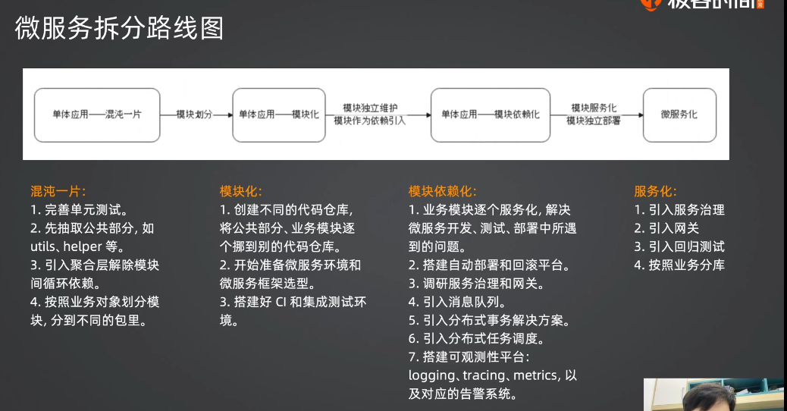

# golang

## defer

### defer 实现机制

在面试问到了 defer 的时候，你要主动回答这些内容。它能让你拉开和面试者的差距。

defer 的内部实现分成三种机制：

• **堆上分配**：是指整个 defer 直接分配到堆上，缺点就是要被 GC 管理。
• **栈上分配**：整个 defer 分配到了 goroutine 栈上，不需要被 GC 管理。比堆上分配性能提升了
30%。
• **开放编码**（Open Code）：启用内联的优化，你直观理解就是相当于把你的 defer 内容放到
了你的函数最后。启用条件：
• 函数的 defer 数量少于或者等于 8 个；
• 函数的 defer 关键字不能在循环中执行；
• 函数的 return 语句与 defer 语句的乘积小于或者等于 15 个。

### 面试思路

你的回答要分成几个部分：
• defer 的作用
• defer 的底层实现原理。这算是你在初级工程师面试中刷亮点的地方：
• 堆上分配与栈上分配：这个地方你要尝试引导到内存逃逸、GO 性能优化这种话题上。
• 开放编码。

# MySQL

# Redis

Redis 面试题目
• 你用 Redis 解决过什么问题？
• 你知道 Redis 支持哪些数据结构吗？你用过哪些？用来解决什么问题？
• Redis 各个数据结构的底层实现？
• 当你更新数据的时候，你先更新数据库，还是先更新缓存？有没有一致性问题？
• 如何解决一致性问题？

# 计算机网络

# 操作系统

# 其他

## gin

**实际上，Gin 作为简单的框架，能够面试的内容并不多。**
• 什么是 Gin 的 middleware？能用来解决什么问题？
• 什么是跨域问题，怎么解决？
• 跨域问题需要设置哪些头部？
在 Gin 面试的时候，一定要提起自己研发了一个强大 Gin 插件库。

## session

• 什么是 Cookie，什么是 Session？
• Cookie 和 Session 比起来有什么缺点？
• Session ID 可以放在哪里？这个问题，你要记得提起 Cookie 禁用的问题。
• 用户密码加密算法选取有什么注意事项？你用的是什么？
• 怎么做登录校验？核心是利用 Gin 的 middleware。

## session深入

• 刷新 Session 过期时间的几种可行的办法，你要能够深入分析不同做法的优缺点。注意，面试不是实
践，不能说我记住最佳的就行，而是你要尽可能”水“时间，展示自己博闻广识。
• 增强登录的安全性：
• 怎么保护 Session id？主要还是要启用 HTTPS 协议，把 Cookie 的 Secure 和 HttpOnly 都设置为
true。
• 怎么做到在 Session id 或者 JWT token 泄露之后保护住用户？要在登录的时候记录一下登录的附
加信息，例如 User-Agent，在登录校验的时候一并校验。
• 如何保护 Web 服务？ 针对 IP 限流、整个集群限流。后续你还会接触到更加多的保护措施。
注意：这一部分的内容在你们面试初级工程师的时候，是属于比较有技术含量的点了，你在面试前一定
要试着按照自己的说话习惯，整理好对应的答案，写出来多读几遍。

## token

面试要点
• 什么是长短 token？为什么要用长短两个 token？
• 长短 token 的过期时间应该怎么设置？
• 怎么保证长 token 的安全性？万一泄露了怎么办？
• 使用 JWT token 怎么退出登录？
• 使用了长短 token 之后怎么退出登录？
• 使用了 JWT 还需要再使用 Session 吗？

## 如何在测试中维护登录态

你有两条思路：
• 在测试初始化的时候去模拟登录，拿到对应的登录态的数据，例如 JWT token 或者 session id。
• 直接手动登录，然后复制对应的 token 或者 cookie 的值到脚本中，运行测试。
如果你的测试里面有权限控制，那么需要使用一个特殊的用户，这个用户有所有的权限。

## 理论

这一节课相关的面试内容都是纯理论：
• 什么是依赖注入？如何在 Go 里面是实现依赖注入？
• 什么是面向接口编程？为什么要面向接口编程？
• 什么是 IoC（控制反转）？
面试不需要太紧张，因为差不多就是问问基本概念。这一类纯理论的面试难点在于，我作为面试官也不
知道怎么面你。

# 小微书项目

## **设计并实现一个 Gin 插件库**

Gin 本身的 middleware 机制可以做到非常多的事情，包括：
• Web 治理：熔断限流降级等
• 可观测性：包括日志、metrics、tracing
• 身份认证与鉴权：我们这一节课已经接触到了登录校验，算是一个比较简单的实现
• ……
在中小型公司里面，可能都是直接使用开源的 Gin 插件实现，但是你可以考虑改成自研的。后续我们会陆
续讲到其它内容。你现在要做的是，先把这个仓库建起来，然后写好第一个登录校验的插件。
自研的好处是：可以针对你们公司的规范、基础设施来定制。
而后你同样可以把这个仓库开源出去，证明你熟练使用 Gin。

## 保护公司前端接口

检查公司的前端接口，而后加入限流功能。
• 可以考虑整个集群限流
• 针对核心业务的接口限流
• 针对不需要登录就可以访问的接口限流
• 为限流添加对应的监控和告警

## Gin 插件库添加限流插件

为 Gin 插件库添加限流插件，包含：
• 单机限流
• 令牌桶算法
• 漏桶算法
• 滑动窗口算法
• 固定窗口算法
• 基于 Redis 限流
• 基于 Redis 的 IP 限流

## 如何实现一个验证码登录功能

你的回答要分成以下几个部分：
• 简要说明验证码流程的基本步骤。
• 详细说明如何保护系统，即防止黑客恶意发送短信，增大成本支出，也要防止验证码被暴力破解。
• 重点说明验证码发送/验证流程，强调里面的并发问题，并如何使用 lua 脚本来解决并发问题。
衍生出来的问题有：
• 能不能让用户在输入错误的验证码后继续重试？

可以，但限制次数比如3次

• 为什么要控制验证码的发送频率？你可以怎么控制？

防止暴力破解

• 如果我在前端加了一个限流措施，能不能保护住我的系统？有什么问题？

不能，黑客利用脚本直接向后端发请求

**验证码加密（可选）**
注意，目前我们在 Redis 中存储的验证码都是明文存储的。但是验证码本身作为一个非常关键的数据，
明文存储是不安全的（主要是防你的同事）。
因此你要做的就是，用合适的加密算法来加密验证码，并且保证整个过程依旧非常流畅。

## 为公司的第三方调用添加治理措施

基本上任何公司都难免要和第三方打交道，你找到这一类代码，而后设计一些治理措施，来提高可用性、
扩展性和安全性。
可行的方式包括：
• 提供自动重试功能。也就是调用方不需要操心重试，以及重试失败怎么处理的问题。

短信服务中的自动重试

• 设计提高可用性的措施，确保在第三方崩溃或者网络崩溃的时候，尽量保持系统依旧可用。

• 在类似于短信这种可以替换服务商的服务中，设计 failover 策略。

• 为第三方调用提供客户端限流功能。

• 为第三方调用提供 mock 实现，方便测试。

为types接口生成mock依赖

就算不是为了升职加薪，单纯为了跳槽，你都要做做这些事情。

## 项目经历：高可用的短信服务

你可以在面试的时候使用今天学习的内容。

描述：设计并实现了一个高可用的短信服务平台

- 提高可用性：重试机制、客户端限流、failover(轮询、实时检测)
  - 基于超时的实时检测（连续超时）
  - 基于响应时间的实时检测（比如说，平均响应时间上升20%）
  - 基于长尾请求的实时监测（比如说，响应时间超过1s的请求占比超过10%）
  - 错误率
- 提高安全性：
  - 完整的资源申请与审批流程
  - 鉴权：静态token和动态token
- 提高可观测性：日志、metrics、tracing、丰富完美的排查手段
- 提高性能：

核心面试点：

• 客户端限流。
• failover 策略：轮询，或者判定服务商健康状态。
• 同步转异步。
• 权限控制。
• 后台管理界面：可以查询到具体每个短信发送请求的发送状态，审批流程……

强调这是一个高可用的项目，比如说在某次网络故障之后，自动切换到了别的服务商等等。

## 微信扫码登录

面试要点
这一节课的面试要点，核心就在于微信扫码登录的流程。
• 请你说说微信扫码登录的流程。

两次跳转

• 为什么微信的回调地址，域名必须是你预先注册的？

安全问题

• 如果我的临时授权码（也就是 code）被黑客拿到了，会发生什么？

会直接被其登录

• state 有什么作用？如何使用 state？

防止跨域攻击

面试中刷亮点要记住：绝大部分公司都没有处理 state，所以你要解释清楚，什么情况下不处理 state
会造成跨域问题，以及如何解决。

## 为 Gin 设计通用的长短 token 机制

长短 token 可以认为是一个常见的解决方案。
所以实际上可以为 Gin 添加这个插件。你可以考虑：
• 提供单独的长短 token 的插件，这个时候你要抽象出生成 token 的方法。
• 提供结合了 JWT 的长短 token 插件。
并且在这个插件的基础上，你可以给用户提供选择：是否要开启 session 机制。
那么就相当于，你为用户提供了一个完整的 JWT 结合 Session 的机制。对于用户来说，接入你的机制，
就解决了整个登录和会话有关的问题。
对于你来说，就是要把 jwt.Handler + JWTLoginMiddlewareBuilder 合并在一起

面试要点
• 什么是长短 token？为什么要用长短两个 token？
• 长短 token 的过期时间应该怎么设置？
• 怎么保证长 token 的安全性？万一泄露了怎么办？
• 使用 JWT token 怎么退出登录？
• 使用了长短 token 之后怎么退出登录？
• 使用了 JWT 还需要再使用 Session 吗？

## 在公司引入远程配置中心

直接引入任何远程配置中心，而后进一步考虑：
• 为公司提供统一的配置接口。
• 根据公司的实际情况，研发一个 Web 界面
• 集成权限控制。
• 某个部门、某个小组只能读取某个路径下的配置。
• 关键配置，只有特定的人才能查看或者修改。
• 集成版本控制，可以快速版本回滚。

切换到旧的配置

• 集成环境控制，可以快速在不同的环境之间同步配置。

测试环境、发布环境

• 集成变更流程和审批流程。即任何一个配置的变更，都需要经过复杂的评审、审批流程。

• 灰度发布

这些看起来很高级的功能，实际上全都是简单的增删改查，你们目前除了前端页面写不出来外，
其他都是足以胜任的。

直接面试配置模块还是很少见的。如果要问的话，主要可能问：
• 你们公司是怎么管理配置的？这种问题强调的是你们公司怎么解决不同环境配置的问题。
• 你们配置的优先级是怎样的？
• 你们有没有使用远程中心，用的是哪个？这个按照公司实际情况来回答就可以了。
如果你已经工作了，并且对 etcd 的原理比较了解，那么可以考虑在简历中写下熟悉 etcd。如果目标公
司用云原生比较多，你进去就会大量接触到 etcd。

## 为公司设计日志规范

这算是一个比较务虚的东西，如果你在中小型公司里面，那么可能用得上。
设计日志规范要考虑：
• 什么情况下打印什么级别的日志
• 什么情况下打印出了什么日志，就要告警
• 怎么保证，在看到日志的情况下，可以快速定位问题并修复
PS：找一个大厂的日志规范，结合公司研发人员的工程素养，做一定的削减和适配。
要注意：要在规范的严谨和易于推行之间取得一个平衡。如果规范过于严苛，那么你十有八九推行
不了；如果规范过于容易，那么效果就比较有限。

面试要点
日志是属于可观测性范畴中的一环。
因此最佳的面试策略就是将日志作为你提高可观测性的一环。而可观测性又是改善性能和可用性的
前提条件，因为你必须要观测到有问题，借助日志来分析问题核心，才能有的放矢，去优化性能和
可用性。
类似话术： 我在接手这个系统的时候，发现性能和可用性都很差，准备着手改进。但是当我准备分
析问题的时候，发现可观测性方面做得非常差，主要就是零散、缺乏标准、不够完备。为此，我首
先是执行了日志规范……

## TDD

面试要点
• 什么是 TDD？简单来说，你就可以回答测试先行。
• TDD 和 DDD 是什么关系？没什么关系，DDD 适合战略规划，TDD 适合落地具体功能。
• TDD 有什么好处？理清思路、查漏补缺、方便重构、测试完善。
• 你是如何实施 TDD 的？回答具体的步骤就可以，你可以用某一个接口来举例子。

## 引入 OSS + CDN、mongoDB

如果你还处在一个中小型公司，并且公司还是自己部署文件服务器，或者前端静态资源依旧是访问你们的后端来
获得，那么应该尝试在公司推广 OSS + CDN。
OSS + CDN 从成本上来说，性价比还是很高的。
而且，自己部署的文件服务器难以解决各种问题：
• 大量小文件。
• 大文件。
• 缓存与性能。即如果文件本身不缓存，那么读速度很慢；如果文件缓存，那么你需要控制住缓存的内存使用
量。
• 可用性差。
所以，不要怀疑，直接上 OSS 和 CDN，省时省心。

**MongoDB 面试要点**

• 有没有用过 MongoDB？用来解决什么问题？

• 为什么用 MongoDB？用 MySQL 行不行？

• 解释一下 MongoDB 中集合和文档的关系？

• 如何设计 MongoDB 上的索引？所谓的 ESR 原则。

**ESR 原则**
ESR 原则是指创建索引的时候，索引列的顺序应该遵循：E（Equal）、S（Sort）、R（Range）。举例来说，在帖子中，假如查询是按照 author_id 查出创作者在一周内（ctime) 发布的帖子，并且按照阅读量（read_cnt）来排序，那么索引列的顺序应该是：author_id, read_cnt, ctime。ESR 可以扩展为：ER、EESR、 ESSR、ESRR……即，只要保持 ESR 的相对顺序不变，可以有 N 个 E，也可以有 N 个 S，也可以有 N 个 R。基本上，你同样可以参考 ESR 规则来设计 MySQL 的索引。

PS：实践中，R 和 S 在一些场景下换一个顺序，有可能性能更好。

• 如果数据存储在 MongoDB 上，怎么生成 ID？

• MongoDB 是否支持事务？是否支持跨文档事务？是否支持 ACID？

支持

## 缓存实现

**适合面试的缓存方案：缓存过期时间设置**

可以注意到，在不同的地方，缓存的过期时间是不同的。

理论上来说，缓存过期时间应该是确保接下来对该资源的访问都命中缓存。

**一般情况下，过期时间越长，命中率越高，但是数据一致性会变差；过期时间越短，命中率越低，但是数据一致性会更好。**那么站在面试的角度来说，你记住这些案例：

• 业务相关的缓存预加载，过期时间要短。

• 在 Publish 提前设置过期时间这里，可以考虑根据创作者是否是大V来确定，大V有更长的过期时间。

**适合面试的缓存方案：淘汰策略**

所谓淘汰策略，是指在缓存内存不够的情况下，要把一些数据淘汰掉，腾出空间。常规的方案就是 LRU（最近最少使用）和 LFU（最近最不频繁使用），这两个常规方案在面试初中级岗位时是足够的。

但是要想面试出亮点，你记住这些方案：

• 优先淘汰普通创作者的数据，尽可能留下大V的数据。LFU 能够达成近似效果，LRU 效果要差一些。

• 优先淘汰大对象。比如说一个帖子字数特别多，那么就可以优先淘汰了它，这样可以一次性**释放出来很多内存。**

• 优先淘汰小对象。比如说一个大对象要十秒钟才能计算出来，小对象100毫秒就能算出来，你就没必要留着小对象。

## kafka

**基本上，你出去面试，Kafka（或者消息队列）都是必考：**

• 有没有用过 Kafka？用来解决什么问题？我们后面会有更加复杂的案例。

• 你为什么要使用消息队列？使用消息队列的好处是什么？好处就是异步、解耦、削峰。

• 请你介绍一下 Kafka？要注意介绍 Kafka 中的几个基本概念。包括：

• 什么是 broker ? broker 和 分区的关系是什么？

• 什么是 topic？ topic 和分区是什么关系？

• Kafka 中 producer 的 acks 有哪些取值？分别是什么含义？你用了哪些？

• Kafka 中的 ISR 是什么意思？

• Kafka 中的一个分区可以有多个消费者吗？

• 消息积压了怎么办？基本思路都是异步消费。

• 怎么保证消息的顺序？怎么保证全局有序？怎么保证业务有序？

**Kafka 面试重难点：消息积压**

消息积压的解决方案很简单，你背下来就好：
• 增加分区/topic：现实中基本不可能。
• 异步消费：也就是在前面例子里你看到的，开启 goroutine 来并发消费，最后合并提交。
• 为什么要合并提交？
• 不合并提交有什么问题？
• 批量消费：可以通过改造生产者和消费者，将原本一个业务一个消息，改造成为一批业务一个消息，一次处
理一批业务，参考阅读计数的优化方案。

## 本地缓存 + Redis 缓存 + 数据库

在大多数时候，追求极致性能的缓存方案，差不多就是本地缓存 + Redis 缓存 + 数据库。
那么：
• 查找的时候，就要先查找本地缓存，再查找 Redis，最后查找数据库。
• 更新的时候，就要先更新数据库，再更新本地缓存，最后更新（或者删除）Redis。核心在于一点，本地缓存
的操作几乎不可能失败。
高级的亮点在于：
• 本地缓存可以预加载。也就是在启动的时候预加载，或者在快过期的时候，提前加载。
• 本地缓存可以用于容错。也就是如果 Redis 崩溃，这时候依旧可以使用本地缓存。例如，正常过期时间是三
分钟，但是本地缓存会设置五分钟。如果数据已经超过了三分钟，那么会尝试刷新缓存，如果刷新失败，那么
就继续使用这个已经“过期”的本地缓存。在部分场景下，可以考虑让本地缓存永不过期，同时异步任务刷新
本地缓存。好处是可以在 Redis 或者 MySQL 崩溃的时候，依旧提供缓存服务。

## 分布式任务调度平台

事实上，这个基于 MySQL 的实现就是一个简单的分布式任务调度平台。你可以在这个基础上，进一步提供
一些管理功能，就可以做成一个分布式任务调度平台，出去面试的话，效果会非常好。
• 加入部门管理和权限控制功能。
• 加入 HTTP 任务和 GRPC 任务支持（也就是调度一个任务，就是调用一个 HTTP 接口，或者调用一个
GRPC 接口）。
• 加入任务执行历史的功能（也就是记录任务的每一次执行情况）。

## 微服务

面试要点
基本上都是一些概念性的题目：
• 什么是微服务架构？为什么使用微服务架构？
• 模块化之后为什么要微服务化？

微服务化独立性更强，独立开发测试部署，以实例为单位，资源占用更少

• RESTful 和微服务架构是什么关系？
• 可以用 HTTP 协议来实现微服务架构吗？
• 什么是 RPC？ RPC 和 HTTP 是什么关系？
• 什么是 DDD？你可以介绍一些 DDD 里面的各个概念吗？
早期的时候特别喜欢问 RESTful、RPC 和微服务架构三者的关系，要注意捋清楚。

面试要点
正常来说，如果你的简历里面没有提及微服务拆分，那么基本上面试官都不会问你，但是如果你简历里面写了，那么面试官就有可能问你。
• 微服务拆分，怎么拆？具体步骤是什么？

• 微服务拆分有哪些难点？你可以根据自己的体会回答，准备环境、技术选型、补充测试、重构过程都可
以。
• 怎么保证微服务拆分没有引入 BUG？事实上就是你保证不了，但是在面试的时候要注意强调测试，完善
的测试可以显著减少引入 BUG 的可能性。
• 怎么在线上做灰度方案？这里提到的就是最简单的灰度方案了，用阈值 + 随机数，也可以考虑阈值 + 业
务哈希值。

## 上线前的流量调度方案

正常来说，在发布一个新功能的时候，又或者重构一个已有系统的时候，一个非常大的问题都是：我想要在出问
题的时候及时回滚。
那么这种情况下，你就需要考虑引入这种流量调度方案。
基本思路都是：
• 设置一个阈值，通过随机数和阈值来控制流量，也可以考虑根据业务的 ID 计算一个哈希值来取代随机数。
• 最开始的时候，让所有的流量都走老路径，或者成熟的路径。
• 开始尝试调大阈值，放一点点流量到新路径。
• 如果没问题，就继续加大流量。
• 如果有问题，立刻关掉所有到新路径的流量。

• 这种机制可以借助配置中心，来动态修改，并且立刻同步到所有的节点上。

## 不停机数据迁移

**面试要点**
你在简历中，记得主动提起，自己在公司设计过不停机数据迁移方案。而后你在面试中要记得主动引导并且说清楚这些问题：
• 不停机迁移的基本步骤是什么？
• 你的数据校验方案是什么？
• 你的数据修复方案是什么？如何保证数据正确性？怎么解决并发问题？

id不可变

• 在数据迁移的每个阶段中，你是怎么考虑保护住数据库的？要提前准备一些高级的、有新意的方案。

使用kafka进行异步修复

动态判定当前负载，负载高则挂起，负载低则继续。

设置一个定时任务，设置时间到业务低峰期。

使用批量校验和修复

**面试要点**
在上一个 PPT 的面试题的基础上，还有一些更加细节的问题：
• 为什么你要使用 Kafka，直接在校验之后就修复数据不行吗？

减少数据库压力，kafka限流保护数据库

• 增量校验和修复、业务写数据、全量校验和修复同时进行，有什么并发问题？怎么解决？记住：怎么解决就一
句话：反复校验和修复，最终总会一致的。
• 在主从同步下，校验和修复有什么注意事项？也就是前面我们说的，读主库还是读从库的问题。
• 怎么保证在数据迁移的时候，不会影响到业务？这个是你面试的时候要反复强调的点，也就是说要让面试官相
信你在数据迁移上是一个专家，各种问题都考虑到了。
• 你使用了哪些性能优化手段来加速数据迁移的过程？你可以编织一套完整的优化方案，主打就是你非常会优化
性能。

**数据迁移是一个非常适合拿出去面试的点。你可以将整个数据迁移过程融入到自己的任何项目中，基本的话术就**
**是要重构系统，逼不得已要进行数据迁移，而你主要负责的就是数据迁移这一块，而后你设计了一个不停机迁移**
**的方案……**
**只要在自我介绍、项目介绍的时候强调的几次，面试官肯定会问你相关的问题。**

## 服务注册与发现

**面试要点**
这个部分基本上就是面试的要点，把这个课程的内容背熟，那么服务注册与发现的基础理论面试就不会有问题。
• 服务注册与发现，有哪些组件？

客户端、服务端、注册中心、（监控平台）

• 什么是注册中心？为什么要使用注册中心？直接使用 IP 或者域名行不行？

管理服务地址的一个中间件，不使用注册中心而直接使用ip缺点，使用域名、dns缺点

• 注册的时候，究竟注册了什么数据？

定位信息和其他信息

• 在使用注册中心的时候，整个流程是什么？
• 注册中心怎么知道服务端已经崩溃？
• 注册中心和服务端是怎么保持心跳的？
• 心跳的间隔怎么设置？有什么影响？

间隔，次数

• 怎么避免偶发性心跳失败的问题？
• 服务端在下线的时候需要注意什么？具体步骤是什么？
• 客户端和注册中心需要保持心跳吗？

**面试要点**
• 什么是 CAP 原理？
• 为什么说大多数时候我们都会选 P？
• 在选择注册中心的时候，CAP 应该选哪个？这个地方，先回答标准答案，而后你可以考虑回答的我理解。

ap

• 你们公司用的是什么注册中心？为什么用它？你记得回答优缺点就可以。
• 怎么保证注册中心高可用？
• 当注册中心崩溃之后怎么办？
• 当服务端连不上注册中心的时候，会发生什么？客户端会怎么样？
• 当客户端连不上注册中心的时候，应该怎么办？

## 负载均衡算法

**面试要点**
负载均衡的面试，集中在理论。
• 首先，静态负载均衡算法的原理你要背得滚瓜烂熟，而后能够评价不同的算法的优缺点。
• 如果要面得有竞争力，就要知道动态负载均衡算法。
• 想要非常有竞争力，就得考虑根据业务设计一些负载均衡算法。
• 面试权重相关的算法，要注意总结部分对权重的讨论，尤其是动态调整权重，以及权重上下限的问题。
后面我们会讲到高端的适合面试的负载均衡策略

**为公司业务添加 failover**
正常来说，如果你追求服务的高可用的话，那么肯定是要考虑 failover 的问题的。
但非常可惜的是，大部分中小型企业（包括一部分大厂的非核心业务）都缺乏这些措施。因此你可以排查公司的核
心业务，为这些核心业务接入 failover 策略。
接入这些策略之后，你后续还可以用于面试，效果会非常好。
除此以外，尽量尝试能不能根据业务特点来设计一些负载均衡策略。例如说在使用了本地缓存的地方，对应的客户
端就使用哈希类的负载均衡算法

**面试要点**
• 把 WRR 的实现背熟，以防面试官要你手搓一个负载均衡算法。
• 如果调用下游失败了你怎么办？也就是考察 failover。又或者你在面试的时候主动提起自己结合负载均衡策略
实现了简单的 failover。
• 如果要想在可用性上给面试官留下深刻印象，则参考短信服务 failover 治理部分，里面的措施你都可以通过负
载均衡策略来实现。
• 你使用过什么负载均衡算法？这个问题，你要先回答一般的算法， 然后结合自己的业务设计一个很有特色的负
载均衡策略，可以参考前面适合面试的负载均衡策略部分。
• 千万记住：哈希负载均衡算法 + 本地缓存 + Redis 缓存这个方法，面试初中级岗位很好用，有点高级但是又不会特别高级以至于面试官不相信。
记住：负载均衡是一个烂大街的话题，如果你想要赢得竞争优势，把算法基本原理讲清楚是最基本的，你还需要
进一步设计亮点，例如说 failover，或者自定义的奇诡的负载均衡算法。

## 服务治理

**面试要点**
这部分内容可以说是面试的高频热点了。
• 什么是熔断？什么是降级？什么是限流？
• 什么时候用熔断？什么时候用降级？什么时候用限流？
• 你知道哪些限流算法？你用过哪些限流算法？各有什么优缺点？注意这里最好要能回答一下

自己根据业务特征设计过独有的限流算法，赢得竞争优势。

**面试要点**
要注意，当你出去面试的时候，要准备一整套的服务治理方案，包括熔断、限流、降级等各种措施，也包括从前
端到后端，以及跟第三方交互的容错措施。具体来说：
• 客户端做好了注册中心崩溃的容错措施。
• 有一个有特色的负载均衡算法。
• 在服务层面上，要有熔断、限流、降级、链路超时控制等，如果你还用了分组和隔离措施，那么会更好。
• 在跟下游服务的时候，有客户端的治理。
• 如果你的业务里面，Redis、Kafka 等是明显的关键组件，那么要考虑这些组件崩溃的问题。
一套完整的服务治理方案，能在面试中极大刷出亮点来

## 为公司接入微服务观测和治理措施

很多服务，不管是大公司的服务，还是小公司的服务，可能都没有任何的治理措施。
在这种情况下，你就可以根据课堂的知识，为服务接入观测和治理。
• 引入 Prometheus。
• 引入 Tracing。
• 引入 Grafana 并且配置监控和告警。
• 至少接入限流，最好是做做压测，积攒一些经验，或者在公司输出一套压测执行的规范标准。
如果你已经是项目的核心成员了，记得设计一整套的提高服务可用性、可观测性的方案，后续你出去面试效果
也会很好。

## 支付系统

**面试要点**
• 搞清楚微信的支付流程，理解关键的 Prepay 和 处理回调。
• 怎么处理支付的回调？最关键的是，我怎么分发/区别不同环境收到的支付回调？
• 金额究竟该怎么存？你可以解释三种可行的方案，然后解释优缺点，最后再讲一下自己的偏好。
• 怎么防止重复支付？核心就是业务方要提供一个唯一凭证，你使用这个凭证来去重。
• 如果微信支付的回调处理失败怎么办？

对账

**检查公司业务，完善数据比对和数据修复**
在实践中，有时候会因为早期时间不够，急于上线，所以系统内部可能充满了有可能导致数据不一致的地方。你要
做的就是梳理自己负责的业务，并且找出这些可能引起不一致的地方，修复掉它。
那么如何识别呢？
关键点：部分失败。
也就是说，但凡涉及到调用不同组件、调用不同服务的地方，都有可能不一致。
你要做的就是仔细思考每一个步骤失败的后果，并且尝试引入数据比对和修复的机制。
注意：这种数据不一致的地方就是你面试的重点，也是面试官喜欢追问的题目。

**面试要点**
• 如何保证消息一定发送出去？也就是说，在类似发送支付结果消息那种场景之下，你怎么确保，生产者一定发
了消息？更进一步，这里又衍生出来另外一个更加复杂的问题，如何确保消息不丢失？

• 如何保证消息有序性？这个问题你在 Kafka 里面已经见过了。衍生出来两个高级问题：
	• 如果 topic 增加分区，怎么保证有序性？

​	让新分区最后被消费

​	• 如果保证消息有序性的时候，消息积压了，怎么办？

​	使用goroutine，消息放到goroutine中，所有消费完了再批量提交

• 如果在自己的业务里面，有很明显的部分失败的场景，要想好怎么补偿。
• 怎么保证幂等？你有一些什么方案？能不能撑住高并发？

## 评论功能

**面试要点**
对于设计一个评论系统来说，属于具体的业务场景，比较少会考察，除非你面试相关的岗位。
• 怎么在数据库里面设计一个支持树形结构的表，你知道哪些方法？用过哪些？各有什么优缺点？
• 什么是外键？你用过没有？为什么大厂不推荐使用外键？

影响性能

有很强的约数，插入数据必须符合外键规范

• 如何提高评论系统的性能？

各种缓存，各种加载

• 如何提高评论系统的可用性？

kafka异步写（高并发不崩），降级策略，读写实例分离

## 用户关系

**面试要点**
• 要注意总结类似于维护计数的解决方案。比如说在点赞里面，我们在数据库里面维护了总数，而在这里我展示
了另外一种设计方案，并且讨论了缓存和索引的问题。
• 如何优化 COUNT 查询？
	• Redis 直接维护结果，避免 COUNT。
	• 利用索引，确保命中索引并且不会回表。
	• 估计，比如说利用 MySQL 的 Explain 命令来拿到估计的数量。
	• 异步刷新，总数缓存在 Redis 里面，异步刷新这个数据。
• Redis 的 Pipeline 是什么？Transaction 又是什么？用来解决什么问题？

## elasticsearch

**面试要点**
正常来说，如果你的简历里面没有提到 ElasticSearch 的话，问到你相关内容的概率不是很高。如果问到了，那么
在初中级岗位的面试里面，也仅仅是聚焦在 ElasticSearch 的一些基本知识里面。
• 你有没有用过 ElasticSearch？用它来解决什么问题？注意，如果你在实践中没有接触过，可以提自己公司别的
部门用它来做什么。
• ElasticSearch 中的倒排索引是什么？为什么叫做倒排索引？
• ElasticSearch 是如何组织倒排索引的？核心是利用了 FST 这个结构。
• ElastciSearch 的节点类型有哪些？它们的作用是什么？
• ElasticSearch 的写入过程是怎样的？为什么说它是近实时的？

**面试要点**
有些时候，你可能会接触到类似于搜索服务这种对接所有业务方的平台服务。它不同于短信服务，是因为不管是数据同步，还是搜索接口，不同的业务方都有差异；也不同于评论服务，只需要用 biz 和 biz_id 来表示不同业务。这一类平台的特征就是，业务方之间有一些共性，但是又不是很强。因此你在面试的时候，这一类的项目要点在于：

• 统一的接入标准和接入流程。在这个基础上，在面试的时候就可以**强调快速接入。基本的话术可以是自己在重构之前，这个系统的接入流程非常混乱，效率极低，经过自己的改造之后，接入非常迅速。**
• **高性能**，老生常谈的话题。
• 高可用，和一般的业务比起来，要在**隔离上更加花费功夫**。也就是说尽可能做到，保大不包小。即通过分组、降级等措施，力保核心业务可用。如果有多个核心业务，那么一个崩溃之后，其它的核心服务依旧能够正常运行。

## 标签服务

**面试要点**
• 什么是缓存预加载？你使用过没有？在极端追求高性能的场景下，一定是缓存预加载，并且是本地缓存预加载，
不然一个缓存不命中，性能就不达标了。
• 怎么判定一个场景要不要缓存？缓存时间多久？
	• 同一个资源，短期内不会被重复访问的，就不需要缓存。
	• 理论上缓存时间应该根据用户的使用习惯来确定，也就是资源会被重复访问的那段时间，就是你的缓存过
	期时间。
• 如何控制 ElasticSearch 返回的结果？这个问题其实相当宽泛，如果你不是专门做搜索的，可以不需要特别关心。因为它本质上问的是搜索模型，即怎么评估结果的相关性，怎么优化，很多细节。
• 怎么在 ElastSearch 中解决类似于 MySQL 的 JOIN 查询的场景？ Nested 或者 Parent-Child。但是我都不建议
使用，拆分多次查询可能都要更好一些。

# k8s

当你出去面试业务研发岗位的时候，Kubernetes 的面试就是集中在一些基本概念上：
• Kubernetes 中的 apiVersion 是什么意思？
• Kubernetes 中 Service、Deployment 和 Pod 的基本概念，能用来干什么？
• Service 的类型有哪几种？有什么区别？用在什么场景？
• 什么是 ingress？ingress 和 ingress-controller 是什么关系？
• PersistentVolume 和 PersistentVolumeClaim 是什么关系？为什么要有这两个？
• accessMode 有哪些取值？分别是什么含义？
正常你在入职一家公司之后，也仅仅是掌握编写 K8s 的配置文件就可以了。

# 面经

make 和 new 的区别﹖ 

了解过golang的内存管理吗? 

调用函数传入结构体时，应该传值还是指针﹖说出你的理由? （内存逃逸）

线程有几种模型?Goroutine的原理了解过吗，讲一下实现和优势?

Goroutine什么时候会发生阻塞? 

PMG模型中Goroutine有哪几种状态? m有几种状态？（空闲、自旋、执行）

每个线程/协程占用多少内存知道吗? 

如果Goroutine—直占用资源怎么办,PMG模型怎么解决的这个问题? 

如果若干线程中一个线程OOM，会发生什么?如果是Goroutine 呢? 项目中出现过OOM吗，怎么解决的? 

项目中错误处理是怎么做的? （直接往外抛）

如果若干个Goroutine,其中有一个panic，会发生什么? 

defer可以捕获到其Goroutine的子Goroutine 的panic吗? 

开发用Gin框架吗?Gin怎么做参数校验?  （validator）

中间件使用过吗?怎么使用的。Gin的错误处理使用过吗?Gin中自定义校验规则知道怎么做吗?自定义校验器的返回值呢? 

golang中解析tag是怎么实现的？反射原理是什么？通过反射调用函数 

golang的锁机制了解过吗? Mutex的锁有哪几种模式，分别介绍一下? Mutex锁底层如何实现了解过吗? 

channel、channel使用中需要注意的地方？ 

数据库用的什么？数据库锁有了解吗？mysql锁机制讲一下。mysql分库分表。 

讲一下redis分布式锁？redis主从模式和集群模式的区别了解过吗？redis的数据类型有哪些？redis持久化怎么做的？ 

编程题：你了解的负载均衡算法有什么？实现一个负载均衡算法。

重点介绍项目
2、如何学习go语言的
3、从搜索引擎输入数据到显示结果的流程
4、通过ip地址如何找到目标地址
5、进程线程区别
6、进程间通信方式 共享内存通信
7、https请求流程
7、http和tcp
8、主协程如何等待所有协程都完成
9、go中的uint无符号整型是否可以相减
10、go的数组和切片 如何更改对应值
11、map数据根据key进行排序
12、go的反射
13、如何定义接口返回类型
14、go的结构体能不能比较
15、GMP调度模型
16、linux常用命令
17、如何查看端口是否被占用
18、如何停止一个进程
19、查找文件中的特定字符
20、git命令 merge和rebase的区别
